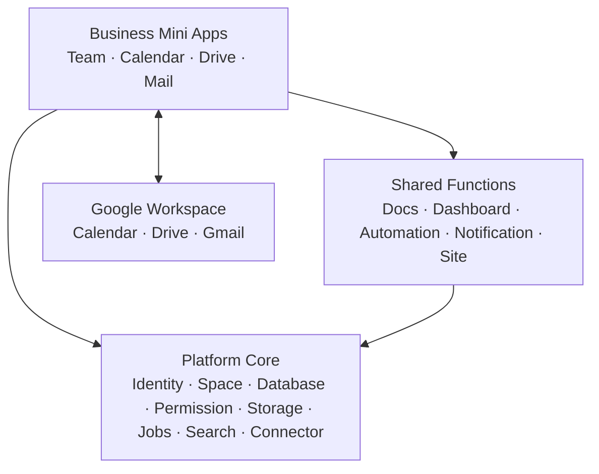

VHB Webapp là nền tảng vận hành nội bộ gồm nhiều ứng dụng dùng chung một lõi dữ liệu, danh tính, phân quyền và tích hợp. Tài liệu này mô tả cả **baseline hiện có trong source code** và **target architecture đã thống nhất** cho các phần cần sản xuất tiếp.

> Chú thích trạng thái dùng xuyên suốt tài liệu: **✅ Đã có** / **🟡 Có một phần** / **⛔ Chưa có (cần sản xuất)**.

---

# 0. Tổng quan kiến trúc

## 0.1. Ba lớp sản phẩm

1. **Platform Core**: Identity, Workspace/Space, Permission, Database Engine, Asset/Storage, Jobs, Audit/Event, Cache, Search và Connector.
2. **Shared Functions**: Documents, Dashboards, Notifications, Automation, Design & Publishing. Đây là các capability dùng lại được bởi nhiều ứng dụng.
3. **Business Mini Apps**: Team, Calendar, Drive và Mail. Mỗi mini app ghép Platform Core, Shared Functions và dữ liệu provider thành một workflow hoàn chỉnh.

Database Engine và Space là **Platform Core**, không phải mini app. Chúng vẫn có UI quản trị/vận hành riêng nhưng không được thiết kế như domain nghiệp vụ độc lập.



## 0.2. Nguyên tắc ownership dữ liệu

- Dữ liệu nghiệp vụ linh hoạt như sản phẩm, công ty, inquiry, order và task nằm trong Database Engine.
- User, permission, audit, document, dashboard, connector, deployment và sync state dùng typed table có migration và auditability.
- Google Workspace là source of truth ban đầu cho Gmail, Google Calendar và Google Drive; VHB lưu connection, mapping, checkpoint, metadata/index cần thiết và cache có thời hạn.
- Mini app gọi service/API của domain sở hữu dữ liệu; không đọc trực tiếp bảng của nhau.
- Mọi resource đều thuộc một Workspace và được kiểm tra quyền ở backend.

## 0.3. Baseline kỹ thuật hiện tại

- **Mô hình**: modular monolith — 1 process FastAPI backend, chia thành 8 module nội bộ (`identity`, `workspace`, `database`, `documents`, `dashboards`, `publishing`, `transfers`, `governance`); 1 worker process riêng xử lý job nền.
- **Frontend**: Next.js 16 + React 19 + TypeScript + TanStack Query, gọi thẳng REST API của backend.
- **Database**: PostgreSQL (self-hosted), meta-schema cố định + JSONB cho dữ liệu động (không tạo bảng Postgres thật cho mỗi Database người dùng tạo).
- **Phân quyền**: mọi truy vấn đều bị buộc phải scope theo Workspace; có thêm lớp override theo từng resource (xem mục Permission).
- **Capability đã tồn tại trong code**: Database Engine, Workspace/Space/Folder, Document, Dashboard, Site, Assets/Jobs, Notifications, Audit và Realtime Collaboration. **Mail, Drive dạng app riêng, Calendar dạng app riêng và Team Directory chưa tồn tại** — chi tiết ở mục C–F.

---

# A. Platform Core — Database Engine

Database Engine lưu dữ liệu nghiệp vụ linh hoạt như sản phẩm, công ty, yêu cầu hỏi hàng, đơn hàng và công việc. User, permission, audit log và metadata hệ thống không lưu dưới dạng Entity.

Một Database là tập hợp Entity dùng chung schema Field. Mỗi Entity đóng vai trò như một dòng, có UUID bất biến và `seq` duy nhất trong Database. Tên hiển thị được lấy từ primary/title field; tên không phải định danh và mặc định được phép trùng.

Database có các field (cột trong bảng) để gắn metadata, có nhiều layout để nhìn cùng một dữ liệu theo nhiều cách, và có thể gom nhiều nguồn dữ liệu trong một database.
Một entity chứa nhiều cell (ô trong bảng), format của dữ liệu trong cell đồng nhất với format chung của 1 field.

## Vai trò và ranh giới

- Quản lý Database, Field, Entity, Relation, Layout, View Preset và Data Source.
- Validate dữ liệu theo Field type ở backend; UI không phải nguồn validation cuối cùng.
- Cung cấp Query API có phân trang, filter, sort, group và aggregation cho Layout, Dashboard, Site và mini app.
- Không chứa business logic cố định của CRM/Order/Task trong engine. Logic nghiệp vụ được cấu hình bằng template, automation hoặc service của mini app.
- Không lưu file bytes trong PostgreSQL; cell `files` chỉ lưu reference/metadata đến Drive file.

## Cấu trúc dữ liệu chuẩn

`Database → Field schema + Data Source → Entity → Cell value`

- `Database`: resource cấp Workspace, có icon, folder, quyền và các Layout.
- `Field`: định nghĩa type, options, validation, order và cách render/edit.
- `Entity`: bản ghi có UUID, `seq`, `data_source_id`, `order`, timestamp và JSONB `data`.
- `Cell`: giá trị logic tại giao điểm Entity–Field; không phải bảng PostgreSQL riêng.
- `DataSource`: nguồn logic của Entity. Mỗi lần import/sync về sau cần có `ImportRun`/`SyncRun` riêng để lưu checkpoint, kết quả và lỗi; không tạo DataSource mới cho mọi lần chạy nếu vẫn là cùng một nguồn.
- `Layout`: cách trình bày Database; không sở hữu hay sao chép Entity.
- `ViewPreset`: snapshot có tên của filter/sort/group trong một Layout.

## Quy tắc dữ liệu bắt buộc

- UUID là định danh thật; `unique_id` là mã hiển thị sinh từ `seq` và prefix.
- Tên/title được phép trùng. Khi cần chống trùng, Database cấu hình business key hoặc unique field riêng.
- Entity thuộc đúng một DataSource; xoá DataSource bị chặn khi vẫn còn Entity.
- Field computed/system là read-only; mọi thao tác ghi phải bị backend từ chối, không chỉ khóa ở UI.
- Relation phải kiểm tra workspace/database đích và không tạo link trùng.
- Query luôn có giới hạn; Layout dùng incremental load và không tải toàn bộ Entity vào browser.

## Tổ chức UI của Database Core

### Database Home

- Context Sidebar hiển thị Space/Folder/Database mà user được phép xem, Recent, Favorites và Templates.
- Content area có danh sách/grid Database, search trong module, filter theo Space/owner và nút tạo Database.
- Global Create có thể tạo Database từ mọi app; Create trong Database module ưu tiên Database, Folder, Import và Template.

### Database Workspace

1. **Resource Header**: breadcrumb Space/Folder, icon + tên Database, favorite, share, activity và menu resource.
2. **Layout Bar**: các Layout tab, nút thêm Layout và Settings; trạng thái active phải có URL/deep link.
3. **View Toolbar**: View Preset, DataSource, group, filter, sort, search, field visibility và action theo Layout.
4. **Content Canvas**: Table/Board/List/Gallery/Calendar/Gantt; dùng chung loading, empty, error, retry và Load more.
5. **Selection Toolbar**: nổi trên content khi chọn Entity/cell; không đẩy layout.
6. **Inspector/Settings**: side panel cho Field, Layout, Preset, DataSource, Import/Export và Database settings.

### Entity Detail

- Mặc định mở bằng **side panel** trên Layout để xem/sửa nhanh mà không mất scroll, selection và filter hiện tại.
- Có nút **Expand** mở Entity thành full page với URL riêng để deep link, comment, activity và nội dung dài.
- Back/Escape đóng panel và trả focus về đúng Entity đã mở; URL/history phải hoạt động với Back/Forward của browser.
- Header gồm title, `unique_id`, status/assignee quan trọng và action. Body gồm Properties, Document/Description, Relations, Files, Comments và Activity.
- Field có thể được pin vào phần Summary; phần còn lại hiển thị theo schema/order của Database.

### Database Settings

- General: name, icon, description, default Layout và title field.
- Fields: tạo/sửa/ẩn/xếp thứ tự Field, validation và business key.
- Layouts & Presets: tạo, nhân bản, reorder, default, archive/xoá.
- Data Sources: source list, lineage, import/sync run và mapping.
- Import/Export: job progress, file kết quả và template export.
- Access: workspace role kế thừa và ResourceGrant override.
- Activity/Audit: thay đổi schema, import/export và thao tác quản trị.

## Global UI và UI thuộc Database

| Phạm vi | Thành phần |
|---|---|
| Global | App Rail, Workspace Switcher, Global Search/Command Palette, Global Create, Notifications, AI, Account |
| Database module | Context Sidebar Database, Database Home, module search, templates, import entry |
| Database resource | Resource Header, Layout Bar, View Toolbar, Content Canvas, Entity Detail, Settings/Inspector |
| Layout-specific | Table grid, Board columns, Calendar time grid, Gallery cards, List rows, Gantt timeline |

## 1. Fields ✅

Là "cột thông tin" của database. Database hỗ trợ các loại Fields chính:

### 1.1. Text-like (lưu string)

| key         | mô tả                |
| ----------- | -------------------- |
| `text`      | 1 dòng               |
| `long_text` | đoạn dài / rich text |
| `url`       | link, validate       |
| `email`     | validate @           |
| `phone`     | số điện thoại        |

### 1.2. Numeric (lưu number)

| key      | mô tả                                                                       |
| -------- | --------------------------------------------------------------------------- |
| `number` | format: `plain`/`currency`/`percent`; options: `precision`, `currency_code` |

### 1.3. Boolean / Date

| key        | mô tả                                             |
| ---------- | -------------------------------------------------- |
| `checkbox` | true/false                                        |
| `date`     | ngày (+ option `include_time`; range ; thông báo — ô "Remind" có UI nhưng **chưa nối logic**, luôn ở "None") |

### 1.4. Choice

| key            | mô tả                                                      |
| -------------- | ------------------------------------------------------------ |
| `select`       | 1 lựa chọn — options: `choices[{id,label,color}]`          |
| `multi_select` | nhiều lựa chọn (tags/labels)                               |
| `status`       | 1 lựa chọn có **nhóm** (To-do/In-progress/Done) — workflow |
| `priority`     | preset (Urgent/High/Normal/Low)                            |
| `rating`       | thang 1–5 (sao/emoji)                                      |

### 1.5. People & Files

| key      | mô tả                                                                              |
| -------- | ------------------------------------------------------------------------------------ |
| `people` | gán thành viên workspace (array user id)                                           |
| `files`  | đính kèm tệp/video, metadata trong PostgreSQL, bytes lưu trên Google Drive Shared Drive |

Chưa có type `media` riêng biệt (ảnh tự động convert `.webp`) — hiện `files` xử lý chung mọi loại tệp, chưa có bước tối ưu hoá ảnh tự động. **⛔ Cần sản xuất thêm** nếu muốn tách riêng.

### 1.6. Relation & Computed

| key        | mô tả                                          |
| ---------- | ----------------------------------------------- |
| `relation` | link sang database khác (1 chiều hoặc 2 chiều) |
| `rollup`   | kéo/tính từ relation (sum/avg/count/min/max…)  |
| `formula`  | biểu thức tính toán giữa field (sandbox `asteval`, không thể chạy code tuỳ ý) |

### 1.7. Progress & Location

| key        | mô tả                                                    | Trạng thái                          |
| ---------- | -------------------------------------------------------- | ----------------------------------- |
| `progress` | % (manual; **chưa có** auto-tính theo subtask/checklist) | 🟡                                  |
| `location` | địa chỉ + lat/lng (Google Maps)                          | ⛔ chưa có field type này trong code |

### 1.8. System / Auto (không nhập tay)

| key                | mô tả                                         |
| ------------------ | ----------------------------------------------- |
| `created_time`     | thời điểm tạo                                 |
| `created_by`       | người tạo                                     |
| `last_edited_time` | sửa lần cuối                                  |
| `last_edited_by`   | người sửa cuối                                |
| `unique_id`        | ID tự tăng có prefix tùy chọn (vd `VHB-1234`) |

Field mới không cần migration Postgres (`Field.type` là VARCHAR, không phải enum DB) — thêm loại field mới chỉ cần code, không cần đổi schema.

## 2. Entity ✅

Entity = một bản ghi (dòng) trong Database. Mỗi Entity có:
- `id` (UUID, bất biến), `seq` (số thứ tự tự tăng theo database, bất biến, phục vụ `unique_id`), `order` (vị trí hiển thị, có thể kéo đổi).
- Không có cột `name` riêng trong model hiện tại; UI lấy title từ primary text field và hiển thị `Untitled` khi trống. Target architecture cho phép chọn title field trong Database Settings.
- `data`: object JSONB, key là `field.id`, value theo đúng format field đó (validate ở tầng Pydantic/service, không dựa cột Postgres thật).
- `data_source_id` (bắt buộc): Entity nào cũng thuộc đúng 1 Data Source (xem mục 4.3).

Tạo Entity thủ công qua nút "New"/phím **N**, hoặc bulk-create (1–100 dòng trắng cùng lúc) qua nút "Bulk" cạnh nút New.

## 3. Cell ✅ 

Người dùng có thể **click vào ô để xem hoặc sửa giá trị**. Cách sửa khác nhau theo từng loại field:

| Field                                     | Click behavior                                                                                                                                                                                             |
| ----------------------------------------- | ---------------------------------------------------------------------------------------------------------------------------------------------------------------------------------------------------------- |
| Text / Long text / Email / URL            | Click chọn ô → click lại hoặc double-click để sửa (input/textarea inline)                                                                                                                                  |
| Number / Progress                         | Giống text — click để sửa                                                                                                                                                                                  |
| Rating                                    | Click trực tiếp vào ngôi sao thứ *i* để đặt điểm; click lại ngôi sao đang chọn để xoá                                                                                                                      |
| Checkbox                                  | 1 click để toggle true/false, không có "chế độ sửa" riêng                                                                                                                                                  |
| Date                                      | Click mở popup kiểu Notion: chip Start/End, lịch 6 tuần, checkbox "Include time"/"End date" (bật "End date" chuyển sang chọn khoảng — click 1 = start, click 2 = end), dropdown định dạng ngày theo field  |
| Select / Status / Priority / Multi-select | Click mở dropdown chọn (đơn hoặc multi), tô màu theo `choices`                                                                                                                                             |
| Country                                   | Click mở dropdown tìm kiếm quốc gia (cờ + tên) — chọn xong **tự điền mã vùng điện thoại** vào field Phone cùng dòng nếu Phone đang trống                                                                   |
| Phone                                     | Click mở dropdown mã vùng + input số; dán số có `+` sẽ tự tách mã vùng/số                                                                                                                                  |
| Relation                                  | Click mở dropdown multi-select các entity của database đích, hiển thị `[unique-id] Tên đậm`                                                                                                                |
| People                                    | Click mở dropdown multi-select thành viên workspace                                                                                                                                                        |
| Files & Media                             | Click hiện các chip file (icon ảnh/kẹp giấy) + nút upload; click vào 1 file mở modal preview toàn màn hình (ảnh/PDF/text xem trực tiếp, loại khác hiện link "Open file"); có nút Delete nếu có quyền write |
| Rollup / Formula / các field System       | Chỉ đọc, không click sửa được                                                                                                                                                                              |
| Unique ID                                 | Chỉ đọc, **không thể click vào chế độ sửa** (bị loại khỏi lớp overlay chọn ô)                                                                                                                              |

**Bulk edit nhiều ô cùng property trên nhiều dòng**: chọn nhiều Entity bằng checkbox (Shift+click để chọn theo khoảng liên tục) → dùng menu cột (Column menu) hoặc kéo thả để set giá trị hàng loạt — xem chi tiết thao tác Table ở mục 9.1.

## 4. Layout ✅

Layout là 1 cách nhìn Database. Một Database có nhiều Layout (tab), mỗi Layout có filter/sort/group/hiển-thị-cột/kích-thước-cột riêng, lưu vào `Layout.config`.

### 4.1. 6 Layout đã có

| Layout         | Trạng thái | Ghi chú                                                                 |
| -------------- | ---------- | ----------------------------------------------------------------------- |
| Table          | ✅          | Đầy đủ nhất — xem mục 9.1                                               |
| Board          | ✅          | Cột theo field Select/Status/Priority, có thể thêm swimlane (sub-group) |
| List           | ✅          | Dòng gọn, tối đa 4 property hiển thị                                    |
| Gallery        | ✅          | Card grid responsive, tối đa 5 property                                 |
| Calendar       | ✅          | Trục là 1 field Date/Created time/Last edited time/Formula ra ngày      |
| Timeline/Gantt | ✅          | Trục Date, kéo-thả để dời/co-giãn khoảng ngày                           |

### 4.2. Layout chưa có

| Layout | Trạng thái |
|---|---|
| Form (nhập liệu, 1 Entity/lượt submit) | ⛔ Chưa sản xuất — đã ghi vào `PRODUCTION_PLAN.md` là kế hoạch (LO1) |
| Dashboard-as-a-Layout (gắn 1 Dashboard làm 1 Layout của Database) | ⛔ Chưa sản xuất — kế hoạch (LO2) |

### 4.3. Data Source ✅ (mới)

Một Database có thể gom **nhiều nguồn dữ liệu** (Data Source). Mỗi Database luôn có 1 nguồn **"Primary"** mặc định (tạo tự động khi tạo Database, entity tạo thủ công mặc định rơi vào đây). Baseline hiện tại cho phép mỗi lần import tạo DataSource mới hoặc gộp vào nguồn có sẵn.

Target architecture coi DataSource là nguồn logic tồn tại lâu dài; mỗi lần import/sync tạo `ImportRun`/`SyncRun` riêng để lưu checkpoint, thống kê, lỗi và retry. Cần migration/domain bổ sung trước khi áp dụng đầy đủ.

**Data Source picker** trên toolbar mỗi Layout (chỉ hiện khi Database có >1 nguồn): dropdown "All sources" hoặc chọn đúng 1 nguồn để lọc Entity hiển thị — lựa chọn này lưu riêng theo từng Layout.

Xoá 1 Data Source: bị chặn nếu là nguồn Primary, hoặc nếu còn Entity thuộc nguồn đó (phải xoá/chuyển Entity trước).

## 5. View Preset ✅ (mới — trước đây chỉ là blob JSON phía frontend, giờ là resource backend thật)

View Preset = một bộ lọc/sort/group đã đặt tên, lưu riêng theo từng Layout, có thể bấm chuyển qua lại nhanh.

- Toolbar mỗi Layout có dropdown chọn Preset (mặc định "Default layout" = không áp preset nào).
- Khi filter/sort/group hiện tại khác với Preset đang áp ("dirty"), nút **"Save preset"** hiện ra: nếu đang có Preset active thì cập nhật đè lên nó, nếu không thì hỏi tên Preset mới.
- Trong Settings → "View presets": click để áp dụng, double-click để đổi tên inline, nút sao để đặt làm mặc định, nút thùng rác để xoá.
- Xoá Preset đang active: Layout tự rơi về "không preset nào" (không lỗi, không bị chặn).

## 6. Automation ⛔ **Chưa có**

Không có bảng/route nào cho automation. `SUPPORTED_JOB_TYPES` trong worker chỉ có: `system.noop`, `asset.verify`, `database.import`, `database.export`, `notification.email`, `site.build` — không có `automation.*`/`webhook.*`. Cơ chế outbox event hiện tại chỉ phục vụ 1 mục đích cố định (bắn notification), không phải rule engine cho người dùng tự cấu hình trigger/action theo thay đổi Entity/Field.

Dấu vết duy nhất: mục "Automations Manager" trong sidebar Settings → People chỉ là label tĩnh, chưa gắn route/API nào.

## 7. Import/Export ✅

- **Import**: `POST /databases/{id}/imports` — nhận 1 Asset (CSV/XLSX) đã upload xong, mapping cột → field, cờ `create_missing_fields` (tự tạo field còn thiếu, đoán type number/text theo dữ liệu cột), tên Data Source mới hoặc tái dùng nguồn có sẵn. Giới hạn **100,000 dòng/lần**. Job chạy nền (`database.import`), UI theo dõi trạng thái job.
- **Export**: `POST /databases/{id}/exports` — xuất CSV hoặc XLSX (có style: header đậm xanh, freeze header, auto-filter, tự co giãn cột). Có escape chống **CSV/XLSX formula injection** (giá trị bắt đầu bằng `=`,`+`,`-`,`@` được thêm `'` phía trước).
- File tải lên qua **presigned URL** (S3-compatible/MinIO) — server không nhận trực tiếp bytes file.

## 8. Permission ✅

Xem chi tiết đầy đủ ở mục **J. Phân quyền & Bảo mật** (dùng chung cho toàn hệ thống, không riêng Database).

---

# B. Platform Core — Workspace / Space

Space là container tổ chức resource trong một Workspace. Space không sao chép Database và không đồng nhất bắt buộc với Department; nó có thể liên kết với Department để tạo navigation và quyền mặc định phù hợp.

## B.1. Phân cấp resource

`Workspace → Space → Folder/Subfolder → Resource
`
Resource có thể là Database, Document, Dashboard hoặc Site. Layout, View Preset, Entity và Cell là cấu trúc nội bộ của Database, không phải node ngang cấp trong cây resource.

- **Workspace**: tenant và security boundary cao nhất; chứa member, role, connector, settings và toàn bộ resource.
- **Space**: nhóm resource theo phòng ban, dự án, chức năng hoặc cá nhân.
- **Folder/Subfolder**: tổ chức nội dung bên trong một Space; `parent_id` cho phép cây nhiều cấp và backend phải chặn cycle/cross-space parent.
- **Resource**: đơn vị nội dung có route, quyền, activity và lifecycle riêng.

## B.2. Loại Space mục tiêu

| Loại             | Mục đích                                                    | Quyền mặc định                                                 |
| ---------------- | ----------------------------------------------------------- | -------------------------------------------------------------- |
| Shared Space     | Chứa resource dùng chung toàn Workspace hoặc liên phòng ban | Theo Workspace role hoặc member/group được cấu hình            |
| Department Space | Liên kết tùy chọn với một Department trong Team app         | Member của Department được cấp quyền mặc định; vẫn có override |
| Personal Space   | Không gian cá nhân được tạo tự động cho mỗi user            | Chỉ chủ sở hữu nhìn thấy; có thể share từng resource khi cần   |
|                  |                                                             |                                                                |

**Trạng thái hiện tại:** model `Space` mới có `workspace_id`, name, icon, color và order; chưa có `kind`, `owner_user_id`, `department_id` hoặc Space-level grant. Ba loại trên là target architecture cần migration/API/UI trước khi dùng như ràng buộc thật.

## B.3. Quan hệ Space và Department

- Department thuộc Team/Organization domain; Space thuộc resource organization domain.
- Một Department có thể link một Department Space mặc định nhưng có thể sử dụng thêm nhiều Shared Space.
- Một Space chỉ link tối đa một Department mặc định; không link vẫn là Space hợp lệ.
- Xoá/đổi Department không được tự động xoá Space hoặc resource; hệ thống chỉ gỡ link và yêu cầu admin xác nhận chính sách quyền mới.
- Group-based grant là lớp quyền mục tiêu để cấp quyền theo Department/Team; không nhân bản từng ResourceGrant cho từng user nếu có thể tránh.

## B.4. Personal Space

- Tạo tự động khi user trở thành member của Workspace; một user có tối đa một Personal Space hoạt động trong mỗi Workspace.
- Chỉ chủ sở hữu thấy Space trong navigation mặc định; owner/admin Workspace chỉ truy cập qua luồng quản trị/audit được quy định rõ, không hiển thị lẫn vào sidebar thường.
- User có thể tạo Database, Document, Dashboard hoặc Site trong Personal Space theo Workspace policy.
- Chia sẻ một resource không tự động chia sẻ toàn Personal Space; người nhận mở bằng deep link và thấy resource trong `Shared with me`.
- Khi user rời Workspace, Personal Space chuyển sang trạng thái suspended; owner/admin phải transfer, archive hoặc delete theo retention policy, không cascade xoá ngay.

## B.5. Quyền và kế thừa

Thứ tự đánh giá quyền mục tiêu:

1. Workspace owner/admin luôn có quyền quản trị theo policy hệ thống.
2. Workspace role cung cấp baseline.
3. Space membership/group grant cung cấp quyền mặc định trong Space.
4. ResourceGrant ghi đè trên một Database/Document/Dashboard/Site cụ thể.
5. Public/published access chỉ đi qua runtime API riêng, không kế thừa admin API.

Frontend chỉ dùng kết quả permission để ẩn/khóa action; backend vẫn phải kiểm tra mọi request. Khi user không có quyền, resource không xuất hiện trong tree/search/recent và deep link trả về not-found/forbidden theo security policy.

**Trạng thái hiện tại:** hệ thống đã có Workspace role và ResourceGrant cho Database/Document/Dashboard/Site; chưa có Space membership/group grant hoặc inheritance chain đầy đủ.

## B.6. Vòng đời và thao tác resource

- Create: tạo Space/Folder/Resource tại vị trí user có quyền; Global Create mặc định đề xuất context hiện tại.
- Move: kéo-thả hoặc dùng Move dialog; backend kiểm tra quyền ở nguồn/đích và không cho move xuyên Workspace.
- Duplicate: tạo resource mới cùng nội dung cấu hình nhưng không sao chép audit/history; dữ liệu nhạy cảm và connector cần quy tắc riêng.
- Archive/Trash: thao tác xoá từ UI nên đưa vào Trash có khả năng restore; hard delete là job quản trị sau retention period.
- Reorder: Space, Folder và Resource có order riêng trong cùng parent; reorder phải optimistic và rollback khi server lỗi.
- Favorite/Recent: là metadata theo từng user, không thay đổi vị trí thật của resource.

**Trạng thái hiện tại:** Space/Folder CRUD và nested folder đã có; Trash/restore, generic resource move, favorite/recent và lifecycle policy chưa hoàn chỉnh.

## B.7. Tổ chức UI của Space Core

### Workspace Switcher

- Nằm ở đầu Context Sidebar hoặc Global Topbar trên màn hình nhỏ.
- Hiển thị Workspace hiện tại, role, danh sách Workspace được phép truy cập và action tạo/chuyển Workspace.
- Khi đổi Workspace: đóng panel context, clear cache dữ liệu theo tenant, đưa user về Workspace Home và không giữ resource ID của Workspace cũ.

### Context Sidebar — Resource Tree

1. Workspace Switcher.
2. Create button theo context.
3. Home, My Work, Recent, Favorites và Shared with me.
4. Personal Space của user.
5. Shared/Department Spaces; mỗi Space mở cây Folder/Subfolder/Resource.
6. Archived/Trash và Workspace Settings ở cuối.

- Tree hỗ trợ expand/collapse, keyboard navigation, rename inline, drag/drop move/reorder và context menu.
- Chỉ load children khi node được mở; giữ trạng thái expand theo user/workspace.
- Resource dùng icon theo type, badge trạng thái khi cần và tooltip cho tên bị truncate.
- Sidebar là **contextual**: ở Database/Docs/Sites nó có thể hiển thị Resource Tree đã lọc theo loại; ở Calendar/Mail/Drive/Team nó đổi sang navigation riêng của mini app.

### Space Home

- Header: icon/color, tên Space, Department link, members/access, favorite và menu.
- Overview: mô tả, pinned resources, recent activity và quick actions.
- Content: list/grid resource với filter theo type, owner, updated time và search trong Space.
- Members/Access: xem group/member và quyền kế thừa; chỉ manager được chỉnh.
- Settings: general, appearance, default templates, access, integrations và archive/delete.

### Personal Space Home

- Ưu tiên My Work, private resources, recent, drafts và quick capture.
- Không hiển thị member management ở cấp Space; chia sẻ thực hiện trên từng resource.
- Có cảnh báo rõ khi chuyển resource từ Personal Space sang Shared/Department Space vì phạm vi người xem thay đổi.

## B.8. Global UI và UI thuộc Space

| Phạm vi | Thành phần |
|---|---|
| Global | App Rail, Workspace Switcher, Global Search, Global Create, Notifications, Account |
| Space Core | Resource Tree, Space Home, Folder navigation, Move/Duplicate/Trash, Recent/Favorites |
| Resource-specific | Header, breadcrumb, share/access, activity, comments, history và content editor |
| Mini app-specific | Sidebar/filter/toolbars của Team, Calendar, Drive, Mail, Docs, Dashboard và Site |

---

# C. `Miniapp` Mail ⛔ **Chưa có**

Không tồn tại model, router hay route frontend nào cho hộp thư email. Điểm dễ nhầm: "inbox" trong code (`app/api/notifications.py`) chỉ là **hộp thông báo trong app** (notification bell), không phải email client. SMTP hiện tại chỉ dùng **gửi đi** (outbound) cho email thông báo hệ thống — không có nhận (IMAP) hay giao diện đọc/soạn email nào.

---

# D. `Miniapp` Calendar 🟡 **Có một phần** (là 1 Layout của Database, không phải app riêng)

`Calendar` hôm nay chỉ tồn tại như **1 trong 6 Layout của Database mini-app** (mục A.4) — hiển thị các Entity có field ngày lên lịch, không phải một ứng dụng lịch độc lập với model sự kiện, mời họp, hay lịch tổng hợp xuyên nhiều Database riêng.

**⛔ Cần sản xuất thêm nếu muốn**: 1 mini-app Calendar độc lập (gộp nhiều nguồn lịch từ nhiều Database, mời người tham gia, nhắc lịch qua email/notification, đồng bộ Google Calendar).

---

# E. `Miniapp` Drive 🟡 **Có một phần** (là field Files & Media, không phải app riêng)

`Drive` hôm nay chỉ tồn tại như field type `files` gắn trên 1 Entity cụ thể (mục A.1.5) — file lưu trên Google Drive Shared Drive (qua service account, scope hẹp chỉ thấy file do app tạo), nhưng **không có giao diện duyệt file kiểu Drive** (không xem được toàn bộ file theo cây thư mục, theo Space, hay theo người upload).

Giới hạn hiện tại: 100MB/file (cấu hình được), tối đa 20 file/lượt upload, cần cấu hình `GOOGLE_DRIVE_SERVICE_ACCOUNT_FILE` + `GOOGLE_DRIVE_FOLDER_ID`.

**⛔ Cần sản xuất thêm nếu muốn**: 1 mini-app Drive độc lập (duyệt cây thư mục, xem toàn bộ file trong Workspace, share file trực tiếp không cần qua Entity).

---

# F. `Miniapp` Team 🟡 **Có một phần** (là quản trị thành viên Workspace, không phải team directory)

`Team` hôm nay chỉ tồn tại như trang **Settings → People** (mục J) — quản lý thành viên + vai trò của Workspace. Không có: hồ sơ cá nhân, sơ đồ tổ chức, trang giới thiệu team, hay nội dung riêng theo team.

**⛔ Cần sản xuất thêm nếu muốn**: trang hồ sơ member, org chart, không gian nội dung riêng cho từng team/phòng ban.

---

# G. Shared Function — Site / Design & Publishing ✅ **Đã có ở mức MVP (DP1–DP7)**

Đây là mini-app **hoàn thiện nhất** trong số 5 mini-app phụ (C–G) — không nên xếp vào diện "chưa có".

- **Site/Page/Data Binding**: mỗi Site có nhiều Page, publish/unpublish theo từng Page và theo cả Site.
- **Web Designer**: dựng bằng GrapesJS — kéo-thả block (Hero/Section/Text/Button/Image + block "Data" tự sinh theo mỗi Data Binding công khai), 3 cột (Blocks | Canvas | Style Manager: Layout/Typography/Decoration), đổi kích thước xem Desktop/Tablet/Mobile, nút Reset (về template mặc định) và Save (lưu thủ công, không autosave).
- **Import design**: Figma HTML export / Penpot HTML export / HTML-CSS thường / GrapesJS project JSON — kéo-thả file hoặc dán trực tiếp, tự đoán loại theo tên file.
- **Public Data Binding**: chọn Database + chỉ những Field được tick mới lộ ra public (kiểm soát riêng tư ở mức field).
- **Public Runtime API**: `/public/sites/...` — không cần token, chỉ trả về Site/Page/Binding đã publish, có rate limit riêng (mặc định 120 request/phút/IP).
- **Build & Deploy**: chọn môi trường Production/Preview, build thành HTML tĩnh lưu object storage; xem 4 bản deploy gần nhất, mỗi bản có trạng thái (queued/building/ready/failed); **Promote/rollback** = chọn 1 bản build cũ đã "ready" để làm bản đang phục vụ (cách rollback chính).
- **Domain**: gắn domain riêng theo từng môi trường, đánh dấu verified/primary (verify hiện là thao tác thủ công, **chưa tự check DNS thật**).
- **Realtime collaboration**: hiện số người đang xem cùng trang thiết kế (avatar màu), broadcast khi ai đó sửa design.

---

# H. Shared Function — Document ✅

- Trình soạn thảo **BlockNote** (rich text block editor) — kéo-thả block, slash-menu, toolbar định dạng là hành vi có sẵn của BlockNote.
- Tiêu đề: sửa xong bấm ra ngoài (blur) mới lưu, không lưu theo từng phím gõ.
- **Autosave nội dung**: debounce 700ms sau mỗi thay đổi, PUT toàn bộ nội dung kèm `expected_version` (optimistic concurrency — phát hiện xung đột khi 2 người sửa cùng lúc, nhưng **chưa có UI giải quyết xung đột**, chỉ đổi icon trạng thái sang lỗi).
- Chỉ báo trạng thái lưu: spinner (đang lưu) / dấu tick xanh (đã lưu) / mây đỏ (lỗi).
- **Realtime presence**: chấm màu xanh + "N online" + tối đa 4 avatar viết tắt tên người đang xem cùng — chỉ báo ai đang xem, **chưa đồng bộ nội dung real-time kiểu Google Docs** (đồng bộ vẫn qua autosave + version, không phải CRDT).

---

# I. Shared Function — Dashboard ✅

- Thêm Widget qua modal: đặt tên → chọn loại chart (**Metric** = 1 số lớn, **Bar** = biểu đồ cột ngang theo nhóm, **Table** = bảng thô 10 dòng đầu/4 cột đầu) → chọn Database nguồn → (Bar) chọn field group-by → (Metric/Bar) chọn field tính + phép tính (Count/Sum/Avg/Min/Max).
- Mỗi Widget tự refresh dữ liệu mỗi 30 giây.
- 🟡 Widget có icon kéo-thả để sắp xếp lại nhưng **chưa nối logic thật** — kéo chưa hoạt động, chỉ thêm/xoá được widget.

---

# J. Phân quyền & Bảo mật (dùng chung toàn hệ thống)

## J.1. Đăng nhập / Xác thực ✅

- **Email + mật khẩu**: băm bằng **Argon2** (không phải bcrypt). Đăng ký tự động tạo 1 Workspace cá nhân cho user mới.
- **Google Identity Services** (SSO duy nhất hiện có): xác minh ID token phía server; nếu email đã có tài khoản mật khẩu, **từ chối đăng nhập Google** (409) — bắt buộc đăng nhập password trước rồi vào Settings tự liên kết Google (`/settings/account`), tránh gộp tài khoản ngầm.
- ⛔ **Chưa có SSO nào khác** (không SAML, không OIDC generic, không Azure AD/Okta).
- **JWT**: thuật toán HS256, hạn 24 giờ; nhưng **token phải khớp với session còn sống trong Redis** mới hợp lệ — do đó "Log out" thu hồi ngay lập tức dù JWT chưa hết hạn.
- **Rate limit đăng nhập**: 20 lần/phút/IP cho signup/login/Google login.
- ⛔ **Chưa có**: đổi mật khẩu, đổi email, sửa hồ sơ cá nhân (không có endpoint nào cho việc này).

## J.2. Vai trò & Phân quyền ✅

- Cấp Workspace — `MemberRole`: **owner, admin, editor, viewer** (+ `member` cũ giữ để tương thích dữ liệu). owner/admin có toàn quyền (read/write/manage); editor có read/write; viewer chỉ read.
- Cấp từng resource (Database/Document/Dashboard/Site) — `ResourceGrant`: có thể **ghi đè quyền của 1 user trên đúng 1 resource** (vd hạ 1 editor xuống viewer chỉ trên 1 Database cụ thể, các resource khác vẫn giữ quyền editor bình thường). **owner/admin luôn bỏ qua mọi grant** (luôn full quyền). Quản lý qua nút "Share" ở header Database/Document/Dashboard/Site.
- Đa-workspace: nếu user thuộc >1 Workspace, mọi request **bắt buộc** phải chỉ rõ Workspace đang thao tác (không có kiểu "mặc định lấy workspace đầu tiên").

## J.3. Quản lý thành viên (Settings → People) 🟡

- ✅ Thêm thành viên (theo email — **phải là user đã có tài khoản sẵn**, không phải mời qua email cho người chưa dùng hệ thống), đổi vai trò (admin/editor/viewer).
- ⛔ **Chưa có**: xoá thành viên khỏi Workspace (không có endpoint DELETE nào), chuyển quyền owner (code chặn set owner qua các API hiện có nhưng chưa xây "luồng chuyển owner" như comment trong code đã ghi chú), mời người **chưa có tài khoản** qua email.
- Sidebar Settings → People có nhiều mục khác (General, Security & Permissions, Audit Logs, Custom Field Manager, **Automations Manager**, Preferences, Access tokens) — **chỉ "People" hoạt động thật, còn lại là label tĩnh chưa nối route**.

## J.4. Audit Log ✅

Mọi thay đổi quan trọng (đăng nhập, đổi vai trò, đổi quyền resource, tạo/xoá Document/Dashboard/Site, deploy, import design...) được ghi vào `AuditEvent` — bất biến, không bị xoá theo code. Xem qua `GET /audit-events`, yêu cầu quyền **manage** cấp Workspace (chỉ owner/admin theo mặc định).

## J.5. Thông báo (Notification) ✅

- Chuông thông báo trong app (topbar) — poll số chưa đọc mỗi 15 giây.
- Có thể bật/tắt riêng: thông báo trong app / thông báo qua email (`/settings/account`).
- Email thông báo gửi qua job nền (SMTP), theo cơ chế outbox đảm bảo không mất thông báo.

---

# K. Hạ tầng dùng chung khác

- **Asset & Job**: upload file qua presigned URL, job chạy nền có retry (exponential backoff, tối đa mặc định 3 lần thử), idempotency key chống tạo trùng job.
- **Realtime Collaboration** (WebSocket): dùng cho Document và Site Page — hiện presence (ai đang xem), broadcast thay đổi nội dung/design. ⚠️ Hiện chạy **trong 1 process duy nhất** — nếu chạy nhiều instance backend cùng lúc (load balancer), presence sẽ không đồng bộ giữa các instance trừ khi nâng cấp sang Redis pub/sub (đã ghi chú sẵn trong code, chưa làm).

---

# L. Kiến trúc UI toàn hệ thống và tương tác theo module

UI sử dụng mô hình **Global Shell + Contextual App Shell**. Global Shell giữ ổn định khi đổi ứng dụng; navigation và công cụ cấp hai đổi theo mini app/resource hiện tại. Mục tiêu là giữ cảm giác ClickUp ở cấp vận hành, nhưng nội dung Database/Document vẫn có độ linh hoạt kiểu Notion.

## L.0. Bốn tầng giao diện

```text
Global App Rail + Global Topbar
└── Context Sidebar của app hiện tại
    └── Resource Header + App Toolbar + Content Canvas
        └── Entity/Inspector Panel hoặc Modal/Popover
```

### Tầng 1 — Global App Shell

Xuất hiện trên mọi màn hình đã đăng nhập và không thuộc riêng mini app nào:

- **App Rail**: Home, Spaces/Database, Docs, Dashboards, Sites và các mini app Team, Calendar, Drive, Mail. App ít dùng nằm trong `More`; user có thể pin/reorder app được phép sử dụng.
- **Workspace Switcher**: đổi tenant; mọi query/cache/navigation phải chuyển theo Workspace.
- **Global Topbar**: Global Search/Command Palette, Global Create, AI Assistant, Notifications, Help và Account menu.
- **Global Create**: mở menu action toàn hệ thống nhưng ưu tiên action theo context, ví dụ đang ở Calendar thì Event đứng đầu, đang ở Database thì Entity/Database đứng đầu.
- **Global Search**: tìm app, command, resource và Entity theo quyền; kết quả có type, breadcrumb, snippet và deep link.
- **Command Palette**: `Cmd/Ctrl+K`; hỗ trợ search, navigation, create và action. Không chạy one-letter shortcut khi focus đang ở input/editor.
- **Notification Center**: panel nhanh từ bell và trang Inbox đầy đủ; notification mở đúng resource/context.

**Baseline hiện tại:** App Rail, Workspace Switcher, Topbar và Notification Bell đã có. Search `⌘K` và AI button mới là UI placeholder; Global Create/Recent/Favorites/Shared with me chưa đầy đủ.

### Tầng 2 — Context Sidebar

Sidebar cấp hai đổi theo mini app. Nó không phải một cây Database cố định cho toàn hệ thống.

- Có header app, primary action, app navigation, saved views/filter và resource tree phù hợp.
- Có thể collapse; trạng thái width/collapse được lưu theo user và app.
- Desktop hiển thị cố định; tablet/mobile mở dưới dạng drawer có overlay.
- Keyboard: arrow điều hướng tree/list, Enter mở, Space expand/collapse khi phù hợp, context menu bằng `Shift+F10`.

### Tầng 3 — Resource Workspace

- **Breadcrumb**: Workspace/Space/Folder/Resource; phần không cần thiết có thể collapse trên màn hình nhỏ.
- **Resource Header**: icon, title, status, favorite, share, collaborators, activity và menu.
- **App Toolbar**: view/tab, filter, sort, group, search và action riêng của app.
- **Content Canvas**: vùng nội dung chính; tự quản scroll, virtualize/incremental load khi có danh sách lớn.
- Sticky header/toolbar không được che content hoặc làm nhảy layout khi trạng thái thay đổi.

### Tầng 4 — Detail, Inspector và Overlay

- **Side panel**: dùng cho Entity detail, file details, event details, email context và widget/settings cần xem song song với canvas.
- **Full page**: dùng cho nội dung dài/có deep link; side panel luôn có Expand khi resource có route riêng.
- **Modal**: dùng cho task ngắn cần xác nhận hoặc tập trung như Create, Import mapping, Share, Delete.
- **Popover/Dropdown**: dùng cho lựa chọn nhanh; phải portal trong viewport, không đẩy content.
- `Enter` xác nhận/lưu khi hợp lệ; `Escape` đóng tầng trên cùng và trả focus về trigger; click backdrop không được làm mất dữ liệu chưa lưu mà không cảnh báo.

## L.0.1. Module Global và module theo ứng dụng

| Module UI | Phạm vi | Ownership nội dung |
|---|---|---|
| App Rail | Global | App Registry, feature flag và quyền truy cập app |
| Workspace Switcher | Global | Workspace/Identity Core |
| Search + Command Palette | Global | Search/Navigation Core; app đăng ký command/provider |
| Global Create | Global | App Registry; app đăng ký create action |
| Notifications/Inbox | Global | Notification Core; source app cung cấp deep link |
| AI Assistant | Global capability | Dùng context do app hiện tại cho phép; không tự đọc resource ngoài quyền |
| Account, Help, Settings | Global | Identity/Workspace settings |
| Context Sidebar | Theo mini app | Mini app quyết định navigation và saved views |
| Resource Header/Breadcrumb | Shared pattern | Resource/Space Core + app bổ sung action |
| Toolbar/Views | Theo mini app/resource | Database Layout, Calendar view, Drive filter, Mail label... |
| Content Canvas | Theo mini app | Renderer/editor chính của app |
| Inspector/Detail panel | Shared pattern + app content | App định nghĩa section và save behavior |
| Share/Activity/Comments/History | Shared function | Permission/Audit/Collaboration Core |

## L.0.2. Tổ chức nội dung theo từng app

| App | Context Sidebar | Header/Toolbar | Content chính | Detail/Inspector |
|---|---|---|---|---|
| Home | My Work, Recent, Favorites, Shared with me | Date/range, filter | Overview, assigned items, recent activity | Quick preview resource |
| Spaces/Database | Space/Folder/Database tree, Templates | Layout, preset, source, filter/sort/group/search | Table, Board, List, Gallery, Calendar, Gantt | Entity panel/full page; Database settings |
| Docs | Space/Folder/Document tree, Favorites | Breadcrumb, share, presence, history | Block editor | Outline, comments, activity, properties |
| Dashboards | Dashboard list, Favorites | Date range, refresh, edit/view mode, share | Responsive widget grid | Widget configuration/data source |
| Sites | Site/Page tree, Deployments | Page, device, preview, save, publish | Web Designer canvas | Blocks, styles, data binding, deployment/domain |
| Team | Directory, Departments, Org Chart, Workload | Search, department/status filters | People list/cards, org chart, workload | Member profile/access summary |
| Calendar | My calendars, Google calendars, Database sources, saved filters | Today, previous/next, Day/Week/Month, people/source filter | Unified time grid | Event/Entity panel; edit ghi đúng source |
| Drive | My Drive, Shared Drives, Recent, Starred, Shared with me, Trash | Search, type/owner/date filter, list/grid | Folder/file browser | Preview, metadata, links, access, activity |
| Mail | Inbox, Starred, Sent, Drafts, labels, saved views | Search, compose, refresh, filter | Thread list + reading pane | CRM context, Entity suggestions, activity |
| Settings | Account/Workspace/Apps/Integrations/Security | Section title, save state | Forms and management tables | Help/validation; tránh nested modal |

## L.0.3. Quy tắc route và lưu context

- Mỗi app có route gốc; mỗi resource có stable URL. View/Layout, Entity detail, selected date hoặc mail thread dùng path/query state đủ để deep link.
- Back/Forward khôi phục app, filter/view và panel đã mở mà không mất dữ liệu đã lưu.
- Scroll, expanded tree nodes, sidebar width và last active view được lưu theo user/workspace/app.
- Khi đổi Workspace, không tái sử dụng resource ID, search result hoặc cache của Workspace trước.
- Link notification/search mở đúng app rồi nạp Context Sidebar tương ứng; không ép mọi resource đi qua Database sidebar.

## L.0.4. Responsive layout

- **Desktop ≥ 1280px**: App Rail + Context Sidebar + Content; inspector mở cạnh phải, có thể resize.
- **Tablet 768–1279px**: App Rail thu gọn; Context Sidebar là drawer/collapsible; inspector overlay trên content.
- **Mobile < 768px**: bottom/app menu thay App Rail, một cột nội dung; detail mở full screen; Table ưu tiên card/row inspector và horizontal scroll có chủ đích.
- Thiết kế desktop-first cho Database/Web Designer nhưng mọi primary action phải thực hiện được trên touch; không phụ thuộc hover để khám phá action quan trọng.

## L.0.5. Trạng thái, feedback và accessibility

- Mọi màn hình có loading skeleton, empty state có next action, inline error + retry và permission-denied state.
- Save state thống nhất: `Saving…`, `Saved`, `Unsaved`, `Failed — Retry`; optimistic update phải rollback khi server lỗi.
- Toast chỉ dùng cho kết quả ngắn; validation đặt cạnh field; job dài hiển thị progress và có thể quay lại từ Notification/Jobs panel.
- Color không phải tín hiệu duy nhất; focus ring rõ, contrast đạt WCAG 2.1 AA, icon-only button có accessible label.
- Chuột và bàn phím có parity: Tab order hợp lý, Enter commit, Escape cancel/close, arrow keys cho menu/grid, focus được phục hồi khi overlay đóng.
- Dropdown dùng component chung, không dùng native `<select>`; menu/toolbar nổi không làm thay đổi chiều cao content.

## L.0.6. Design system dùng chung

- Token hóa color, typography, spacing, radius, shadow, z-index và motion; không hard-code màu theo từng app nếu không phải semantic/app accent.
- Component global: Button, IconButton, Dropdown, MultiDropdown, Input, DatePicker, Dialog, Popover, Tooltip, Tabs, Breadcrumb, Avatar, Badge, EmptyState, ErrorState, Skeleton, Toast.
- Pattern global: AppShell, ContextSidebar, ResourceHeader, Toolbar, DataList, DetailPanel, Inspector, ShareDialog, ActivityFeed, CommandPalette và JobProgress.
- Mini app được phép có accent/icon riêng nhưng phải dùng cùng density, focus, feedback và overlay behavior.

## L.1. Database — Table Layout (phức tạp nhất)

**Click/chọn ô**: click 1 ô chưa chọn → chọn (highlight kiểu Excel); click lại ô đã chọn, hoặc double-click bất kỳ ô nào → vào chế độ sửa. Click-kéo qua nhiều ô → chọn vùng hình chữ nhật.

**Kéo-thả (Drag & Drop)**:
- Kéo header cột để **đổi thứ tự cột**.
- Kéo cạnh phải header để **đổi độ rộng cột** (tối thiểu 80px).
- Hover 1 dòng hiện icon "grip" bên trái checkbox → kéo để **đổi thứ tự dòng**.
- Sub-item: **không kéo-thả** — thêm qua nút "+" cạnh chevron mở/đóng của dòng cha.

**Bulk actions**: chọn nhiều dòng bằng checkbox (Shift+click chọn theo khoảng) → thanh nổi dưới màn hình hiện nút Duplicate / Delete / Deselect.

**Menu cột** (click hoặc right-click header): Sort tăng/giảm, Group theo cột này, Filter theo cột này, Wrap text, Calculate (Count/Sum/Avg/Min/Max...), Freeze đến cột này, Insert cột trái/phải, Delete cột.

**Shortcut riêng Table**:
| Phím | Hiệu ứng |
|---|---|
| `N` | Tạo Entity mới, tự vào chế độ sửa cột text đầu tiên |
| `↑ ↓ ← →` | Di chuyển ô đang chọn (khi có vùng chọn, không đang sửa) |
| `Tab` / `Shift+Tab` | Sang ô kế/trước |
| `Enter` | Mở ô đang chọn để sửa |
| `Esc` | Bỏ chọn vùng / huỷ sửa |
| `Ctrl/Cmd+Shift+↓/↑` | Mở rộng vùng chọn dòng (checkbox) từ điểm neo |
| `Ctrl/Cmd+C` | Copy vùng ô đang chọn dạng TSV (dán được vào Excel) |

**Trong ô đang sửa** (áp dụng mọi Layout dùng chung `CellEditor`): `Esc` huỷ, `Enter` lưu + xuống dòng dưới, `Tab`/`Shift+Tab` lưu + sang ô kế/trước, `Shift+Enter` xuống dòng (chỉ Long text).

## L.2. Database — Board Layout

- **Kéo-thả**: kéo bất kỳ card nào thả vào cột (hoặc swimlane) khác → tự set field group-by (và sub-group nếu có) theo đích thả. Field không "set được" bằng kéo-thả: rollup/formula/relation/people/timestamp tự động/multi_select/unique_id.
- Click "+ New" ở mỗi cột tạo card mới trong đúng cột đó, tự vào chế độ sửa tên.
- `N` = tạo card mới ở cột đầu tiên.

## L.3. Database — List / Gallery Layout

- Không có kéo-thả. Click/double-click sửa tiêu đề inline. `N` tạo mới. Group theo field (List: header nhóm có thể thu gọn).

## L.4. Database — Calendar Layout

- **Kéo-thả sự kiện**: kéo 1 event sang ô ngày/giờ khác để dời lịch (giữ nguyên thời lượng); thả vào dải "All day" → chuyển thành sự kiện cả ngày.
- **Double-click** ô trống (chế độ Day/4 ngày/Week) hoặc **hover rồi bấm "+"** (chế độ Month) → mở popup tạo sự kiện nhanh (Enter lưu, Esc huỷ).
- 5 chế độ xem: Day, 4 days, Week, Month, Year — chỉ sửa được khi field trục là Date thật (không phải formula/computed).
- `N` = mở popup tạo sự kiện tại ngày đang xem.

## L.5. Database — Gantt/Timeline Layout
- **Kéo giữa thanh (bar)**: dời cả khoảng ngày.
- **Kéo mép trái/phải thanh**: co giãn ngày bắt đầu/kết thúc riêng.
- **Khay "Unscheduled"** (Entity chưa có ngày): click hoặc click-kéo trực tiếp trên dải ngang của dòng đó để **gán ngày mới**.
- Cột trái (Name + trục ngày + cột ghim thêm) đều kéo đổi độ rộng được; có nút "+" để ghim thêm cột hiển thị.
- Nút "More" ở 2 mép khi cuộn hết tầm nhìn → mở rộng thêm cửa sổ thời gian.
- `N` = tạo Entity mới, tự vào chế độ sửa tên.
## L.6. Database — Settings Sidebar & Preset
- Trang "Layout": kéo-thả để đổi thứ tự tab layout; double-click đổi tên; sao = đặt mặc định; icon copy = nhân bản; thùng rác = xoá (khoá nếu chỉ còn 1 layout).
- Trang "View presets": click áp dụng, double-click đổi tên, sao = đặt mặc định, thùng rác = xoá.
- Trang "Property visibility": kéo-thả đổi thứ tự field, click icon mắt để ẩn/hiện.

## L.7. Search Bar (Database)

- Gõ tìm theo toàn bộ field (hoặc thu hẹp về 1 field qua dropdown "scope").
- Checkbox "Only matches": bật = ẩn hẳn dòng không khớp; tắt = chỉ tô sáng dòng khớp.
- Click gợi ý/kết quả → **"Jump to entity"**: nhấp nháy highlight + tự cuộn tới đúng dòng đó trong Layout đang mở.
- `Esc` = xoá từ khoá tìm kiếm.

## L.8. Document

- Autosave 700ms sau khi gõ; tiêu đề lưu khi blur (không autosave theo phím).
- Realtime presence hiện avatar người đang xem cùng.

## L.9. Site — Web Designer

- Kéo-thả block (Hero/Section/Text/Button/Image/Data-binding) từ panel trái vào canvas giữa.
- Kéo-thả hoặc click-upload file `.html`/`.css`/`.json` để import design.
- Đổi kích thước xem: nút Desktop/Tablet/Mobile.
- Save = thao tác thủ công (không autosave).

## L.10. Dashboard

- View mode ưu tiên đọc dữ liệu; Edit mode bật widget library, drag/resize grid và inspector cấu hình.
- Context Sidebar hiển thị dashboard list, favorites và templates; không dùng Database tree làm navigation chính.
- Toolbar có date range/global filter, refresh state, share và Edit/View toggle.
- Click widget mở Inspector bên phải; thay đổi data source có preview và chỉ commit khi hợp lệ.
- Dashboard-as-a-Layout về sau tái sử dụng cùng renderer nhưng giữ breadcrumb/Layout Bar của Database.

## L.11. Team — target UI

- Context Sidebar: Directory, Departments, Org Chart và Workload; có saved filter theo location/status/role.
- Directory dùng table/card toggle; click member mở profile panel, Expand mở full profile page.
- Profile có Overview, Organization, Contact, Workload, Access và Activity; dữ liệu quyền nhạy cảm chỉ hiện cho manager.
- Org Chart hỗ trợ pan/zoom, collapse branch, search member và keyboard navigation; không dùng màu làm tín hiệu duy nhất cho trạng thái.
- Department page hiển thị lead, member, linked Space, pinned resource và workload summary.

## L.12. Calendar Mini App — target UI

- Context Sidebar tách My calendars, Google calendars, Database sources và Saved views; mỗi nguồn có toggle màu/visibility.
- Toolbar có Today, previous/next, timezone, Day/Week/Month, people/source filter và Create Event.
- Unified canvas hiển thị Google Event và Entity bằng icon/source badge khác nhau; drag/resize phải ghi đúng source.
- Click item mở event panel. Google Event có guests/RSVP/Meet/location; Entity có properties/relation và nút mở Entity full page.
- Khi write-back lỗi, item giữ trạng thái pending/error và có Retry; không âm thầm tạo bản sao ở source còn lại.

## L.13. Drive Mini App — target UI

- Context Sidebar: My Drive, Shared Drives, Recent, Starred, Shared with me và Trash; phía dưới là folder tree lazy-load.
- Toolbar có breadcrumb folder, search, file type/owner/date filter, list/grid toggle, upload và New Folder.
- Content hỗ trợ multi-select, drag/drop move/upload và keyboard navigation; action bar nổi khi chọn nhiều file.
- Click file mở Preview/Inspector; ảnh/PDF/text/video preview trong app, loại khác có Open/Download rõ ràng.
- Inspector có metadata, resource links, access, version và activity; chọn file cho cell `files` tái sử dụng file hiện có thay vì upload lại.
- UI phải cảnh báo khi quyền Google Drive và quyền VHB không đồng nhất; backend quyết định cuối cùng có được stream/download hay không.

## L.14. Mail Mini App — target UI

- Desktop dùng 3 pane: label/sidebar, thread list, reading pane; CRM Context mở thành inspector thứ tư hoặc drawer có thể collapse.
- Mobile dùng một pane theo route: mailbox → thread → compose/context.
- Compose mở panel/modal có draft autosave, recipient suggestion từ Team/CRM, attachment từ upload hoặc Drive picker.
- Reading pane hiển thị thread, participants, attachment và action reply/forward/label; không sao chép toàn bộ message vào Entity.
- CRM Context đưa ra Contact/Company/Inquiry/Order được gợi ý kèm lý do match; user xác nhận trước khi tạo link và có thể undo/change.
- Search/label/archive/read state ghi về Gmail; lỗi provider, token hết hạn và rate limit phải có trạng thái phục hồi rõ ràng.

## L.15. Settings

- Global Settings chia hai nhóm: **My Settings** (profile, connected accounts, notifications, preferences) và **Workspace Settings** (general, people, teams, permissions, integrations, audit, security).
- Chỉ hiển thị section user có quyền; section chưa sản xuất không xuất hiện như navigation hoạt động giả.
- Form có dirty state, Save/Cancel rõ ràng và cảnh báo khi rời trang chưa lưu; setting lưu tức thời phải có optimistic feedback + rollback.
- Integration settings hiển thị account/provider, scope, health, last sync, reconnect và disconnect; token/secret không hiển thị lại cho frontend.

---

# M. Danh sách tổng hợp — Chưa có / Cần sản xuất thêm

| #   | Hạng mục                                             | Ghi chú                                                         |
| --- | ---------------------------------------------------- | --------------------------------------------------------------- |
| 1   | Mini-app Mail (hộp thư email thật)                   | Chưa có model/route/UI nào                                      |
| 2   | Mini-app Calendar độc lập                            | Hiện chỉ là 1 Layout trong Database                             |
| 3   | Mini-app Drive độc lập (duyệt file kiểu cây thư mục) | Hiện chỉ là field Files & Media trên từng Entity                |
| 4   | Mini-app Team/Directory (hồ sơ, org chart)           | Hiện chỉ là quản trị member trong Settings                      |
| 5   | Automation (trigger/action tự cấu hình)              | Chưa có bảng/API/UI; label "Automations Manager" chỉ trang trí  |
| 6   | Form Layout                                          | Đã ghi vào roadmap (`PRODUCTION_PLAN.md`, LO1), chưa code       |
| 7   | Dashboard-as-a-Layout                                | Đã ghi vào roadmap (LO2), chưa code                             |
| 8   | SSO ngoài Google (SAML/OIDC/Azure AD)                | Chưa có                                                         |
| 9   | Đổi mật khẩu / đổi email / sửa hồ sơ cá nhân         | Chưa có endpoint nào                                            |
| 10  | Xoá thành viên khỏi Workspace                        | Chưa có endpoint DELETE                                         |
| 11  | Chuyển quyền Owner của Workspace                     | Bị chặn tạm thời, chưa xây luồng thay thế                       |
| 12  | Mời người **chưa có tài khoản** qua email            | Hiện "Invite" chỉ thêm được user đã tồn tại                     |
| 13  | Command palette toàn app (⌘K)                        | Chỉ là hint trang trí, chưa nối logic                           |
| 14  | Kéo-thả sắp xếp lại Widget trong Dashboard           | Icon có sẵn nhưng chưa nối logic                                |
| 15  | Field type `media` riêng (tự convert ảnh sang .webp) | Hiện gộp chung vào `files`                                      |
| 16  | Field type `location` (địa chỉ + lat/lng)            | Chưa có trong code                                              |
| 17  | Auto-tính `progress` theo subtask/checklist          | Hiện chỉ nhập tay                                               |
| 18  | Nhắc lịch (Remind) cho field Date                    | Có UI, chưa nối logic                                           |
| 19  | Xác minh domain thật (DNS check) khi publish Site    | Hiện "Mark verified" là thao tác thủ công                       |
| 20  | Đồng bộ Realtime Collaboration đa-instance           | Cần nâng cấp sang Redis pub/sub nếu chạy nhiều backend instance |

---

*Cập nhật lần cuối: 2026-07-16. Baseline được đối chiếu với source code backend/frontend; target architecture đã chốt Space linh hoạt có Department link, Personal Space riêng tư, contextual sidebar và Entity detail dạng panel + full page. Xem thêm `CLAUDE.md`, `docs/product-context.md`, `PRODUCTION_PLAN.md`, `docs/adr/` trong repo.*
