# CRM, Quotation, and Order Operations

Status: Draft
Last updated: 2026-07-30
Source: `/office-hours` discovery, Notion audit, and VHB operating-procedure audit
Implementation status: Planning only

## 1. Purpose

This document defines the planned CRM, quotation, and order-operations domain
for VHB Super App.

The immediate goal is to replace the operational CRM and order workflow in
Notion, eliminate duplicate order entry in Google Sheets, and provide reliable
customer, source, product, order, payment, and revenue reporting.

VHB is an internal operating system first. A later external B2B trade product is
a future-fit consideration, not current implementation scope.

## 2. Problem and Evidence

### Duplicate order entry

Sales currently enters an order list into Notion and then recreates it in Google
Sheets because Notion cannot generate the required company document.

For an order list with hundreds of items:

- Notion entry takes approximately 1–2 hours.
- Recreating the Google Sheet brings total effort close to half a working day.

The new system must make the structured order record the single source from
which the existing spreadsheet/PDF output is generated.

### Unreliable management reporting

When management requested Alibaba-originated revenue:

- The answer should have taken approximately 15 minutes.
- It took two days.
- Management had to ask each salesperson.
- Sales had to search historical orders manually.

The current CRM contains customer source, order relations, and revenue rollups,
but incomplete relations make the result unreliable.

### Disconnected departments

- Sales cannot efficiently prepare and revise long order lists.
- Procurement has difficulty entering, storing, and transferring product data.
- Sales Admin cannot see all active orders and payment obligations in one place.
- Marketing cannot reliably connect lead source, customers, and lifetime sales.
- Management cannot see product demand, customer quality, repeat orders, or
  payment risk without manual follow-up.

## 3. Audited Sources

### Notion

- [FMCG Price Database](https://app.notion.com/p/229baac445128030b14ac19bf4115ba6)
- [Inquiries](https://app.notion.com/p/277baac445128019a7a0d141a34205eb)
- [Customer Relation Management](https://app.notion.com/p/2bfbaac445128023b070e5ad6d8033c9)
- [Order Management](https://app.notion.com/p/2bfbaac4451280118089e7cf12b79869)
- [Agriculture Price Database](https://app.notion.com/p/25ebaac4451280e3ae77f4b2771c7643)

### Company procedures

- [VHB GROUP: QUY TRÌNH CÔNG VIỆC](https://docs.google.com/spreadsheets/d/135PIwpkdSPF9AkgL4JS2kZgpDus9-HIAEva_o_NvlLk/edit?gid=481761686#gid=481761686)
- Audited tabs: `Kinh doanh`, `Mua hàng`, and `Chứng từ`.

## 4. Current Data Audit

### FMCG Price Database

- 10,650 products.
- 547 distinct brand labels.
- 3,196 records missing supplier input price.
- 1,091 records missing unit.
- 2,385 records missing last-price-update date.
- 9,915 records missing a normalized supplier relation.

The catalog contains useful specification, packing, origin, Incoterm, supplier,
tax, cost, margin, and logistics data. However, brand and unit options contain
duplicates, spelling variants, capitalization differences, and trailing spaces.

### Inquiries

- 689 inquiries.
- 45 missing a customer relation.
- 178 missing a structured product from either product catalog.
- 61 missing Procurement PIC.
- 33 missing Sourcing PIC.
- 661 missing target price.

Inquiry already bridges customers, requested products, and sourcing. It should
remain a domain object but use one unified product model instead of separate
FMCG and Agriculture relation fields.

### Customer Relation Management

- 2,669 customer records.
- 198 missing Current PIC.
- 922 missing acquisition source.
- 2,373 without a linked inquiry.
- 2,605 without a linked order.
- 2,248 missing last-contact time.
- 82 customers marked as Alibaba-sourced.
- Only 22 of those Alibaba customers have a linked inquiry.
- Only 7 have a linked order.

This is insufficient for dependable acquisition and lifetime-revenue reporting.

### Order Management

- 581 rows.
- 131 top-level rows.
- 119 top-level rows with sub-items, behaving as order headers.
- 450 line items.
- 19 top-level rows missing customer.
- 80 top-level rows missing total balance.
- 94 lines missing a structured product relation.
- 31 lines missing quantity.
- 92 lines missing all main target, sourcing, and final price fields.

The header/line pattern is valid and should be retained. The main issue is that
one database mixes quotation, sourcing, supplier selection, confirmed order,
payment, fulfillment, logistics, and export documentation.

## 5. Product Principles

1. Enter commercial data once.
2. Generate documents from structured records.
3. Keep quotation separate from Sales Order.
4. Preserve immutable historical price and quotation versions.
5. Make every important status an explicit event, not an inferred checkbox.
6. Keep MISA as the accounting system of record.
7. Track operational payment work and accounting-confirmation checkpoints in
   VHB.
8. Preserve source provenance during migration.
9. Use permissions down to sensitive commercial fields.
10. Automate extraction and matching, but require human confirmation for
    ambiguous products, prices, and migration conflicts.

## 6. Target Lifecycle

```mermaid
flowchart LR
    L["Lead / Customer"] --> I["Inquiry / Sourcing Request"]
    I --> Q["Quotation / Order List"]
    Q --> A["Customer Acceptance"]
    A --> R["Required Documents Satisfied"]
    R --> S["Sales Order: Awaiting Commercial Release"]
    S --> M["Payment / Documentary Milestone Satisfied"]
    S -. "approved bounded commitment" .-> E["Pre-release Procurement"]
    M --> P["Procurement and P&L"]
    P --> F["Fulfillment and Logistics"]
    F --> X["Draft / Final Documents"]
    X --> B["Remaining Payment Milestones"]
    B --> C["Completed and Archived"]
```



### Quotation is not an order

- Pre-confirmation customer lists are Quotations/Order Lists.
- Every issued quotation is an immutable version.
- Only the accepted quotation version becomes the source for PI, Contract, and
  Sales Order.

### Sales Order creation and release

- A Sales Order is created only when the approved `Document Requirement
  Profile` for its legal profile and transaction type is satisfied.
- A requirement profile names the accepted legal evidence: PI, Sales Contract,
  Customer PO, or an approved combination. Sales cannot choose the requirement
  ad hoc per order.
- Required documents and their commercial terms must match the accepted
  quotation version.
- A customer-returned document containing any material edit is not valid
  acceptance evidence for the existing version. Sales must record the delta,
  create a new quotation version or post-order amendment as applicable, and
  obtain all affected approvals before proceeding.
- Its initial status is `Awaiting Commercial Release`.
- Procurement, shipment, and document-release gates are evaluated from the
  order's approved Payment Terms and Payment Milestones rather than a
  hard-coded deposit flag.
- A bank slip and credited funds are separate events.

### Sales Order amendments

Every commercial change after Sales Order creation creates an immutable `Order
Amendment` from the current Sales Order version. The amendment records
the before/after delta and re-runs every price, payment, procurement, document,
or management approval affected by that delta.

Only an approved amendment becomes the current operational version. Previously
issued Sales Orders, PI, Contract, purchase documents, and artifacts remain
immutable and linked to the version that produced them.

If execution has begun, approval also requires an `Amendment Impact
Assessment` over supplier commitments and payments, goods in production or
inventory, booked/in-flight shipments, issued documents, allocated customer
payments, and customer/supplier liabilities. Each impact receives an owned,
approved disposition such as retain, reallocate, cancel, return, write-off,
claim, surcharge, or follow-up order.

Already executed quantities and facts are never rewritten. The amendment
changes only remaining entitlement/obligation and emits compensating events
and tasks for its dispositions. It cannot apply while an affected allocation
has no disposition or while executed plus newly authorized quantities violate
the reconciled order boundary.

### Customer acceptance

Acceptance evidence may be:

- Customer PO.
- Email.
- WhatsApp or WeChat confirmation.

The approved Document Requirement Profile must be satisfied before Sales Order
creation; later procurement/shipment/document release follows the order's
Payment Terms and milestone conditions.

## 7. Product-List Intake

The common input is an arbitrary English Excel, PDF, or image file sent by the
customer.

The Quotation Builder must:

1. Preserve the original file.
2. Extract product description, specification, packing, quantity, and target
   price when present.
3. Suggest matching Internal SKUs.
4. Show confidence and likely alternatives.
5. Let Sales confirm ambiguous rows.
6. Create hundreds of quotation lines in one operation.
7. Learn confirmed mappings for later files without silently committing future
   matches.

File import does not decide whether an Inquiry/Sourcing Request exists. Sales
manually creates that request based on the commercial situation.

An unmatched item may become a `Provisional Product` linked to a Sales-created
Inquiry/Sourcing Request. Procurement later confirms the SKU and price.

## 8. Product Master

The unified catalog separates canonical identity from trading context:

- `Product Variant` represents the stable sellable good and receives the
  Internal SKU.
- Versioned `Pack Configuration` represents packing, sales/base units, and
  effective periods.
- `Supplier Item` stores a supplier-specific code, name, specification, and
  pack offer without replacing canonical identity.
- `Customer Item Alias` stores the customer's code/description and confirmed
  mapping history used by intake.
- Approved, scoped `Equivalent`, `Substitute`, and `Supersedes` relations
  express interchangeability without merging history.
- Origin or regulatory variants become distinct Product Variants only when the
  difference changes sale, documentation, pricing, or fulfillment eligibility.

Each Product Variant receives an Internal SKU based on:

- Brand.
- Product name.
- Specification/size.
- Packing.
- Sales unit.
- Base unit.
- Origin.
- Barcode when available.

Rules:

- Procurement owns product-master entry and maintenance.
- Manager approves merges and material changes.
- Sales may propose a product but may not publish a master SKU.
- Discontinued products remain available for history.
- Governed master Entities use an explicit lifecycle such as `active`,
  `discontinued`, or `merged`. Once referenced by a commercial transaction,
  they cannot be physically deleted; a merge retains the losing ID and an
  auditable redirect to the winning ID.
- Product names may change without breaking order history.
- Every quotation/order snapshots the Product Variant, contextual supplier or
  customer identity when applicable, and exact Pack Configuration version.
- A master edit or superseding pack never rewrites an issued quotation,
  accepted order, or executed allocation.
- Sales or Procurement may override the Pack Configuration conversion on a
  specific quotation, procurement, or fulfillment line. The line snapshots the
  override value, units, actor, timestamp, and mandatory reason; the override
  does not update the product master or any other line.

### Customer and B2B party identity

T0 defines and T4 establishes the minimum B2B party model before quotation/order
references are built:

- `Customer Account` is the commercial relationship, ownership/PIC and
  acquisition-history boundary.
- `Legal Party` is a registered buyer or related organization with versioned
  legal name, registration/tax identifiers, country and supporting evidence.
- `Contact` belongs to the account and may be associated with one or more legal
  parties with governed communication details/consent.
- Governed addresses retain type/effective history and are not overwritten when
  a customer changes location.
- Later transactions assign explicit buyer, bill-to, ship-to, consignee and
  importer-of-record roles to approved parties/addresses and snapshot the
  selected identity.

The foundation does not build a sanctions/KYC engine, external identity
federation, or a generic party graph. Missing or conflicting legal identity is a
named review state and cannot be silently inferred from display names.

## 9. Pricing

### Responsibilities

- Procurement enters supplier input price for Vietnam-origin goods.
- Procurement enters FOB International input price for foreign-origin goods.
- Manager enters percentage margin.
- Manager approves standard and case-specific final prices.

### Versioning

Every standard price has:

- Effective start date.
- Effective end date.
- Input cost.
- Cost currency.
- Exchange-rate snapshot.
- Incoterm/formula.
- Cost components.
- Margin percentage.
- Proposed selling price.
- Manager-approved final price.
- Approver and approval time.

Expired prices cannot be used as approved prices.

### Margin and final price

- Margin is percentage-based.
- Margin may differ by case.
- Margin basis depends on Incoterm and the specific case.
- The system proposes a final price using the selected pricing formula.
- Manager may adjust and approve the final price.
- A quotation snapshots all pricing inputs and never changes when the product
  price or exchange rate is updated later.

Pricing formulas are governed `Pricing Rule` versions, not arbitrary executable
code. A rule may use only approved components such as input cost, FX rate,
logistics, tax, quantity, packing conversion, and margin.

Pricing Rules do not execute the generic Dynamic Database formula engine.
T0 inventories every pricing formula and case basis actually used across FMCG,
Agriculture, Incoterms, and documented exceptions. T4 implements only the small
fixed set of typed strategies proved by that inventory, with typed component
inputs evaluated by pure domain functions using Python `Decimal` and PostgreSQL
`NUMERIC`. Each
semantic value type defines precision, scale, allowed range, currency/unit
compatibility, and explicit rounding points; binary floating point is rejected
at API and persistence boundaries. Managers select approved methods and inputs
rather than author executable expressions. T4 does not build a generic
strategy/component authoring UI or workflow unless the inventory proves that
fixed methods cannot represent current operations. Every activated method/rule
version carries golden calculation cases that remain executable as regression
tests.

The MVP component set remains input cost, FX, logistics, tax, quantity,
packing conversion, and margin. A case may add one or more `Other Cost`
components, each with category/description, amount, currency, inclusion and tax
treatment, owner, and mandatory reason. Other Cost is included in the immutable
price snapshot but is not promoted into a new reusable formula component
without a later governed Pricing Rule change.

Each rule version has effective dates, test cases, preview output, Manager
approval, and immutable usage history. Activated versions cannot be edited;
quotations snapshot the rule version and all inputs/outputs. Case-specific
overrides remain separate approved events.

P&L may reconcile estimated components with actual costs while preserving the
issued quotation calculation. Reports expose Other Cost as an aggregate plus
its audited case detail; the MVP does not promise a full landed-cost taxonomy.

### Standard and exception paths

1. Reusable manager-approved standard price.
2. Case-specific quotation price or margin override.

Manager may approve a case verbally. Sales may send the quotation immediately
after recording `Orally approved, pending confirmation`. Manager later confirms
the approval in the system. The exception does not update the standard price.
The current scope does not impose a value threshold, hard expiry, or automated
blocking escalation on this path.

The UI represents this as its own non-color-only state:
`Orally approved · Confirmation pending`. It never uses the same approved icon,
label, filter value, or report grouping as `System confirmed`. Before issuance,
the Sales confirmation names the claimed approving Manager, statement time,
recording Sales actor, quotation version, and the fact that system confirmation
is still pending. Recording it creates a Manager confirmation item in Pricing
Approvals and My Work and preserves an immutable audit event; it does not block
the already accepted quotation-send path.

Pricing list, detail, quotation history, audit, and reports expose the pending
state consistently. Manager confirmation records the resulting system-confirmed
version/time; rejection or disputed attribution creates an explicit exception
and does not rewrite the fact that the quotation was previously issued under
oral approval.

This is an explicitly accepted control risk: oral approval may remain pending
and can become a routine bypass. The record still captures the Sales actor,
claimed approving Manager, time, quotation/version, and later confirmation so
management can audit usage, but those records do not substitute for a hard
preventive control.

### Internal exchange rate

- VHB maintains an internal exchange-rate table.
- Each rate has an effective date range.
- Quotations snapshot the selected rate.
- Manager directly creates and activates internal exchange-rate versions.
- Activation requires impact preview and an audit record, but does not require a
  separate proposer/approver role.
- Case-specific FX overrides are approved quotation events and never rewrite the
  standard rate.

## 10. Quotation and Document Generation

### Quotation versions

Supported states:

- `Draft`
- `Internally Approved`
- `Sent`
- `Superseded`
- `Accepted`
- `Rejected`

Every new issue creates a version. Versions are never overwritten.

### Generation sequence

- Negotiation stage: generate Order List/Quotation.
- Accepted stage: generate PI and Sales Contract from the accepted version.
- Sales does not re-enter product lines.

### Legal profiles

- Business units: M-Pacific, Vihaba, and DP.
- M-Pacific and Vihaba use Vihaba legal information.
- DP uses DP legal information.
- Document layout is shared.
- Legal fields are populated from the selected legal profile.
- Receiving bank account is selected from an approved list filtered by legal
  profile and currency.
- Sales Admin performs the final bank-information check.

## 11. Payment Operations and MISA Boundary

MISA remains the source of truth for accounting records. VHB tracks the
commercial and operational workflow:

- Deposit due date.
- Expected bank-slip date.
- Deposit bank slip received.
- Deposit credited confirmation.
- Balance due date.
- Promised payment date.
- Balance reminder.
- Balance bank slip received.
- Balance credited confirmation.
- Overdue and escalation events.
- Evidence and communication history.

A general ledger, formal accounting recognition, and MISA replacement are not
part of this module.

### Payment terms and milestones

Every Sales Order snapshots an approved `Payment Terms` version instead of
assuming exactly one deposit and one balance. It defines:

- payment method such as advance bank transfer, letter of credit, cash against
  documents, or approved credit terms;
- one or more milestones expressed as an exact amount or percentage, currency,
  due-date/event rule, tolerance, and party responsible for bank fees;
- the confirmed-payment or documentary condition that releases procurement,
  shipment, and/or final documents;
- permitted partial payment, over/underpayment, chargeback, and exception
  behavior.

Payment Receipts allocate to these milestones. A release policy evaluates only
confirmed allocations and approved documentary facts; a bank slip or customer
promise is never equivalent to credited money. Case-specific terms require the
same explicit approval/versioning discipline as price exceptions.

Quote FX, payment-settlement FX, and Accounting/MISA FX are separate facts with
separate purposes and timestamps. Reporting must name which one it uses and
never overwrite a quotation snapshot with a later settlement or accounting
rate.

### Payment receipts and allocations

Each Accounting-confirmed incoming transfer creates a `Payment Receipt` with
amount, currency, value date, receiving account, bank reference, confirmer, and
evidence. One receipt may be allocated partially or fully across one or more
Sales Orders and any configured Payment Milestones.

Allocations cannot exceed the receipt amount. The system tracks unallocated,
underpaid, overpaid, and currency-mismatch states. Corrections use explicit
reversal/reallocation events; confirmed receipts and prior allocations are
never silently edited.

### Cancellation after confirmed payment

An order that cannot proceed after any confirmed customer payment is never
deleted or silently rewritten. It follows:

`Cancellation Requested` → `Cancellation Approved` → `Refund Pending` →
`Refund Confirmed` or `Closed Without Refund`.

The workflow stores the reason, responsible party, approval, affected amount,
currency, customer agreement, evidence, and Accounting/MISA confirmation.
Operational reports preserve the original order and apply explicit reversal or
exclusion events to the relevant commercial measure on the event date.

## 12. Procurement, Fulfillment, and Documents

### Procurement

- Receive a released Sales Order/PO.
- Target comparison of at least three suppliers.
- Capture price, production time, and payment terms.
- Attach supplier review for new suppliers.
- Prepare P&L with logistics estimate.
- Route Manager/Director approval.
- Issue purchase order and track supplier payment/production.

The system may proceed with fewer than three supplier quotations when a
Manager records that the available evidence is sufficient. The comparison
retains the quote count, suppliers considered, selection rationale, evidence,
approver, and approval time. This is a governed attestation, not an exhaustive
exception taxonomy.

Before normal commercial release, Procurement may act only through an approved
`Pre-release Procurement Commitment`. The commitment records:

- type: RFQ, sample, price hold, capacity/lead-time reservation, or supplier
  deposit;
- maximum liability, currency, expiry, cancellation terms, and supplier
  evidence;
- accountable owner and Manager approval according to configured thresholds;
- the Sales Order/version and line quantities it may later cover.

It remains visibly `Pre-release`, does not satisfy the order's commercial
release condition, and cannot become an ordinary purchase commitment by
implication. When the order is released, Procurement explicitly converts,
reconciles, cancels, or escalates it; expiry creates an owned Exception.

### Fulfillment

- Production status.
- Labeling requirements.
- Expected goods-ready date.
- Loading date.
- Product, container, seal, and loading evidence.
- Exceptions and explanations.

Each Sales Order line may be allocated across multiple supplier quotations,
purchase orders, production batches, and shipments. The system tracks
`ordered`, `procured`, `ready`, `shipped`, `delivered`, and `cancelled`
quantities and derives header status from line allocations.

Allocation cannot exceed the quantity on the current approved Order Amendment.
All allocations use the line's snapshotted Sales Unit/Base Unit conversion:
normally the selected Pack Configuration value, or the explicit audited
line-level override entered by Sales/Procurement. Missing conversions block
allocation; differences from the master remain visible in validation and
reporting but are not rejected solely for being an override.

After execution begins, an Amendment Impact Assessment freezes the affected
allocation snapshot. Executed procurement, inventory, shipment, receipt, and
document facts remain attached to the version that authorized them; approved
dispositions reconcile them to the amended remainder through explicit
compensating records rather than reassignment-by-edit.

### Logistics and export documents

- Target comparison of at least three forwarders, including one new option when
  required by the operating procedure.
- Approve logistics cost.
- Booking, POL/POD, ETD/ATD/ETA.
- Container and seal information.
- Invoice, Packing List, SI, Draft BL, Final BL, and customs declaration.
- Checklist and SLA determined by product line.

Fewer forwarder quotations may proceed under the same Manager attestation:
available bids, rationale, evidence, approver, and approval time are retained.

## 13. Communication Capture

### Stage 2: explicit capture

- Forward/import an email or `.eml` file into an explicitly selected customer,
  inquiry, quotation, order, payment, or other supported record.
- Send issued commercial email from the system and retain the immutable sent
  copy and provider response.
- Malware-scan and snapshot required attachments under linked-record access.
- Store WhatsApp/WeChat screenshots or files with contact, timestamp, and
  evidence type.

Stage 2 does not crawl individual/shared mailboxes, run background delta sync,
or create an unmatched-message classification queue. Capture is initiated by a
user or by a governed send action and is idempotent by `Message-ID`, provider
ID when present, content checksum, and target record.

### After Stage 3 adoption/reliability gate

Only after Stage 3 meets its adoption, reliability, security, and ownership
gate may the program add the previously designed hybrid mailbox capability:
provider metadata matching/deduplication, governed snapshot after linkage,
short-retention unmatched queue, individual/shared mailbox OAuth, delta retry,
and reconnect reconciliation. That capability receives its own acceptance
gate before enabling any mailbox cohort.

### Deferred

- Direct WhatsApp integration.
- Direct WeChat integration.

## 14. Access Control

### Sales

- Read all customers, inquiries, quotations, and orders.
- Edit only assigned records.
- PIC transfer creates a handoff audit record.
- No access to protected input cost, margin, supplier quote, or P&L fields
  unless separately authorized.

### Sales Admin and Manager

- Cross-team operational visibility.
- Manager controls pricing and sensitive approvals.

### Marketing

- Read-only customer, inquiry, quotation, and order context.
- Access acquisition, conversion, customer, product, and revenue reporting.
- No access to input cost, supplier quote, margin, P&L, bank slips, or protected
  documents.

### Procurement

- Access requested product, specification, quantity, packing, deadline,
  supplier information, and input cost.
- No access to customer selling price or margin.

## 15. Customer Attribution

- Each acquisition, campaign, referral, or reactivation observation creates an
  immutable source touchpoint with time, channel, campaign when known,
  evidence, confidence, and recorder.
- Reports explicitly choose an attribution lens: original first touch, most
  recent acquisition/reactivation touch, Marketing-confirmed primary source,
  or order-attributed source snapshotted when that order is created.
- Customer merges retain all touchpoints. Corrections supersede an erroneous
  touchpoint with permission and audit rather than rewriting history.
- Distributor/end-customer context remains attached to the touchpoint/order
  rather than replacing the customer's identity.
- Missing source remains `Unknown`; migration confidence is visible.

Customer classification:

- No previous Sales Order: new customer.
- First Sales Order: first order from a new customer.
- Any later Sales Order: order from an existing customer.

Reports must support:

- Date range.
- New/existing customer.
- Attribution lens and source.
- Sales PIC.
- Business unit.
- Country.
- Product/category.
- Order/payment status.
- `Contracted Order Value`: value of Sales Orders created after their approved
  Document Requirement Profile is satisfied, including orders still awaiting
  commercial release.
- `Activated Order Value`: value of Sales Orders whose approved initial
  commercial-release condition has been satisfied, whether by confirmed
  credited payment or an approved documentary/credit condition.
- `Collected Cash`: confirmed credited amount actually received.
- `Accounting Revenue`: shown only when the underlying value is confirmed from
  MISA by Accounting; VHB must not infer this measure from operational order
  states.

Every report, export, KPI, and management question must name the measure it uses.
The generic label `Revenue` must not be used for operational order values.

For the current scope, Accounting may enter and confirm `Accounting Revenue`
manually without a mandatory MISA voucher/document identifier or batch
reconciliation record. The system retains confirmer, time, amount, currency,
period, and available evidence. This is an accepted verification limitation:
the value means `Accounting-confirmed` and is not proof of automated or
identifier-level reconciliation with MISA.

## 16. Migration

Inventory and preserve all available historical sources for:

- Customers.
- Inquiries.
- Products.
- Orders and line items.

T0 profiles records by period, source, completeness, relationship integrity,
monetary coverage, and business value, then obtains data-owner approval for a
promotion cutoff and priority cohorts. T3 ingests all inventoried sources into
immutable staging so history is not lost, but does not promise to promote every
row into operational truth. Only the approved priority window and records that
reach `Verified` are promoted into operational balances and complete KPIs.
Older/incomplete records may remain `Partially Verified` or `Reference Only`:
searchable with provenance and coverage warnings, but excluded from operational
balances. No low-value row may block the priority-cohort cutover indefinitely.

Every migrated record preserves:

- Source database/file.
- Source URL or ID.
- Original values.
- Import timestamp.
- Mapping confidence.
- Verification status.
- Review notes.

Migration does not write directly into governed masters. T3 adds typed staging
for batches, immutable source-row locators and parsed values, normalized
candidates, conflicts, review decisions, and promotion receipts. The original
file remains a governed Asset; every staged row retains its file/sheet/row
locator and mapping version. Mapping and matching may be rerun into new candidate
versions without rewriting the raw source.

Promotion into a governed Entity/master version is a separate authorized,
idempotent command that records the reviewer, chosen candidate/conflict
disposition, resulting master ID/version, audit event, and promotion receipt in
one transaction. The generic spreadsheet importer is not a migration shortcut
and cannot directly populate governed master databases during T3.

Notion Order Management and historical Google Sheet order lists must be
reconciled:

- Match using PI/order number, customer, date, Sales PIC, and product lines.
- Import unambiguous matches.
- Show field and line-item conflicts.
- Do not silently prefer one source.
- Sales validates assigned historical records.
- Sales Admin controls completion.
- Manager resolves disputes.
- Every unresolved item has an accountable owner, remediation deadline, and
  final disposition.

Historical trust tiers:

| Tier | Use |
|---|---|
| `Verified` | Operational balance and verified reporting |
| `Partially Verified` | Search and separately labelled reporting with coverage warning |
| `Reference Only` | Historical lookup only; excluded from operational balance/KPI |
| `Rejected/Duplicate` | Provenance retained; excluded from business use |

Reports expose coverage by period, source, team, and dataset. A verified metric
uses only `Verified` records; a broader historical estimate must name included
tiers and cannot be displayed as a complete total.

Notion becomes read-only only for the capability/cohort that passes its
cutover gate. The freeze boundary names affected record types, dates, teams,
and the authoritative system for new versus historical work.

## 17. Existing Capabilities to Reuse

- Dynamic Database, Entity, Field, and DataSource model.
- Relations, rollups, formulas, and sub-items.
- Table, board, list, calendar, gallery, and timeline layouts.
- CSV/XLSX import and export jobs.
- Google Drive files and media.
- Workspace authorization and resource grants.
- Audit/history and notifications.
- Dashboards and live data bindings.
- Import provenance.

### Transactional source-of-truth boundary

Typed commercial records are the only writable source for Inquiry, Quotation,
Price Snapshot, Sales Order, Payment Receipt/Allocation, Procurement
Allocation, Shipment, Amendment, Approval, and Issued Document state.

Engineering review confirms this as an intentional platform-boundary change,
not an implementation exception. T0 must record an accepted ADR and update
`docs/product-context.md` before domain implementation begins: the dynamic
Database Engine remains the source for governed flexible masters, while typed
commercial tables are the source for transactional business records. The ADR
must define ownership, reference integrity, authorization, audit, deletion, and
reporting boundaries between those two stores.

Transactional records are not mirrored into generic Entity records or generic
Database layouts. They are read through domain workspaces and purpose-built,
workspace-scoped operational/reporting projections. Dynamic Product, Customer,
Supplier, Channel, Country, and similar masters remain referenced business
masters with stable IDs and governed merge/delete behavior.

Typed transaction rows reference the dynamic master Entity with a restrictive
foreign key and also store the approved identity/version snapshot required for
historical rendering and calculation. Command services verify that the Entity,
its Database, and the transaction belong to the same workspace before creating
the reference. Master retirement or merge does not rewrite an existing
transaction snapshot. Generic hard-delete remains available only where no
governed lifecycle or commercial dependency applies; dependency checks return a
named conflict and the allowed retire/merge action.

Every successful commercial command commits typed state, audit metadata, and a
domain outbox event in the same PostgreSQL transaction. Idempotent projectors
then update purpose-built read/report projections, My Work tasks,
notifications, and cache invalidation.

Projection consumers track a canonical event-version watermark. Domain
mutations and approvals always load canonical typed state and enforce
`expected_version`; a projection can locate work but cannot authorize or
complete it. Projection-only export, bulk action, and time-sensitive reporting
require a declared minimum watermark or are blocked/labelled with an explicit
`as of` time. My Work completion rechecks canonical state and is idempotent.
UI shows `Syncing`, data time, and refresh/retry guidance when a projection
lags. Transient failures retry with backoff;
terminal failures enter a dead-letter/reconciliation queue with backlog alerts.
Projection failure never rolls back or hides an already committed commercial
transaction.

## 18. Capabilities to Add

1. Typed CRM, quotation, and Sales Order lifecycle.
2. Bulk product-list extraction and matching.
3. Product master and SKU deduplication workflow.
4. Versioned cost, pricing, margin, and exchange-rate engine.
5. Manager price approval and oral-approval follow-up.
6. Immutable quotation versions.
7. Order List, PI, Contract, XLSX, and PDF generation.
8. Payment milestones and accounting confirmation.
9. Supplier comparison and P&L approval.
10. SLA timers, reminders, and escalation.
11. Explicit email capture/issuance first; gated mailbox synchronization later.
12. Shipment and export-document checklist.
13. Stage 0 attribute-policy security spike and selected typed-only or unified
    enforcement architecture.
14. Migration reconciliation and confidence scoring.
15. Acquisition, customer, product, order, payment, and SLA dashboards.

## 19. Delivery Plan

Every stage that replaces a live Notion/Sheet path includes its own capability
and cohort cutover gate before the legacy path is frozen:

- migration reconciliation and trust-tier coverage meet approved tolerance;
- equivalent KPI/report output has been compared;
- role/attribute policy matrix and negative-access tests pass;
- SOP, training, business-owner sign-off, and support ownership exist;
- parallel-run evidence meets duration/volume/error criteria;
- feature-flag rollback to the compatible prior path has been rehearsed;
- freeze scope and authority boundary are communicated and auditable.

Stage 6 closes remaining program-level migration and dual-run work; it is not
the first time training, permissions, reporting, support, or rollback is tested.

### Adoption and operating capacity

Every production queue/work type has an `Operational Ownership & Capacity
Contract` before cohort enablement:

- primary owner role and backup role;
- priority-specific SLA on the approved business calendar;
- expected arrival rate, handling-time assumption, WIP/capacity limit, and
  backlog-age alert;
- escalation owner for overdue work, absence, or capacity breach;
- explicit handoff and completion evidence;
- measured throughput, aging, reopen/error rate, and exception load.

Rollout pauses when forecast workload exceeds available reviewed capacity.
After a capability's cutover, the same workflow cannot be maintained in a
shadow spreadsheet; approved exports are snapshots, not an alternate operating
system. A temporary continuity procedure must have owner, expiry, reconciliation
rule, and incident record.

### Stage 0: Data contract and migration rehearsal

- Define canonical entities and IDs.
- Export/profile Notion data.
- Inventory historical order-list spreadsheets.
- Inventory every current commercial template with legal entity, business/legal
  owner, document purpose, input fields/mappings, formulas-as-values, print
  areas, signatures/stamps, required output formats, and known exceptions.
- Select the highest-volume primary order-list template as the T2 acceptance
  anchor and approve representative golden inputs, including at least one real
  de-identified order with more than 100 lines.
- Test matching and reconciliation without cutting over.
- Run the attribute-policy security spike and record the typed-only or Unified
  Attribute Policy Engine ADR before Stage 1 sensitive rollout.
- Run the blocking document-rendering feasibility spike with approved VHB
  XLSX/DOCX templates in an environment matching the intended production
  renderer/container.

The rendering spike covers Vietnamese font availability/embedding, merged
cells, formulas-as-values, print areas, page setup and pagination,
headers/footers, images, stamps/signatures, deterministic renderer/OS versions,
and golden-file tolerances approved by each document owner. A failed spike
changes the supported template contract, renderer, or deployment architecture
before Stage 2 implementation; it does not defer the risk to the Stage 2 exit.
It is not complete when the renderer merely starts: the primary order-list
owner must confirm that generated XLSX and PDF outputs from the approved
100-plus-line golden order are operationally usable without manual recreation.

### Stage 1: Product, customer, and pricing foundation

- Internal SKU and packing conversion.
- Product ownership and merge approval.
- Supplier input-price versions.
- Manager margin, price approval, expiry, formulas, and exchange-rate snapshot.
- Customer source/PIC migration.

### Stage 2: Inquiry and Quotation Builder

- Excel/PDF/image ingestion.
- Bulk catalog matching.
- Provisional products and Sales-created sourcing requests.
- Quotation versions and price exceptions.
- Order List/Quotation generation.
- Explicit `.eml`/forwarded-email capture and governed outbound issuance; no
  background mailbox synchronization.

### Stage 3: Acceptance and Sales Order

- Acceptance evidence.
- PI and Contract generation.
- `Awaiting Commercial Release` Sales Order.
- Approved bank account selection.
- Structured Payment Terms/milestones, release conditions, and accounting
  confirmation.
- Decide whether the Stage 3 adoption/reliability/security/ownership gate is
  met before scheduling full mailbox synchronization.

### Stage 4: Procurement and P&L

- Supplier comparison.
- New-supplier review.
- P&L and approvals.
- Purchase orders and procurement schedule.

### Stage 5: Fulfillment, logistics, and documents

- Production/loading milestones.
- Forwarder comparison.
- Shipment tracking.
- Draft/final document checklist.

### Stage 6: Reporting and cutover

- Acquisition and customer-cohort reporting.
- Product and repeat-order trends.
- Booked Sales and Collected Cash.
- Payment and SLA risk.
- Complete remaining migration verification, parallel run, training/SOP,
  support, and reconciliation obligations not closed by earlier gates.
- Complete program-level Notion freeze only after every in-scope capability and
  cohort passes its own cutover gate.

## 20. Success Criteria

- A 100-plus-line customer file becomes a reviewable quotation without manual
  retyping of every line.
- Sales enters commercial data once.
- No second Google Sheet rebuild is required.
- PI and Contract come from the accepted quotation version.
- Alibaba/customer-source reporting reconciles to an approved baseline for a
  representative period using a named attribution lens and commercial measure.
- Reconciliation coverage, error tolerance, exclusions, and unresolved
  differences are quantified and approved by the accountable business owner.
- Re-running a report against the same data/version produces the same result.
- Active orders and overdue payments are visible without asking individual
  salespeople.
- Every active Sales Order links to customer, Sales PIC, and accepted quotation.
- Every active line links to an Internal SKU or explicit provisional product.
- Every issued price has cost, formula, rate, margin, approver, validity, and
  snapshot.
- Every migrated record has provenance and verification status.

## 21. Open Questions

1. Exact Incoterm pricing formulas and permitted overrides.
2. Approved sources, effective-period rules, and override tolerance for quote
   FX; settlement and MISA/accounting FX remain separate facts.
3. Exact Document Requirement Profiles by legal profile and transaction type.
4. Exact Payment Terms profiles, milestone/release conditions, bank-fee
   treatment, tolerances, LC/CAD/credit variants, and chargeback rules.
5. Exact Order List, PI, Contract, and later fulfillment templates plus
   business-approved golden tolerances.
6. Provider and retention contract for explicit outbound/imported email; full
   mailbox OAuth/shared-mailbox details are decided only after the Stage 3 gate.
7. Supplier comparison/P&L fields and Director approval rules.
8. SLA calendars, holidays, pause rules, escalation recipients, queue volume,
   and handling-time assumptions.
9. Required document checklist by product line.
10. Historical Google Sheet inventory, trust-tier coverage, reconciliation
    tolerance, and remediation deadline.
11. Stage 0 security-spike outcome: typed-only policy or Unified Attribute
    Policy Engine.
12. Accounting-confirmation operating procedure and minimum evidence for the
    manually confirmed Accounting Revenue measure.
13. Representative Alibaba/source baseline, attribution lens, coverage, and
    accepted error tolerance.
14. Cohorts, parallel-run duration/volume criteria, training dates, support
    rota, and capability-specific cutover dates.

## 22. Required Validation Before Implementation

Run one end-to-end workshop using:

1. A real Ava order list with at least 100 items.
2. A historical Alibaba customer with a repeat order.
3. Sales, Sales Admin, Procurement, Documents/Logistics, Accounting, Marketing,
   and Manager.

Walk through import, SKU matching, pricing, quotation versions, acceptance,
document-requirement validation, payment milestones, commercial release,
pre-release commitment, procurement, an execution-stage amendment, documents,
remaining collection, and the final Alibaba reconciliation question. Resolve
fields without a clear owner or source before a stage becomes
implementation-ready.

## 23. Reviewed Architecture

### System boundary

```text
┌────────────────────────────── Next.js ──────────────────────────────┐
│ Product/Customer │ Pricing │ Quotation │ Order │ Procurement       │
│ Data Quality     │ Template Studio    │ My Work │ Reports          │
└───────────────────────────────┬─────────────────────────────────────┘
                                │ REST + generated types
┌──────────────────────────── FastAPI ────────────────────────────────┐
│ Commercial Domain                                                    │
│ Quote/Order versions │ Pricing rules │ Payment allocations          │
│ Amendments │ Procurement allocations │ Shipment/document states     │
├──────────────────────────────────────────────────────────────────────┤
│ Domain Support                                                       │
│ Validation registry │ Work tasks │ Templates │ Email capture/gated sync│
├──────────────────────────────────────────────────────────────────────┤
│ Existing Platform                                                    │
│ Authz │ Audit │ Outbox/Jobs │ Assets/Drive │ Notifications │ Query  │
└──────────────┬──────────────────┬───────────────────────┬────────────┘
               │                  │                       │
       Dynamic Masters      Typed Transactions       Async/External
       Product/Customer     Quote/Order/Payment      Email provider
       Supplier/Channel     Procurement/Shipment     Google Drive
                                                    MISA confirmation
```

### State-machine decomposition

```text
Quotation:
Draft -> Internally Approved -> Sent -> Accepted
   |              |               |-> Rejected
   |              |               |-> Expired
   |              |               `-> Superseded by new immutable version
   `-> Cancelled  `-> Rejected internally

Sales Order:
Awaiting Commercial Release -> Released to Procurement -> In Execution -> Completed
      |                              |
      |                              `-> payment/document milestone gates continue
      |-> Pre-release Commitment (separate bounded approval; not a release)
      |-> Cancellation Requested -> Cancellation Approved
      |                               |-> Refund Pending -> Refund Confirmed
      |                               `-> Closed Without Refund
      `-> Expired/Cancelled before release

Order Amendment:
Draft -> In Review -> Approved -> Applied
   |          |            `-> Superseded
   |          `-> Rejected
   `-> Withdrawn

Payment Receipt:
Pending Confirmation -> Confirmed -> Partially Allocated -> Fully Allocated
          |                 |                  |                 |
          `-> Rejected      `------------------`-----------------`-> Reversed

Procurement Allocation:
Requested -> Quoted -> Selected -> Ordered -> Ready/Received
    |          |          |          |
    `----------`----------`----------`-> Cancelled/Exception

Shipment:
Planned -> Booked -> Loaded -> Departed -> Arrived -> Delivered
   |         |         |         |          |
   `---------`---------`---------`----------`-> Cancelled/Exception

Issued Document:
Draft -> Reviewed -> Generated -> Durably Stored -> Issued -> Superseded
  (No direct transition to Issued; no issued artifact is overwritten)

Work Task:
Open -> In Progress -> Waiting on Others -> Completed
  |          |                 |                 |
  `----------`-----------------`-----------------`-> Cancelled/Reconciled
```

Each aggregate owns its state and invalid transitions. A process manager
consumes committed domain events, coordinates prerequisites, and creates or
reconciles My Work items. `Order Health/Phase` is a read-only summary and never
acts as the source of truth for child workflows.

## 24. Error Contract

API, background jobs, UI, structured logs, metrics, and tests use one domain
error registry. Every error definition includes:

- stable error code;
- specific exception class;
- HTTP status when applicable;
- retryable/non-retryable classification;
- severity;
- safe user message and recommended action;
- structured diagnostic context that excludes unauthorized sensitive data.

FastAPI returns RFC Problem Details with the stable code. Durable jobs persist
the same code in failure results. UI behavior maps codes rather than parsing
message strings.

T0 introduces one shared Problem Details schema and domain-exception mapper,
initially mandatory for commercial APIs only. It includes `type`, `title`,
`status`, `detail`, `instance`, stable `code`, `request_id`, authorized field
errors, and supported safe actions. The generated frontend contract upgrades
`ApiError` to retain these fields while continuing to parse legacy FastAPI
`detail` responses for existing non-commercial endpoints. A platform-wide
error migration is a separate compatibility project, not a prerequisite for
T0–T4.

`409 VERSION_CONFLICT` uses a typed `ConflictPayload` extension rather than a
message-only error or an editor-specific refetch/diff convention. It includes
the expected and current version, authorized changed-field paths, safe current
values or an authorized snapshot reference, supported rebase/refresh actions,
and `request_id`. The user's draft stays client-side until they resolve or
discard it.

The command handler builds conflict metadata from canonical typed/master state
and applies the selected attribute-policy adapter before serialization.
Restricted values and even restricted field existence are omitted; the payload
may state that additional protected changes exist without naming them. A
snapshot reference is version-bound and cannot silently resolve to a newer
record. Components render this generated contract and never parse `detail`
strings to infer fields, retryability, or allowed actions.

Initial families include:

- `VALIDATION_*`
- `AUTHORIZATION_*`
- `STATE_TRANSITION_*`
- `PRICE_*` and `APPROVAL_*`
- `PAYMENT_*`
- `IMPORT_*` and `MATCHING_*`
- `PROJECTION_*`
- `DOCUMENT_*`
- `EMAIL_*`
- `STORAGE_*`
- `DEPENDENCY_*`

Retry policy is defined per error code:

- timeout, rate limit, connection interruption, and other named transient
  dependency failures retry with bounded exponential backoff;
- validation, authorization, missing prerequisite, unsupported input, and
  invalid state transitions never retry automatically;
- unknown failures retry at most once and then dead-letter;
- every side-effecting job defines an idempotency scope and is tested under
  duplicate delivery and partial completion;
- exhausted retry enters an observable recovery queue rather than disappearing.

Exhausted or human-correctable failures create a persistent Exception task
linked to the job and business record. The task exposes only authorized
diagnostics and offers the valid actions for that code: `Fix`, `Resume`,
`Retry from start`, or `Escalate`. Resume uses a service-defined checkpoint and
idempotency key so already committed work is not repeated.

### Error and rescue registry

| Codepath | Named failure | Rescue/action | User sees |
|---|---|---|---|
| Intake upload | `UploadTooLargeError`, `UnsupportedMediaTypeError`, `StorageUnavailableError` | Reject before queue; transient storage retry | Exact file constraint or persistent upload Exception |
| Parse/extract customer file | `EncryptedDocumentError`, `MalformedWorkbookError`, `OCRUnavailableError`, `ExtractionEmptyError` | No retry for unsupported/malformed; retry named dependency errors; preserve source | Row/file-specific correction or extraction Exception |
| Catalog matching | `CatalogUnavailableError`, `MatchAmbiguousError`, `MatchModelInvalidOutputError` | Retry catalog dependency; ambiguous/invalid output enters human review | Confidence alternatives or matching Exception; never auto-commit |
| Master validation/merge | `ValidationRuleFailedError`, `MergeDependencyError`, `MergeConflictError` | Dry-run diff; block; reversible merge record | Named fields/dependencies and resolution queue |
| Pricing evaluation | `PricingRuleExpiredError`, `PricingInputMissingError`, `FxRateUnavailableError`, `UnitConversionError` | Block calculation; no auto retry except named rate dependency | Exact missing/expired input and responsible owner |
| Price approval | `ApprovalRequiredError`, `ApprovalStaleVersionError`, `ApprovalUnauthorizedError` | Refresh/review current version; never reuse stale approval | Re-approval action or access denial |
| Quotation issue | `QuotationNotApprovedError`, `QuotationVersionConflictError`, `DocumentGenerationPendingError` | Block issue; refresh version; wait/resume generation | Current blocker and no false `Sent` state |
| Quotation acceptance | `AcceptanceEvidenceMissingError`, `QuotationSupersededError`, `QuotationExpiredError` | Block transition and require valid current evidence/version | Correct version/evidence action |
| Order amendment | `AmendmentConflictError`, `DownstreamImpactUnresolvedError` | Rebase or resolve affected approvals/documents | Before/after conflict and affected work |
| Order procurement release | `DocumentRequirementUnsatisfiedError`, `CommercialReleaseConditionUnsatisfiedError`, `OrderBlockedError` | No retry; prerequisite task | Explicit document/payment release checklist |
| Payment receipt confirmation | `PaymentEvidenceMissingError`, `PaymentDuplicateReferenceError`, `CurrencyMismatchError` | Block/duplicate review; Accounting confirms | Discrepancy queue |
| Payment allocation | `PaymentOverAllocationError`, `PaymentOrderMismatchError`, `PaymentConcurrentAllocationError` | Transaction rollback; refresh allocations; reapply | Remaining allocatable amount and conflict |
| Payment reversal | `PaymentAlreadyReversedError`, `DownstreamClosureConflictError` | Idempotent no-op or block pending impacted-state review | Reversal status and affected orders |
| Procurement allocation | `QuantityOverAllocationError`, `UnitConversionError`, `SupplierQuoteExpiredError` | Roll back allocation; correct quantity/unit/quote | Line-specific allocation error |
| Shipment transition | `ShipmentPrerequisiteError`, `ShipmentVersionConflictError` | Block invalid transition; refresh | Missing evidence/checklist or stale state |
| Template validation | `TemplateUnsupportedConstructError`, `TemplateMappingError`, `TemplateFontMissingError` | Reject activation; show supported-features result | Cell/bookmark/construct-specific findings |
| Document render | `DocumentRendererTimeoutError`, `DocumentRendererCrashError`, `DocumentFidelityError` | Retry transient render; quarantine mismatched output | Persistent generation Exception; never issue |
| Artifact storage/issuance | `ArtifactStorageError`, `ArtifactChecksumMismatchError`, `IssuanceConflictError` | Retry idempotently; orphan cleanup; issue only after durable commit | `Generation failed`, never false issued state |
| Post-gate email delta sync | `EmailRateLimitError`, `EmailPermissionRevokedError`, `EmailDeltaTokenExpiredError` | Backoff; reconnect task; full bounded reconciliation | Sync health/owner action without message leakage |
| Email import/send/snapshot | `EmailTargetMissingError`, `EmailAttachmentBlockedError`, `EmailSnapshotConflictError` | Select target; quarantine blocked file; idempotent upsert/send | Target/blocked/retry state |
| Outbox/projector | `ProjectionVersionGapError`, `ProjectionPoisonEventError`, `ProjectionWriteConflictError` | Stop partition/item; dead-letter; replay after fix | `Syncing` then operator Exception if SLA breached |
| Work task projection | `TaskDuplicateEventError`, `TaskAuthorizationRoutingError`, `TaskStaleReferenceError` | Idempotent collapse; route to authorized role; reconcile | One current authorized task |
| Migration import | `MigrationMappingError`, `MigrationDuplicateSourceIdError`, `MigrationBatchCountError` | Abort batch transaction; preserve report/source | Batch-specific correction; no partial silent import |
| Migration reconciliation | `ReconciliationVarianceError`, `ReconciliationConflictError` | Assign Sales/Sales Admin/Manager workflow | Counts, monetary variance, field/line conflicts |
| Reporting projection | `ReportProjectionLagError`, `MetricDefinitionError`, `UnverifiedDataError` | Show watermark; block invalid metric; label/exclude unverified | Named measure, freshness, and verification status |

No rescue may swallow and continue. Each rescue either retries with bounded
backoff, degrades with an explicit user-visible state, or raises a named error
with added authorized context.

## 25. Security Review

### Attribute-policy architecture gate

Stage 0 selects either typed commercial policies plus explicit reporting
datasets, or the Unified Attribute Policy Engine, after the security spike in
Section 32. No sensitive rollout starts before that decision and its
enforcement-point inventory are approved.

T1 first defines a stable `PolicyDecisionService` interface and a testable
inventory of enforcement points. Command, query, search, export, reporting,
notification, projection, and file services call that interface before query
construction or serialization; routers and UI visibility are not policy
implementations. The spike builds only enough typed-policy and unified-policy
adapters to test the threat model. Its ADR selects exactly one production
adapter and records rejected alternatives. Do not build a generic unified
engine before that evidence.

Both candidate architectures must enforce explicit attribute policy for:

- read;
- write;
- export/download;
- search and result snippets;
- filter, sort, group, and aggregate;
- use as a formula, rollup, relation, dashboard, notification, or public
  binding input;
- file preview/download.

Authorization is enforced before query construction and serialization, not by
frontend visibility. Unauthorized fields are omitted from schemas/results and
cannot be referenced to infer values through counts, filters, sorts, errors, or
timing. Formula/rollup/aggregate outputs inherit the most restrictive policy of
their protected dependencies unless an explicit declassification policy is
approved and audited.

Policy changes are workspace-scoped, versioned, audited, deny-by-default for
new protected attributes, and covered by cross-path tests.

If the typed-only architecture is selected, sensitive dynamic fields are not
supported and every sensitive report/export uses an explicitly authorized
typed dataset. If the Unified architecture is selected:

- dynamic attributes target `database/entity resource + Field UUID`;
- typed attributes target `domain resource type + stable attribute key`;
- one evaluator returns operations plus redaction/declassification obligations;
- adapters apply decisions before query, mutation, serialization, projection,
  export, file access, and derived output.

### Untrusted file-processing boundary

Customer, supplier, email, migration, and template files are untrusted even
when uploaded by an authenticated employee.

- Verify file signature/MIME, declared and expanded size, archive ratio,
  extension/content agreement, macro/external-link/formula policy, and malware.
- Parse, OCR, and render in isolated workers/containers with no database
  credentials, deny-by-default outbound network, ephemeral filesystem, and
  bounded CPU, memory, disk, and wall time.
- Scan outputs before promoting them to governed storage.
- Reject unsupported constructs with named errors; never fall back to a less
  secure parser silently.
- Persist checksums, scanner/parser/renderer versions, and security result for
  audit and reproducibility.

T0F provides one isolated file-worker container and manifest/artifact protocol
shared by T2 and T3. A trusted worker writes an input Asset and bounded manifest;
the file worker receives only scoped object access, has no application database
credentials and deny-by-default outbound network, and writes a checksummed
result artifact. The trusted worker validates the output schema, security result,
tool versions, and checksum before any staging or governed write. The contract
includes timeout, cancellation, orphan cleanup, and reproducible local/staging
container profiles.

The file-worker image is a released artifact, not a developer-local build. Pull
requests build it and run hostile-file/resource-limit tests. Merge/tag CI
publishes a versioned image to GHCR with an immutable digest, SBOM, and
vulnerability scan; deployment configuration pins the approved digest rather
than `latest`. Linux/amd64 is the required initial target, with arm64 added only
if the production environment inventory requires it. Base-image ownership,
update cadence, scan policy, and rollback to a prior digest are recorded in the
runbook.

### AI/OCR extraction boundary

AI/OCR is an untrusted extraction service with zero action authority.

- Send only the minimum file sections and catalog candidates needed for the
  extraction/matching operation.
- The model has no tools, direct database, email, Drive, or arbitrary outbound
  network access.
- Any external provider requires approved no-training, retention, residency,
  and incident terms.
- Treat every response as untrusted: strict schema, type, length, range,
  quantity, currency, and allowed-enum validation is mandatory.
- Model output cannot create an Inquiry, publish a SKU, approve a price, issue a
  document, or commit a match.
- Human confirmation is required according to confidence and ambiguity rules.
- Maintain a versioned evaluation set covering malformed, empty, refusal,
  invalid JSON, prompt-injected, multilingual, and adversarial documents.

### Email OAuth and secrets

The controls below apply to governed outbound email in Stage 2 and to full
mailbox synchronization only if the post-Stage-3 gate approves it.

- Each individual user connects their own mailbox through provider OAuth.
- An authorized administrator connects a shared mailbox as an
  organization-owned connection.
- Request only the scopes required for synchronization; sending permission is
  separate and absent unless explicitly approved.
- Refresh tokens use envelope encryption in a secret/KMS-backed vault and never
  appear in frontend responses, application logs, job payloads, or ordinary
  database exports.
- Connect, consent, scope change, refresh failure, revoke, and admin reassignment
  are audited.
- Permission revocation immediately blocks new sync, creates a reconnect task,
  and preserves previously governed evidence according to retention policy.
- Provider adapters bind every account to the correct workspace and mailbox;
  no domain-wide credential is used.

## 26. Data Flow and Interaction Contracts

### Mutation concurrency

Every side-effecting commercial command requires an `Idempotency-Key`. Every
update or state transition also requires `expected_version`.

- Duplicate keys return the original committed result and never repeat side
  effects.
- Governed updates use one atomic compare-and-increment statement constrained
  by `workspace_id`, record ID, and `expected_version`; a prior application-side
  read is never the concurrency guard. Commands that truly require multiple-row
  locking must define and test one deterministic lock order.
- Stale writes return `409 VERSION_CONFLICT` with an authorized current-version
  summary and refresh/rebase action.
- Idempotency uses a shared PostgreSQL `commercial_command_receipts` table.
  Records are workspace-, actor-, command-, and target-scoped with a unique
  idempotency key, canonical request hash, execution state, safe stored response,
  committed resource/version, and bounded retention appropriate to the command.
  Reusing a key with a different request hash is rejected. The receipt, typed
  state, audit metadata, and domain outbox event commit or roll back together;
  Redis is not the authoritative idempotency store.
- Concurrent duplicate requests resolve through the receipt uniqueness contract:
  only one executes the command and later duplicates replay the committed safe
  response. Tests cover an in-flight owner rollback, retry after failure, and
  response replay after process restart.
- Document generation, payment confirmation/allocation, amendment application,
  email snapshotting, projection, and notification are tested under duplicate
  delivery and concurrent requests.

### Bulk intake staging and publish

Each source upload creates an immutable Intake Batch plus staged lines. Lines
move independently through `Extracted`, `Matched`, `Ambiguous`, `Invalid`, and
`Excluded` review states without mutating a Quotation.

After review, one idempotent publish command atomically creates the selected
valid lines in a new Quotation draft/version. Publish records source batch and
line IDs, mapping decisions, excluded reasons, reviewer, expected target
version, and idempotency key. Invalid or unresolved lines cannot leak into the
published quotation; a failed publish leaves the batch resumable and the target
unchanged.

Review decisions persist on the server with debounced/batched autosave and
optimistic expected-version checks. The UI exposes `Saving`, `Saved`,
`Offline changes`, and `Conflict`; reopening restores the batch, selection,
filters, and a bounded navigation/scroll checkpoint. Offline/local state is
temporary and encrypted browser persistence is not the source of truth.
Autosave never publishes a Quotation.

Intake and Quotation drafts pin the Product revision, Price/Rule/FX versions,
and Template version used for review. Publish, approval, and issuance
revalidate every dependency. Changed or expired dependencies block the command
and show affected lines plus before/after delta; an authorized user must
explicitly `Rebase`, `Keep approved exception`, or `Remove`.

### Reviewed data flow and shadow paths

```text
SOURCE FILE
  │ nil/missing ───────────────▶ reject FILE_REQUIRED
  │ empty/zero byte ───────────▶ reject FILE_EMPTY
  │ unsupported/malicious ─────▶ quarantine + Exception
  ▼
SCAN + ISOLATED PARSE/OCR
  │ timeout/transient ─────────▶ bounded retry
  │ malformed/refusal/invalid ─▶ named line/file errors, source preserved
  ▼
IMMUTABLE INTAKE BATCH
  │ zero extracted lines ──────▶ reviewable ExtractionEmpty Exception
  │ ambiguous/invalid lines ───▶ staged human review, never auto-commit
  ▼
SERVER-AUTOSAVED REVIEW
  │ navigate/offline ──────────▶ resume from server + temporary offline changes
  │ concurrent edit ───────────▶ 409 conflict + rebase UI
  ▼
DEPENDENCY REVALIDATION
  │ changed product/price/FX/template ─▶ explicit delta + rebase/exception/remove
  ▼
ATOMIC IDEMPOTENT PUBLISH
  │ duplicate request ─────────▶ return original result
  │ transaction failure ───────▶ no target changes, batch remains resumable
  ▼
QUOTATION VERSION -> APPROVAL -> DURABLE DOCUMENT -> ISSUE
  │ generation/storage failure ▶ never mark issued; Exception + safe resume
  ▼
READ-ONLY PROJECTIONS + MY WORK + REPORTING
  │ lag/poison event ──────────▶ Syncing, retry, dead-letter, reconciliation
```

### Interaction edge-case map

| Interaction | Edge case | Required handling |
|---|---|---|
| Upload | Empty, unsupported, too large, encrypted, malicious | Preflight reject/quarantine with stable code |
| Upload/publish/approve/confirm | Double click or HTTP retry | Idempotency-Key returns original result |
| Edit/review | Two tabs or users | Expected version, 409, authorized delta/rebase |
| Long review | Navigate, refresh, disconnect, switch device | Server autosave, offline indicator, resume |
| Async extraction/render/sync | Timeout or dependency outage | Named bounded retry then owned Exception |
| Async job | Partial side effect then crash | Checkpoint plus idempotent resume/cleanup |
| Async job | Duplicate delivery | No duplicate line, file, email, task, or notification |
| Queue | Backlog exceeds SLA | Visible health, alert, work-item age, operator runbook |
| Large list | Zero results | Actionable empty state preserving filters |
| Large list | 10,000+ records / 1,000-line quote | Bounded server pagination/virtualization and supported limits |
| Revalidation | Dependencies change mid-review | Block silent publish; explicit affected-line delta |
| Projection | Canonical state newer than view | `Syncing` watermark and canonical detail refresh |

## 27. Code Organization

CRM and Order Operations remain inside the existing modular monolith but use
bounded subdomains under one top-level `commercial` platform module. Only the
subdomains required by the currently authorized engineering tranche are
created; later-stage packages are added only after their fresh engineering
review. T0–T4 therefore establish:

- `commercial/shared`
- `commercial/migration_quality`
- `commercial/attribute_policy`
- `commercial/catalog`
- `commercial/pricing`

Later engineering gates may add the following subdomains without promoting each
one to a top-level `PlatformModule` by default:

- `crm`
- `quotations`
- `orders`
- `payments`
- `procurement`
- `fulfillment`
- `commercial_documents`
- `work`

Backend routers remain thin and call domain/application services. Models,
schemas, policies, commands, events, projections, and tests live with their
module. Frontend routes, components, query/mutation hooks, state, and tests use
matching feature modules.

Commercial command handlers own the database transaction boundary. Domain
logic, repositories, policy adapters, event writers, and job-enqueue helpers may
`flush` but never independently `commit`; the handler commits receipt, typed
state, audit metadata, and outbox event once. External/OCR/render work never
occurs inside that transaction. Architecture tests reject `commit()` in
commercial domain/repository helpers and verify that shared infrastructure
called by a command offers a participate-in-current-transaction API. Existing
non-commercial services are migrated only when a commercial path depends on
them.

Module-boundary tests prohibit commercial-domain imports into the generic
Database Engine and prohibit lifecycle/business rules in routers or generic
table components. They also prohibit direct cross-subdomain model/service
imports except through declared public interfaces. Shared platform primitives
are consumed through explicit interfaces rather than expanded `engine.py` or
`table-view.tsx` branches. Do not scaffold empty packages for unauthorized
later-stage domains.

The commercial shared kernel is intentionally small:

- typed IDs;
- decimal Money/Currency;
- Quantity/UOM and explicit conversions;
- Version and EffectivePeriod;
- Actor and ApprovalEvidence;
- DomainEvent;
- domain error/idempotency/policy interfaces.

State machines, transition rules, validation, pricing, and workflow invariants
remain in the owning module. Do not build a generic configurable workflow
engine. Repeated domain behavior is extracted only after at least two concrete
modules prove identical semantics.

Additional quality guardrails:

- Never use binary floating point for money, rates, margin, or quantities
  requiring exact commercial rounding.
- Pure domain functions evaluate pricing, transitions, allocation, and
  readiness wherever I/O is not required.
- Functions with more than five meaningful branches are decomposed into named
  rules/policies.
- Catch-all exceptions exist only at process/API boundaries to translate
  unknown failures; they log and re-raise/return a named internal problem and
  never swallow.
- Commands use imperative names; events use past-tense facts; status labels do
  not substitute for event/invariant names.

## 28. Test Strategy

```text
NEW UX FLOWS
  Data quality queues and remediation
  Product/customer/pricing governance
  Intake upload/extraction/review/rebase/publish
  Quotation version/approval/issue/acceptance
  Order amendment/cancellation/refund
  Payment confirmation/allocation/reversal
  Split procurement/fulfillment/documents
  Template registration/validation/approval/generation
  My Work/Exception recovery
  Explicit email import/send; conditional post-gate classification/reconnect
  Reporting/cutover reconciliation

NEW DATA FLOWS
  Untrusted file -> sandbox -> intake -> quotation
  Dynamic master -> typed transaction snapshot
  Typed event -> outbox -> projection/task/notification
  Template + snapshot -> renderer -> Drive artifact -> issuance
  Explicit email -> selected record -> governed snapshot
  Post-gate mailbox delta -> metadata -> classification -> governed snapshot
  Notion/Sheets -> migration batch -> reconciliation -> verified projection

NEW CODEPATHS
  State transitions and invalid transitions
  Approval/version/expiry/rebase policies
  Money/FX/UOM/rounding/allocation invariants
  Attribute-policy allow/deny/derived-data decisions
  Retry/dead-letter/resume/idempotency/concurrency
  Readiness/metric definitions and reversal behavior

NEW JOBS / EXTERNAL CALLS
  Malware scan, parse, OCR/AI extraction, document rendering
  Google Drive storage, explicit email send/import
  Conditional post-gate email provider delta sync
  Projections, My Work, notifications, migration/reconciliation

NEW ERROR/RESCUE PATHS
  Every row in the Error and Rescue Registry in Section 24
```

Coverage layers:

| Layer | Required coverage |
|---|---|
| Pure unit/property | Money, rounding, FX, UOM, rules, allocations, readiness, metric formulas |
| State-machine/model | Every allowed and invalid transition; cancellation, amendment, partial and reversal paths |
| PostgreSQL integration | Constraints, row locks, expected versions, idempotency, outbox atomicity, workspace isolation |
| API contract | Problem Details/error codes, authorization/redaction, pagination, limits, generated OpenAPI types |
| Policy matrix | Every role × attribute × read/write/export/search/derived/file path, including inference attempts |
| Job/chaos | Duplicate delivery, crash after side effect, timeout, 429, revoked permission, poison event, backlog |
| Golden artifacts | XLSX/DOCX/PDF fidelity, unsupported constructs, fonts, pagination, checksums, deterministic versions |
| Migration | Counts, checksums, duplicates, conflict precedence, monetary variance, rollback/replay |
| E2E | Stage acceptance scenarios from upload through reporting, with one hostile/failure journey per stage |

Tests use `vhb_test`, deterministic clocks/IDs/rates, local fakes for external
services, and production-like staging smoke tests. External network, real email,
real Drive, random time, and unordered queue execution are not dependencies of
the normal test suite.

Database tests use two lanes. The fast integration lane initializes one schema
per test worker and isolates each test through a transaction/savepoint shared
with the overridden FastAPI session; it does not drop/recreate all tables for
every case. The migration lane runs Alembic against clean test databases and
tests upgrades from the repository head immediately preceding commercial
migrations, including real backfills, constraints, indexes, and model/schema
drift checks. The implementation records that predecessor at delivery time
(the engineering-review baseline is `f4a6c8e0b2d4`) rather than relying on a
stale documentation constant. No test may connect to development database
`vhb`.

T0E establishes Playwright against the real Next.js, FastAPI, and PostgreSQL
`vhb_test` stack with deterministic seeds and isolated workspaces. The T0–T4
suite is intentionally bounded to login/workspace isolation, migration
upload-review-promote, governed-master retire/merge dependency, pricing
draft-approve-stale-conflict, and one attribute-policy denial/inference journey.
Later stage reviews add their own acceptance and hostile journeys. Playwright
traces and failure screenshots are retained as CI artifacts; browser tests do
not replace pytest domain/integration or Vitest unit/component coverage.

### T0–T4 reviewed coverage map

All entries below are requirements because the commercial code does not exist
yet; existing pytest/Vitest coverage is reused only as regression protection for
platform primitives.

```text
CODE PATHS                                      USER FLOWS
T0 command boundary                             Capability and command UX
  |-- [PLANNED ★★★] capability/policy deny        |-- [PLANNED →E2E] hidden/disabled action
  |-- [PLANNED ★★★] duplicate/payload mismatch    |-- [PLANNED →E2E] double submit replays result
  |-- [PLANNED ★★★] stale/concurrent update       `-- [PLANNED →E2E] stale tab refresh/rebase
  `-- [PLANNED ★★★] rollback state/audit/event

T0J job execution                              Background progress and rescue
  |-- [PLANNED ★★★] priority/fair claim           |-- [PLANNED] queued/running/progress
  |-- [PLANNED ★★★] crash/retry/checkpoint         |-- [PLANNED →E2E] cancel/resume
  `-- [PLANNED ★★★] terminal/dead-letter           `-- [PLANNED] named failure and next action

T0F/T2 file and render boundary                 Document-rendering spike
  |-- [PLANNED ★★★] signature/size/malware         |-- [PLANNED →E2E] reject unsafe file
  |-- [PLANNED ★★★] timeout/resource/network       |-- [PLANNED] generation progress/failure
  `-- [PLANNED ★★★] checksum/schema/version         `-- [PLANNED] approved golden artifact

T1 policy decision                             Sensitive-data access
  |-- [PLANNED ★★★] role x attribute x action      |-- [PLANNED →E2E] allowed view/export
  |-- [PLANNED ★★★] filter/count/error inference   `-- [PLANNED →E2E] denial without leakage
  `-- [PLANNED ★★★] cache invalidation/default deny

T3 migration quality                           Data Quality Control Center
  |-- [PLANNED ★★★] immutable source/remap         |-- [PLANNED →E2E] upload/review/promote
  |-- [PLANNED ★★★] match/duplicate/conflict       |-- [PLANNED →E2E] assign/fix/retry
  |-- [PLANNED ★★★] authorized idempotent promote  `-- [PLANNED] empty/large/partial batch
  `-- [PLANNED ★★★] counts/checksum/reconciliation

T4 governed master and pricing                 Procurement/Manager foundation
  |-- [PLANNED ★★★] same-workspace reference       |-- [PLANNED →E2E] create/retire/merge
  |-- [PLANNED ★★★] delete dependency/merge        |-- [PLANNED →E2E] draft/preview/approve
  |-- [PLANNED ★★★] Decimal/rounding/UOM/FX         |-- [PLANNED →E2E] stale approval conflict
  `-- [PLANNED ★★★] expiry/override/oral evidence   `-- [PLANNED] oral-pending audit state

CURRENT NEW-PATH COVERAGE: 0/24 (code not implemented)
PLANNED COVERAGE: 24/24 behavior + edge + named failure paths
E2E-WORTHY JOURNEYS: 12  |  LLM EVAL: none in T0–T4
```

The reviewed frontend slice gates apply the same layered contract without
making Playwright the only proof:

```text
                         SHARED CONTRACT TESTS
       registry/capability | conflict | state union | dictionary parity
                                  |
                                  v
FOUNDATION ── component/integration ── commercial-shell.spec.ts
                                  |
                                  v
T3 QUALITY ─ component/integration ─── commercial-quality.spec.ts
                                  |
                                  v
T4 MASTERS ─ component/integration ─┬─ commercial-masters.spec.ts
                                    `─ commercial-pricing.spec.ts
                                                   |
                                                   v
                                 commercial-smoke.spec.ts after T4 only

Each slice: deterministic seed -> allowed journey -> hostile journey
         -> trace/screenshot artifact -> cohort gate or independent rollback
```

Required test files and assertions:

| File | Type | Required assertions |
|---|---|---|
| `backend/tests/commercial/test_command_contract.py` | PostgreSQL/API | Atomic version increment; stale `409`; duplicate replay; payload mismatch; rollback leaves no state/receipt/audit/outbox |
| `backend/tests/commercial/test_capabilities.py` | Contract | Workspace/role/user precedence; global deny-only kill switch; stale cache denies; audited version change |
| `backend/tests/commercial/test_jobs_v2.py` | Job/chaos | Fair priority claim; duplicate delivery; crash after checkpoint; resume/cancel; retry exhaustion; parent progress |
| `backend/tests/commercial/test_file_worker_contract.py` | Container/contract | No DB/network credentials; signature/size/archive/malware rejection; CPU/RAM/time limit; checksum/schema/version rejection; orphan cleanup |
| `backend/tests/commercial/test_policy_matrix.py` | Security matrix | Every approved role × protected attribute × read/write/search/filter/aggregate/export/file decision plus count/error inference attempts |
| `backend/tests/commercial/test_migration_quality.py` | PostgreSQL/job | Immutable source; remap creates candidate version; duplicate/conflict ownership; promote authorization/idempotency; count/checksum/variance; replay |
| `backend/tests/commercial/test_catalog.py` | Domain/integration | Same-workspace Entity reference; immutable snapshot; retire; reversible merge redirect; referenced hard-delete blocked |
| `backend/tests/commercial/test_pricing.py` | Unit/property/integration | Decimal precision/ranges; currency/UOM compatibility; rounding points; strategy golden cases; expiry; override reason; stale/oral approval evidence |
| `backend/tests/test_commercial_migrations.py` | Alembic | Clean upgrade; upgrade from recorded predecessor head; real backfill/constraints/indexes; model-schema parity |
| `frontend/src/modules/commercial/**/*.test.tsx` | Vitest/component | Problem actions, loading/empty/error states, stale-conflict rebase, queue progress and authorized control visibility |
| `frontend/e2e/commercial-shell.spec.ts` | Playwright | Authorized/denied module navigation, stable fallback, deep links, Back/Forward checkpoint restoration and responsive drawer behavior |
| `frontend/e2e/commercial-quality.spec.ts` | Playwright | Quality-slice acceptance and hostile journeys: immutable intake, review/promote, partial/stale lock, denied inference and failed-job recovery |
| `frontend/e2e/commercial-masters.spec.ts` | Playwright | Master-slice acceptance and hostile journeys: create/retire/merge, dependency conflict, no-access inference and focus/context restoration |
| `frontend/e2e/commercial-pricing.spec.ts` | Playwright | Pricing-slice acceptance and hostile journeys: draft/preview/approve, double submit, two stale tabs and oral-confirmation recovery |
| `frontend/e2e/commercial-smoke.spec.ts` | Playwright | One bounded cross-slice smoke journey added only after T4 is complete; it is not a substitute for slice gates |

Existing platform regression tests remain mandatory for `database.import`,
Entity/DataSource behavior, resource grants, current jobs, Drive assets,
documents, dashboards, sites, auth/workspace isolation, generated OpenAPI
types, frontend typecheck/lint/unit tests, and production build. Any change to a
shared platform primitive must add a focused regression case to its existing
test file as well as the commercial contract test.

AI/OCR/model/prompt/parser changes require a versioned adversarial evaluation
suite before activation. The corpus uses approved/de-identified real examples
and covers XLSX/PDF/image, poor OCR, layout variation, empty/refusal/invalid
JSON, prompt injection, multilingual content, and ambiguous SKU candidates.

Release metrics include schema validity, field exactness, row recall, false
high-confidence match rate, latency, and human correction effort. A candidate
runs in shadow against the current version and cannot activate if a blocking
metric regresses. Reviewed production failures become permanent regression
cases.

## 29. Performance Architecture

Operational lists, order health, My Work, and reporting use purpose-built,
workspace-scoped read projections rather than request-time joins across every
typed transaction, allocation, policy, and JSONB master.

- Cursor/keyset pagination is mandatory for unbounded lists.
- Projection tables use explicit foreign-key, status/date, assignment/deadline,
  customer/source/product, and event-version indexes based on measured queries.
- Aggregations are bounded by date/filter/cardinality limits.
- Query plans and p95/p99 latency are captured in performance tests.
- Projections expose canonical watermark/freshness and are rebuildable without
  mutating canonical transactions.
- Attribute policies are materialized/redacted only through versioned policy
  decisions; policy changes trigger affected projection rebuild/invalidation.
- Do not use application-level caching to hide missing indexes or unbounded
  queries.

The Commercial Data shell uses one workspace-scoped bootstrap query rather
than one request per navigation destination. The bootstrap returns only
server-authorized context-navigation descriptors, capability/cohort version,
safe pending-work badge counts, and a freshness watermark. It never includes
record samples, hidden-destination counts, or attribute existence that the
caller cannot observe. Quality, Product, Customer, and Pricing lists remain
separate purpose-built projection queries with cursor/keyset pagination.

Frontend query identity includes workspace, capability version, bounded
filter/sort state, and cursor where applicable. A successful command
invalidates only its affected badge and projection keys; it does not refetch
the complete Commercial module. Performance tests bound bootstrap query count
independently of the number of authorized destinations, assert no
authorization/count inference, and measure cold/warm p95 latency and payload
size.

Large work uses a parent manifest plus bounded, idempotent child chunks:

- explicit row/page/byte/time/memory limits;
- durable checkpoints and safe resume;
- deterministic result ordering/assembly;
- priority classes so payment/document operations are not starved by migration
  or projection rebuild;
- per-workspace and global concurrency quotas;
- queue backpressure, cancellation, fairness, and age limits;
- short database transactions and no connection held during external/OCR/render
  work.

Before T2 or T3 begins, the existing PostgreSQL job subsystem is extended rather
than replaced. The extension introduces a handler registry, parent/child chunk
identity, priority, durable progress/checkpoints, cancellation, structured
problem codes, and request/command/correlation/causation context. Existing job
types migrate to the same registry and retain compatibility. The worker must no
longer dispatch an expanding type-specific `if` chain. No Celery/Dramatiq or
second queue is introduced without production evidence that PostgreSQL cannot
meet the approved capacity and isolation contract.

Load tests cover 10x and 100x catalog/order-line volumes, maximum supported
intake/quotation sizes, projector rebuild, queue backlog, policy-filtered
reporting, and concurrent imports across workspaces.

## 30. Observability and Debuggability

Every business operation carries one trace context across synchronous and
asynchronous boundaries:

- `request_id` identifies the inbound API request;
- `command_id` identifies the idempotent business command;
- `correlation_id` groups the complete business operation;
- `causation_id` links a command/event/job to the fact that triggered it;
- workspace, resource ID/type, expected and committed version identify the
  affected business record;
- `job_id`, parent job ID, and `chunk_id` identify background execution.

T0/T0J implement this as a typed operation-context contract persisted on
command receipts, audit/outbox events, jobs, and child chunks. Logs are
structured JSON and apply tested redaction to sensitive fields and payloads.
The in-process counter/defaultdict baseline is replaced with the standard
Prometheus client using request/command/job counters, latency histograms, queue
age/backlog gauges, retry/failure counts, and chunk progress. The context is
OpenTelemetry-compatible, but collector, tracing backend, sampling, and
long-term observability infrastructure remain a T10 decision.

The API transaction, domain event, transactional outbox, projector, My Work
task, notification, document render, Drive operation, and governed email
operation must preserve this context. Structured logs and traces expose stage,
duration, outcome, retry count, and named problem code. They never include
access tokens, full message bodies, bank details, or unrestricted commercial
payloads; sensitive attributes are redacted according to the same attribute
policy used by the product.

Audit trails answer who changed a business fact and why. Operational traces
answer how the system executed that change. Neither substitutes for the other,
and support tooling links them only after an authorization check.

Operational health is monitored through the engineering observability stack,
not through a new product-facing Operations Health Console. Dashboards and
alerts cover projection lag/watermarks, email and Drive synchronization,
render/OCR/AI dependencies, queue backlog and age, dead letters, retry
exhaustion, and migration/cutover reconciliation.

Monitoring is not the business workflow. A condition that needs a business
decision or correction must create an authorized, persistent Exception in My
Work with an owner, SLA, resource link, problem code, and supported rescue
action. Pure infrastructure incidents remain in engineering monitoring and
route to the on-call runbook. Each alert therefore declares whether it is
engineering-owned, business-owned, or both; alerts without an owner and
runbook are not production-ready.

## 31. Deployment, Rollout, and Rollback

The foundation-first implementation is released through staged feature flags,
not exposed to the whole company as soon as code exists. Flags are scoped by
workspace, capability/stage, role, and approved user cohort.

Flags are server-authoritative PostgreSQL records with capability mode (`off`,
`shadow`, or `enabled`), optional role/user cohort, effective time, approver,
reason, and version. Backend command/query services enforce the resolved
capability before work begins; the frontend consumes an authorized capability
response only to shape navigation and UI. Flag changes are versioned and
audited. A deployment environment setting may provide a deny-only global
emergency kill switch, but cannot enable a workspace or cohort. Resolution
precedence, cache invalidation, stale-cache denial behavior, and rollback are
covered by contract tests.

```text
IMPLEMENT + TEST
        |
        v
SHADOW / READ-ONLY
compare projections, documents, metrics, and policy decisions
        |
        v
INTERNAL REVIEWERS
synthetic plus approved real scenarios
        |
        v
LIMITED SALES / OPERATIONS COHORT
parallel run, training, measured rescue workload
        |
        v
ACCEPTANCE GATE
reconciliation + security + UX + reliability + owner sign-off
        |
        v
EXPAND COHORTS --------------------+
        |                           |
        v                           | gate fails
FULL STAGE ENABLEMENT               |
                                    v
                         DISABLE NEW CAPABILITY
                         preserve evidence and data
                         return to prior read/work path
```

Shadow mode may compute projections, documents, classifications, and metrics
but cannot issue a document, send email, confirm payment, or mutate a canonical
commercial state. Cohort expansion requires measured acceptance criteria; the
calendar alone cannot promote a release.

Disabling a feature flag stops new use of the capability and returns users to
the approved prior path. It does not erase committed orders, receipts,
amendments, documents, audit records, or outbox events. Any business action
already committed is handled through its named reversal/cancellation process.

Schema and data changes use forward-only expand-migrate-switch-contract:

1. **Expand:** add compatible tables, columns, events, indexes, and dual-capable
   code without removing the old contract.
2. **Migrate:** backfill with parent jobs and bounded chunks; record counts,
   checksums, rejects, monetary variance, and restartable checkpoints.
3. **Switch:** compare old/new reads in shadow, then change cohorts through a
   feature flag after the acceptance gate.
4. **Contract:** remove the old path only in a later release after the rollback
   window, reconciliation, and explicit data-owner approval.

```text
PRODUCTION PROBLEM
        |
        v
Was a canonical business action committed?
        |
   +----+----+
   | NO      | YES
   v         v
Disable flag  Preserve committed facts
or deploy     and stop new affected commands
compatible            |
code                   v
   |           Can old compatible path read them?
   |                   |
   |              +----+----+
   |              | YES     | NO
   |              v         v
   |         Route cohort   Forward-fix schema/code;
   |         to old path    operate in safe/read-only mode
   |              |         until reconciled
   +--------------+------------+
                  |
                  v
       reconcile, document incident,
       resume only after acceptance gate
```

Database snapshots are disaster-recovery controls, not ordinary feature
rollback. Down migrations are allowed only for provably metadata-only,
lossless changes; they are never the rollback plan for commercial records.
Deployments pause if the old and new versions cannot coexist, the migration
cannot resume safely, or reconciliation cannot prove completeness.

## 32. Long-Term Architecture and Reversibility

A Stage 0 security spike and explicit architecture decision are prerequisites
for Stage 1 sensitive CRM data. The spike must threat-model and prototype the
three highest-risk cross-model paths:

1. derived/formula data that can reveal a protected input;
2. relation/search inference across protected records or attributes;
3. export/file access that bypasses the on-screen representation.

It measures enforcement completeness, explainability, query latency, cache and
projection invalidation, implementation surface, and the ability to prove
deny-by-default behavior. Before Stage 1, its evidence selects and records one
of two architectures:

- typed role/attribute policies plus explicit authorized reporting datasets,
  leaving sensitive dynamic fields unsupported; or
- a Unified Attribute Policy Engine shared by typed attributes and dynamic
  fields.

No sensitive production cohort begins while that decision is open. If the
Unified Engine is selected, the shared policy contract must provide:

- deny-by-default read, write, export, search, relation, file, and derived-data
  decisions;
- identical enforcement for typed commercial attributes and dynamic fields;
- server-side filtering/redaction that cannot be bypassed by alternate layouts,
  exports, projections, search, API clients, or background jobs;
- explainable policy decisions, versioned policy definitions, cache
  invalidation, and authorized audit;
- a complete role/attribute/action test matrix for the CRM use cases currently
  approved.

Neither outcome builds a general policy programming language, arbitrary
customer-authored conditions, cross-company federation, or a generic workflow
engine. New policy dimensions require an explicit use case, threat model,
enforcement-point inventory, performance budget, and migration plan.

This makes the security contract load-bearing while keeping individual
commercial modules replaceable. Dynamic masters, typed transactions, policy
decisions, outbox events, and read projections meet at narrow versioned
contracts; no module may depend on another module's private tables or status
implementation.

Deferred capabilities retain only future seams and irrecoverable facts:

- supplier quote provenance, candidate/selected supplier, decision reason, and
  procurement outcome are captured for a later Supplier Intelligence phase;
- customer, contact, legal party, actor type, communication consent, and
  document-visibility facts can later support an external portal;
- contracts distinguish internal from external actors and keep authorization
  decisions server-owned.

The current roadmap does **not** add supplier scoring/ranking, recommendation
workflows, external identity federation, portal APIs, portal UI, or
customer/supplier self-service. These require new explicit scope decisions
after Supplier Intelligence reaches its post-Stage-4 gate or after internal
cutover for the External Trade Portal.

Reversibility classification:

| Decision | Reversibility | Protection |
|---|---|---|
| Typed commercial facts as canonical source | Low | Versioned domain contract, migration rehearsal, immutable events |
| Attribute-policy architecture after security spike | Low | Stage 0 evidence and explicit gate before sensitive rollout |
| Async projections and My Work | Medium | Rebuildable consumers and watermarks |
| Email/Drive/renderer/provider choices | High | Ports/adapters, provider IDs outside domain invariants |
| Deferred future seams | High | Facts retained; no premature workflow or UI |

## 33. User Experience and Information Architecture

The primary experience is role-based Home plus My Work, not a directory of
databases. Home answers what changed, what needs attention, and what is at
risk. My Work unifies approvals, assigned tasks, SLA items, and authorized
Exceptions while preserving the distinct state machine and owner of each
underlying resource.

```text
ROLE-BASED HOME
  |-- KPI / readiness / freshness appropriate to role
  |-- recent changes and risk signals
  `-- MY WORK
       |-- approval
       |-- assigned action / follow-up
       |-- SLA due or overdue
       `-- exception with Fix / Resume / Retry / Escalate
                         |
                         v
                DOMAIN WORKSPACE
        Sales | Pricing | Orders | Procurement
          Fulfillment/Documents | Reporting
                         |
                         v
              LIST / QUEUE + DETAIL PANE
      preserve filters and list position while editing
                         |
                         v
           VALIDATE -> SAVE DRAFT -> SUBMIT/PUBLISH
                         |
                         v
        success evidence + next action + audit link
```

Generic Databases and their six persisted layouts remain available for master
data administration, ad-hoc analysis, and authorized configuration. They are
not the default path for high-frequency quotation, order, payment,
procurement, document, or exception work.

### Commercial Data workspace

Product data quality, governed masters, and pricing share one top-level
`Commercial Data` module rather than occupying separate global app-rail
destinations. The module reuses the existing app rail, 40px top bar, and 256px
context sidebar. Server-authorized context-navigation items are:

```text
COMMERCIAL DATA
  |-- Quality Control        badge: open exceptions assigned/visible to user
  |-- Products               governed Product Master
  |-- Customers              governed Customer and B2B Party Master
  `-- Pricing                cost, margin, price version, approval
```

The module preserves a continuous operational path:

```text
QUALITY EXCEPTION
  -> review source and proposed match
  -> open linked Product / Customer / Price in the detail pane
  -> fix, merge, verify, or request missing evidence
  -> return to the same queue, filters, row, and scroll position
  -> publish only when the governing checks pass
```

Navigation badges communicate pending work, not total record count. A user
does not see an unauthorized destination merely because another role uses it.
Cross-workspace links carry the source queue context so Back returns to the
same work item rather than the module root. Product, Customer, and Pricing
remain distinct governed resources and permission scopes even though they
share one navigation shell.

Commercial navigation state has explicit ownership:

- the URL carries the stable module child route, saved-view ID, selected record,
  and bounded search/filter/sort/group query needed for reloadable deep links;
- large or reusable filter definitions remain server-persisted saved views and
  are referenced by ID rather than serialized as unbounded query JSON;
- a workspace- and route-keyed session navigation checkpoint with bounded TTL
  may retain scroll offset, focused row/control, and a reference to an
  in-progress local draft; it is not the source of business truth;
- Back/Forward follows browser history and restores the checkpoint only when
  its workspace, route-state version, capability context, and record version
  are still compatible;
- switching workspace clears incompatible checkpoints and commercial query
  cache; authorization/capability loss discards restricted state rather than
  rendering it from a client store.

Commercial pages do not create one long-lived global domain store and do not
use `localStorage` as the canonical restoration mechanism. Query serialization
is versioned and length-bounded; invalid or obsolete parameters fall back to a
safe authorized saved view with an explicit notice.

Opening `/commercial-data` routes to the authorized Quality Control work queue,
not to a KPI-card overview and not to the last visited child page. If the user
cannot access Quality Control, the route resolves to the first authorized
context-navigation destination in the fixed order above. This gives training,
bookmarks, and support instructions a stable landing behavior.

The first-screen hierarchy for an authorized Quality Control user is:

```text
1. WORK ORIENTATION
   queue name | open/overdue count | data freshness | ownership
2. ACTIONABLE WORKSPACE
   saved view + compact filters | exception queue | selected-item detail
3. SECONDARY CONTEXT
   batch/source summary | history/audit | help and escalation
```

Overview metrics are available as a named saved view or secondary summary, not
as a blocking dashboard between the user and the queue. The primary visual
anchor is the selected exception and its next safe action.

Quality Control is organized around a unified exception queue rather than one
screen per import batch or one queue per master type. Each row represents one
actionable quality issue and exposes, at minimum:

```text
severity | issue type | affected record | proposed resolution
owner | due/SLA state | source/batch | confidence | verification status
```

Saved views provide `Assigned to me`, `Unassigned`, `Blocking publish`,
`Overdue`, `Product`, `Customer`, `Pricing`, and approved team-specific slices.
Batch and source are persistent filters and context, not the primary unit of
navigation. Selecting an exception opens a detail pane with:

```text
1. Decision: issue, consequence, recommended next safe action
2. Evidence: immutable source row/file, field-level comparison, provenance
3. Resolution: match, create provisional, merge, correct, reject, or escalate
4. Impact: downstream records/reporting affected and publish eligibility
5. History: prior decisions, actor, reason, version, and audit link
```

Cross-domain issues stay one work item with linked Product, Customer, and
Pricing effects instead of being duplicated into disconnected queues. Grouping
and bulk resolution are allowed only when the selected items share the same
issue type, proposed resolution, evidence sufficiency, and authorization
requirement; the confirmation names the exact item count and exclusions.

The governed-master workspaces reuse the existing dense list plus detail-pane
pattern instead of generic dashboard cards:

```text
PRODUCTS
  1. search + verification/ownership/status filters + governed actions
  2. dense product list: SKU, normalized identity, pack, owner, quality state
  3. detail: Summary | Packaging | Supplier inputs | Linked prices | History

CUSTOMERS
  1. search + PIC/source/status/legal-party filters + governed actions
  2. dense account list: account, country, PIC, customer state, quality state
  3. detail: Summary | Legal parties | Contacts | Addresses | Activity | History
```

The initial detail tab answers identity, governance state, missing evidence,
linked commercial use, and the next allowed action before showing lower-value
metadata. Merge and retire actions live in the detail action menu, never as
unlabelled row icons. The list remains visible while editing so users retain
selection, filters, and position.

Pricing uses two named views over the same canonical price and approval state:

```text
PRICING
  |-- PRICE BOOK
  |     1. product/search/filter orientation
  |     2. dense rows: cost/FOB, FX, method, margin, sell price, validity
  |     3. selected price-version detail and comparison/history
  `-- APPROVALS
        1. assigned/open/overdue orientation
        2. approval and exception queue
        3. decision detail: delta, evidence, impact, approve/reject/request
```

Procurement maintains supplier input cost/FOB primarily in Price Book. Managers
work primarily from Approvals. The client may remember the last Pricing view
for convenience, while bookmarks, My Work links, notifications, and audit links
always deep-link to an explicit view and record. Both views read the same
canonical versions; neither is a shadow price store.

UX requirements:

- every queue explains ownership, due state, freshness, and the action that
  will move work forward;
- record details open in a workspace or split pane so list filters, selection,
  scroll position, and pending work context are retained;
- editing distinguishes draft, saved, submitted, approved, issued, and synced
  states and never presents them all as generic success;
- loading, empty, no-access, partial-data, stale-projection, validation,
  concurrency-conflict, dependency-down, and retrying states are designed
  explicitly;
- destructive or legally meaningful actions show scope, consequence, required
  reason, approval status, and resulting immutable evidence;
- custom Dropdown/MultiDropdown controls, chip-based multi-selection, and
  overlay menus follow the existing non-negotiable UX rules;
- keyboard order, focus restoration, visible focus, error association,
  contrast, non-color status cues, and screen-reader labels are acceptance
  criteria rather than later polish.

### Interaction state contract

Stale or partial projections remain visible for lookup and orientation instead
of blanking the entire workspace. A persistent status banner names:

- the latest canonical/projection `as of` time;
- the affected dataset, fields, rows, or batch;
- whether the cause is pending work, retrying, dependency failure, or terminal
  reconciliation;
- the safe actions still available and the exact reason a command is blocked;
- `Refresh`, `Retry`, or `View reconciliation` when authorized.

Read-only lookup, navigation, evidence inspection, and audit access remain
available when their underlying facts are present. Approve, merge, publish,
bulk update, and other commands that require a minimum watermark or complete
evidence are disabled at the command surface when that requirement is not met.
The disabled state includes an adjacent explanation and remediation action; it
does not rely on a tooltip or a generic `Something went wrong` message.

The UI never converts a stale projection into an authoritative decision by
asking the user to click through a warning. Emergency overrides, if later
approved by policy, must be named domain commands with reason, authorization,
immutable evidence, and downstream reconciliation rather than a client-side
`Continue anyway`.

Empty states distinguish absence, query mismatch, and authorization:

| Empty condition | What the user sees | Primary recovery |
|---|---|---|
| First authorized use | Workspace purpose, what data belongs here, and the responsible owner; no decorative illustration required | `Import data`, `Create product/customer`, or the one authorized setup action appropriate to the workspace |
| Zero results | Current search, filter chips, and saved-view name remain visible; copy states that no records match this query | `Clear filters`, with individual filters still removable |
| No access | No record count, names, samples, or hidden-state metadata; copy names the capability required | `Request access` or contact the named workspace owner |

The UI does not clear filters automatically. A successful clear is reversible
through query history/back navigation, and returning to the saved view restores
its declared filters. Users without create/import authority see orientation and
the responsible owner rather than a disabled primary CTA.

Failed commands preserve the user's in-progress values and workspace context.
The form or decision pane remains open:

- transient/network failure shows a local error summary and `Retry`; retry uses
  the same command idempotency key and cannot create a duplicate version,
  approval, merge, or resolution;
- validation failure moves focus to the error summary, links each message to
  its visible field, and preserves all valid fields;
- authorization or policy failure names the blocked capability without leaking
  restricted data and offers the allowed request/escalation path;
- canonical version conflict loads the latest authorized version and presents
  a field-level comparison of `Your draft` and `Current value`;
- the user may accept the latest value, retain their value only where policy
  permits, or cancel without mutating canonical state.

The system never silently reloads a conflicting form, silently overwrites the
newer version, or reduces a command failure to a disappearing toast. Closing a
dirty pane requires an explicit discard confirmation; successful completion
replaces the draft warning with the new state/version, timestamp, audit link,
and next available action.

Long-running import, scan, parse, profile, match, reconciliation, and bulk
render operations leave the initiating modal after the request is accepted and
appear in the shared background job tray. The visible job phases are
`Queued`, `Scanning`, `Parsing`, `Matching`, `Needs review`, `Completed`,
`Failed`, and `Cancelled` where applicable. The tray shows item progress,
current phase, elapsed/updated time, safe cancellation availability, and a deep
link to batch detail or generated exceptions. Closing the browser does not
cancel a durable job. Completion and action-required states also use the
existing notification surface; retry cannot duplicate already committed
chunks.

The screen-level interaction-state acceptance matrix is:

| Feature | Loading | Empty | Error | Success | Partial/stale |
|---|---|---|---|---|---|
| Quality exception queue | Skeleton rows preserve column widths; toolbar and prior filters stay stable | First use, zero results, and no access follow the distinct empty-state contract | Inline queue error with retry and last successful `as of`; no fake empty queue | Resolved row updates state, retains surrounding position, and exposes audit/next item | Visible rows remain readable; unsafe bulk/resolution commands identify missing watermark/evidence |
| Exception detail | Pane skeleton preserves header/action placement | Prompt to select an item; never a blank pane | Evidence or linked-record failure is isolated to that section with retry | Resolution receipt shows actor, time, resulting master/version, and next item | Available evidence is labelled; publish/merge is blocked when required sections are incomplete |
| Product/Customer lists | Stable dense-row skeleton; search input remains operable only after query readiness | Contextual first use/zero results/no access | Preserve filters and last good results with error banner | Created or updated record is selected and marked with saved version | Records remain viewable; governed mutations obey minimum freshness/evidence |
| Master detail/edit | Field-group skeleton, then explicit draft state | Missing optional relationship shows owner-specific add action | Draft retained; validation, policy, dependency, and conflict recovery follow the command contract | Saved state names version, verification status, audit link, and remaining gaps | Affected field groups are labelled and unsafe merge/retire/publish actions are blocked |
| Pricing Price Book | Stable column skeleton; no full-page spinner over existing rows | Contextual first use/zero results/no access | Preserve view, filters, comparison selection, and last good `as of` | New cost/price version appears selected with validity and approval state | Stale inputs remain inspectable; calculate/publish is blocked when required cost, FX, method, or policy fact is incomplete |
| Pricing Approvals | Queue skeleton retains counts/filter placement | Warm zero-work state confirms nothing currently needs action and links to Price Book/history | Preserve decision draft and show retry/conflict path | Receipt shows approved/rejected/requested state, version, actor, reason, and next approval | Decision context names unavailable facts and disables approve/reject when canonical checks cannot run |
| Import/reconciliation job | Job tray exposes durable phase and progress; user may navigate away | Batch with no valid rows explains source requirements and offers corrected-file retry | Failed phase, structured error artifact, safe retry/resume, and support/reconciliation link | Batch summary names counts promoted, excluded, conflicted, and requiring review | Completed chunks remain visible; batch cannot publish until blocking chunks and trust criteria are satisfied |

### Onboarding and user journey

Onboarding is contextual to the authorized workspace and real work item, not a
forced login tour. On first use, each workspace offers a dismissible checklist
of three to five concrete outcomes. The first selected item may anchor short
callouts to `Issue`, `Evidence`, `Action`, and `Result`; callouts never cover the
queue, command controls, or evidence being explained. Progress persists per
user and workspace, disappears as steps are completed, and can be reopened
from Help. The related SOP/video remains available as supporting material but
is not the primary in-product explanation.

The journey storyboards are:

| Step | User does | Intended feeling | Product support |
|---|---|---|---|
| Procurement enters Quality Control | Scans assigned/blocking exceptions | Oriented within five seconds, not confronted by an unknown database | Stable landing queue; count, freshness, owner, severity, and next action appear before secondary metadata |
| Reviews a product issue | Compares source row with proposed/current master | In control and able to verify rather than trust automation | Side-by-side field evidence, provenance, confidence, downstream impact, and explicit safe actions |
| Resolves or escalates | Chooses match/create/correct/reject/escalate with reason | Certain about consequence | Pre-submit validation, scope summary, reason/evidence requirements, immutable receipt, next item |
| Returns days later | Opens saved view and continues backlog | Trusts continuity | Filters, selection, onboarding state, audit history, and ownership persist |
| Sales Admin opens a customer conflict | Compares account, legal party, contact, address, PIC, and source | Sees business identity rather than duplicate rows | Customer detail hierarchy and field-level match evidence |
| Merges or retains both parties | Reviews linked commercial use and chooses governed outcome | Protected from accidental relationship loss | Merge preview, dependency count, survivor identity, reversible pre-submit cancel, immutable merge map |
| Manager opens Pricing Approvals | Scans assigned/overdue price decisions | Knows what needs attention and why | Queue ordered by urgency with delta, validity, requester, and missing-evidence signals |
| Reviews and decides | Compares cost/FOB, FX, method, margin, exception, and prior version | Confident that the price is explainable | Decision-focused hierarchy, non-color risk cues, policy result, reason and evidence |
| Uses the price months later | Opens historical quotation/order snapshot | Trusts that history was not rewritten | Version identity, effective dates, approver, calculation inputs, and immutable snapshot/audit link |

Time-horizon acceptance:

- **First five seconds:** page, queue/view, freshness, ownership, workload, and
  primary next action are identifiable by scanning headings and status labels.
- **First five minutes:** a trained user can resolve one representative item
  without leaving the workspace, retyping source data, or reading a long help
  article; a first-time user can complete the same item with contextual help.
- **Long-term trust:** every consequential outcome can be reconstructed from
  source evidence, version, actor, reason, policy result, timestamp, and
  downstream snapshot without asking the original operator.

### Visual direction

The three Commercial Data workspaces use a calm operational-worksheet
direction, not a dashboard-card mosaic and not a spreadsheet clone. They align
to `design-system/vhb-super-app/MASTER.md` and `docs/ui-system.md`:

- Geist for interface text and Geist Mono only for stable identifiers, versions,
  codes, or source-row references;
- 52px app rail, 40px top bar, 256px context sidebar, 4px/8px spacing system,
  32–36px dense rows, and 6px default radius;
- white/`#F9F9F9` work surfaces, `#E8EAED` separators, `#202020` primary text,
  and VHB `#0C8CE9` reserved for selection and primary actions;
- no decorative gradient outside the existing app rail/brand asset, no
  glass/blur, no ornamental icon circles, no emoji controls, and no shadow for
  static workspace hierarchy;
- borders, surface contrast, alignment, and typography create hierarchy;
  shadows are reserved for portalled menus, dialogs, and other floating layers;
- status always combines concise text with shape/icon where useful; color never
  carries verification, risk, overdue, or approval meaning alone;
- cards appear only when the bounded object itself is the interaction, such as
  a comparison candidate or approval decision; rows and metadata are not each
  wrapped in cards.

Typography uses semantic roles instead of one global product-body size:

| Role | Desktop | Mobile | Use |
|---|---:|---:|---|
| Dense data | 13–14px | 14–16px or read-focused summary | Table cells, compact status, identifiers, secondary technical metadata |
| Control label | 13–14px | at least 16px where used in an input/control | Filters, tabs, buttons, visible field labels |
| Reading/decision body | at least 16px | at least 16px | Instructions, evidence explanation, approval reasoning, error summary, help |
| Heading | Existing Geist semantic scale | Existing responsive scale | Page, queue/view, pane, and section hierarchy |

Normal reading text meets WCAG AA contrast of at least 4.5:1. Dense-data text
does not use the tertiary `#838383` token on white for material values.
Browser zoom and text resizing must not hide commands, overlap columns, or
detach error messages from their fields.

Existing component leverage is explicit:

| Existing pattern/component | Commercial Data use |
|---|---|
| `AppShell` global rail, top bar, responsive Context Sidebar drawer | Module shell and authorized child navigation |
| `ViewShell`, `ViewsBar`, `SearchBox`, query/saved-view patterns | Work queues, Price Book, Approvals, master lists |
| Dense table/list, bounded horizontal scroll, paged-query conventions | Product, Customer, Price Book, exception rows |
| Shared `Dropdown` and `MultiDropdown` | All single/multi choice controls; selected multi-values render as chips |
| Portalled menu/dialog and history-drawer conventions | Filters, governed actions, merge/retire confirmation, audit/history |
| `Button` and shared async-action feedback | Primary/secondary/destructive commands and progress |
| `FaIcon` (Font Awesome Free 5 Solid) | All general-purpose product icons; no new icon family |
| Existing notification and job surfaces | Background import/reconciliation progress and action-required return links |

Commercial-specific UI may compose these primitives into `ExceptionQueue`,
`EvidenceComparison`, `GovernedMasterDetail`, `PriceBook`, and
`ApprovalDecisionPane`. It must not fork base Dropdown, table, button, icon,
overlay, focus, or responsive-navigation behavior.

The primary visual anchor is contextual: the selected quality exception and
evidence comparison, the selected governed master identity, or the selected
price decision/delta. Secondary metrics never compete with that anchor.
Motion is restrained to existing 160ms feedback and 220ms structural
transitions, uses transform/opacity only, and respects reduced motion.

App-UI litmus result:

| Check | Required result |
|---|---|
| Product/module unmistakable on first screen | Yes: app rail, `Commercial Data`, active context item, queue/view title |
| One strong visual anchor | Yes: selected work item/record/decision detail |
| Understandable by scanning headings | Yes: orientation, actionable workspace, secondary context |
| Each section has one job | Yes |
| Cards necessary | Only for bounded comparison/decision objects |
| Motion improves hierarchy | Yes, limited to feedback and pane/menu structure |
| Premium without decorative shadows | Yes; static hierarchy uses spacing, separators, and type |

The product is desktop-first with a responsive mobile companion:

| Capability | Desktop | Mobile companion |
|---|---|---|
| My Work, notifications, record summary | Full | Full, touch-optimized |
| Approve/reject with reason and version check | Full | Full |
| Comment, view/upload authorized evidence | Full | Full |
| Customer/order/payment status lookup | Full | Read-focused with safe short actions |
| Large quotation/order-line editing | Full | View and hand off to desktop |
| Bulk intake/reconciliation | Full | Status and exception view only |
| Template Studio and complex layout/configuration | Full | Not supported |
| Large reporting exploration/export | Full | Summary only |

Mobile is not a separate authority boundary: it uses the same server-side
attribute policy, expected-version conflicts, approval rules, audit evidence,
and session controls. Unsupported work shows why desktop is required and
preserves a deep link to the exact resource rather than exposing a broken
compressed editor.

Commercial Data responsive behavior is verified at 375px, 768px, 1024px, and
1440px:

- at 1024px and above, the authorized context sidebar and list/detail workspace
  may appear together; the data region owns any bounded horizontal scroll;
- below 1024px, the existing Context Sidebar drawer owns module navigation and
  never overlays an open destructive/approval confirmation;
- queue/list selection opens a full-screen detail route/panel rather than
  squeezing list and pane side by side;
- Back restores the exact saved view, filters, sort/group, scroll position, and
  selected row; a copied deep link opens the same authorized record directly;
- detail uses a sticky action bar only for short, safe mobile actions such as
  approve/reject with reason, retry, assign, comment, or escalate;
- large line editing, bulk reconciliation, multi-record merge, template work,
  and dense Price Book maintenance show a read-focused summary plus `Continue
  on desktop`; the deep link preserves the exact record/view;
- every touch target is at least 44px even when the desktop control/row is
  visually denser, and no required action depends on hover.

Tables may use internal horizontal scroll on narrow screens, but the page,
navigation, action bar, error summary, and detail heading remain fixed to the
viewport width. Columns collapse by declared priority rather than arbitrary
CSS wrapping; hidden material fields remain available in the detail view.

Dense data surfaces implement an accessible grid keyboard model:

- one Tab stop enters the grid; arrow keys move the active row/cell without
  adding every cell to the page Tab sequence;
- `Enter` opens the selected record or begins an editable cell where inline
  edit is explicitly supported; `Escape` cancels the edit or closes the
  transient pane/menu without discarding an unrelated draft;
- `Tab` from an editor commits only after validation, then moves to the declared
  next editable cell/control; validation failure retains focus and announces
  the associated message;
- Home/End and Page Up/Page Down behavior is declared for each virtualized or
  paged grid and never moves focus to an unrendered row without updating the
  accessible position;
- screen readers receive grid/row/column names, selection, sort, editability,
  invalid state, and row-position/count information that remains accurate
  under filtering and virtualization;
- opening a detail pane, action menu, or dialog moves focus to its heading or
  first required field; closing it restores focus to the originating row/action;
- a visible keyboard-help entry lists supported shortcuts, and every shortcut
  has a menu/button equivalent.

Commercial Data uses English as the canonical interface language for module
navigation, field labels, statuses, commands, filters, and audit terminology,
matching the current Database UI. Vietnamese may appear in contextual
onboarding, help, linked SOPs, and explanatory copy where it materially reduces
training friction. International domain terms such as SKU, FOB, Incoterm,
Quotation, and Margin follow the approved glossary rather than ad-hoc
translation.

All new user-visible strings use localization keys and support text expansion;
developers do not embed mixed-language labels directly in components. A future
complete Vietnamese locale may change presentation text but not canonical
status codes, API values, permissions, audit facts, exported identifiers, or
business semantics.

Design-review decisions now resolved:

| Decision | Resolution |
|---|---|
| Commercial Data navigation | One module with Quality Control, Products, Customers, and Pricing context destinations |
| Module landing | Stable Quality Control work queue, with authorized fallback |
| Quality organization | Unified exception queue with batch/source context |
| Pricing organization | Price Book plus Approvals over one canonical state |
| Stale/partial data | Keep safe lookup visible; block commands lacking required freshness/evidence |
| Empty states | Separate first use, zero results, and no access |
| Failure/conflict | Preserve draft; retry idempotently; resolve version conflict field by field |
| Long jobs | Background job tray with durable phase, notification, and deep link |
| Onboarding | Contextual work-based checklist/callouts, reopenable from Help |
| Visual direction | Calm operational worksheet using existing VHB tokens |
| Typography | Adaptive dense-data and reading/decision scales |
| Mobile | List-to-full-screen-detail drill-in with exact context restoration |
| Keyboard | Accessible grid model with arrow/Enter/Escape behavior |
| Oral approval | Distinct pending-confirmation state and Manager queue |
| Language | English canonical UI, Vietnamese contextual support, localization-ready strings |

## 34. Final Scope Boundaries

### Not in scope

- Replacing MISA, maintaining a general ledger, accounting recognition, tax
  filing, or initiating/moving money.
- Direct WhatsApp or WeChat integration.
- Full mailbox crawling/synchronization before the post-Stage-3 gate.
- Supplier scoring/recommendations or an External Trade Portal; both are P3
  follow-ups in `TODOS.md`.
- A dedicated Customer 360/relationship-health scoring product.
- A generic workflow language, arbitrary policy language, or external identity
  federation platform.
- A free-form Office designer, macro execution, or unlimited DOCX/XLSX feature
  compatibility.
- Full mobile parity for large-line editing, reconciliation, templates, or
  complex reporting.
- Autonomous AI/OCR authority to create master products, approve matches,
  prices, payments, documents, or migrated truth.
- Mirroring typed transactional records into generic Entity layouts.
- Engineering authorization to implement T5–T11 in the current tranche; those
  roadmap tasks require fresh stage reviews.
- A generic module-plugin framework, domain booleans inside `AppShell`, or
  duplicate Commercial-owned navigation outside the shell registry contract.
- An app-wide navigation store or localStorage as canonical Commercial
  navigation state; URL plus a bounded session checkpoint owns restoration.
- Expanding the existing Database `ViewQueryState` into Commercial domain
  semantics, or migrating its six layout consumers during T0–T4.
- Per-destination Commercial badge requests or deriving authoritative counts
  from the first page of a client list.
- Replacing the PostgreSQL queue with Celery/Dramatiq, splitting commercial
  domains into microservices, or scaffolding later-stage domain packages.
- Migrating every legacy platform endpoint to Problem Details or deploying the
  full OpenTelemetry collector/backend before T10.
- External SaaS file parsing/rendering and an arm64 file-worker image unless the
  production environment inventory proves either is required.
- Redesigning the global VHB shell, app rail, generic Database layouts, or
  shared visual language as part of Commercial Data.
- Shipping a complete Vietnamese locale in T0–T4; the reviewed UI is
  localization-ready and may include Vietnamese contextual support.
- Full mobile editing parity for Price Book, bulk quality reconciliation,
  governed multi-record merge, or other dense desktop workflows.

### What already exists and is reused

| Existing VHB capability | Reuse in this plan |
|---|---|
| FastAPI auth, workspace scoping, grants, audit | Identity, resource boundary, audit substrate |
| Dynamic Database/Entity/Field/DataSource | Flexible governed product/customer/supplier/channel masters |
| Six persisted layouts and dashboard bindings | Master administration and authorized ad-hoc analysis |
| Durable Jobs, Assets, notifications, worker | Intake, scan, render, migration, projections, reminders |
| Google Drive files/media | Durable issued artifacts and governed evidence |
| OpenAPI-generated frontend types | Typed commercial API contract |
| PostgreSQL/Alembic | Canonical transactions, outbox, projections, migration |
| Query/layout UX components | Filters, tables, custom dropdowns, overlays, accessibility conventions |
| Typed `PRODUCT_MODULES` registry and `AppShell` context-sidebar slot | Extended with a bounded module-owned navigation descriptor; the shell remains domain-neutral |
| TanStack Query and existing workspace query keys | Reused for Commercial bootstrap/projection identity and narrow invalidation, not as an authorization boundary |
| Existing `ApiError` client path | Extended to preserve a typed, redacted `ConflictPayload` while retaining legacy detail compatibility |
| Existing Database `ViewQueryState` and six layout consumers | Kept unchanged as regression-protected precedent; Commercial receives its own exhaustive state contract |
| `design-system/vhb-super-app/MASTER.md` and `docs/ui-system.md` | Visual tokens, density, navigation shell, motion, icons, typography roles |
| `docs/ux-guidelines.md` | Choice controls, overlay stability, keyboard parity, import review, copy conventions |
| AppShell, ViewShell, ViewsBar, SearchBox, dense table/list patterns | Commercial Data navigation, saved views, queues, master lists, Price Book |
| Dropdown, MultiDropdown, Button, FaIcon, notification/history conventions | Shared controls and feedback without a second component system |

### Dream-state delta

At the end of this plan, VHB has a governed internal commercial operating
system from lead/inquiry through quotation, order, payment operations,
procurement, fulfillment, documents, reporting, and cutover evidence. The
single-entry and source-reporting problems are addressed without replacing
MISA.

The 12-month ideal may additionally include supplier intelligence, a restricted
external portal, automated MISA reconciliation, and full mailbox
synchronization. Those capabilities remain separate decisions because they
need observed internal adoption, verified operational data, and a stable
security boundary. The current plan preserves facts and ports/adapters needed
for them without paying their product/security cost now.

## 35. Failure Modes Registry

```text
COMMAND / REQUEST
      |
      v
validate input + policy + expected_version + prerequisite
      | failure
      +------> Problem Details + named code + safe action + structured trace
      |
      v
atomic typed state + audit + outbox
      | failure
      +------> rollback transaction; no domain fact published
      |
      v
async job / projector / provider
      | transient             | exhausted or human-correctable
      v                       v
bounded retry          dead letter + authorized Exception
      |                       |
      +-----------> checkpoint / Fix / Resume / Retry / Escalate
                              |
                              v
                     reconcile canonical outcome
```

| Codepath | Failure mode | Rescued? | Test? | User sees | Logged? |
|---|---|---:|---:|---|---:|
| Command API | Validation/prerequisite failure | Y | Y | Field/problem code and next action | Y |
| Command API | Authorization or inference denial | Y | Y | Safe no-access result | Y |
| Command API | Version/idempotency conflict | Y | Y | Refresh/compare/retry guidance | Y |
| Transaction/outbox | Commit or outbox atomicity failure | Y | Y | Operation not committed; retry state | Y |
| File intake | Malware, unsupported or resource-exhausting file | Y | Y | Quarantine/reject with safe reason | Y |
| OCR/AI/parser | Invalid, ambiguous or injected extraction | Y | Y | Review queue; no auto-publish | Y |
| Product/price | Missing version, conversion or expired approval | Y | Y | Blocking field-specific Exception | Y |
| Payment/allocation | Mismatch, over-allocation, reversal | Y | Y | Named reconciliation state | Y |
| Amendment | Unresolved executed obligation | Y | Y | Impact/disposition blockers | Y |
| Rendering/Drive | Fidelity, conversion, upload or orphan failure | Y | Y | Draft remains unissued; retry/escalate | Y |
| Explicit email | Send/import/dedup/attachment failure | Y | Y | Not sent/captured; retry or evidence task | Y |
| Projection/My Work | Lag, poison event or version gap | Y | Y | Freshness gate/`as of`/Exception | Y |
| Migration | Conflict, variance, duplicate or bad history | Y | Y | Trust tier and remediation queue | Y |
| External provider | Timeout, 429, revoked permission | Y | Y | Retrying/reconnect/escalation state | Y |
| Parent/chunk job | Partial completion, quota or cancellation | Y | Y | Progress/checkpoint/resume state | Y |
| Capability resolution | Stale cache or conflicting scope enables denied action | Y | Y | Denied/default-off state and retry guidance | Y |
| Commercial shell bootstrap | Destination fan-out, stale capability version, badge leakage or oversized payload | Y | Y | Safe unavailable/stale state without hidden counts | Y |
| Navigation checkpoint | Incompatible workspace/route draft or stale checkpoint restores into the wrong context | Y | Y | Checkpoint discarded; stable authorized fallback | Y |
| Conflict payload | Changed-field paths or values reveal restricted attributes, or malformed payload loses the draft | Y | Y | Redacted comparison and safe refresh/rebase action | Y |
| Commercial interaction state | Unhandled union member presents a stale/blocked state as ready | Y | Y | Compile/test failure before release; safe runtime-boundary fallback | Y |
| Commercial dictionary | Missing or mismatched help key leaks a placeholder or mixed-language command | Y | Y | CI failure; English canonical fallback for non-help copy | Y |
| Slice E2E isolation | Shared seed/cohort leaks between specs and creates a false pass or failure | Y | Y | Named setup failure with retained trace/screenshot | Y |
| Command receipt | Concurrent duplicate, payload mismatch or owner rollback | Y | Y | Replayed result or named conflict/retry | Y |
| Governed master reference | Cross-workspace target or referenced hard-delete | Y | Y | Named dependency conflict and retire/merge action | Y |
| File-worker artifact | Image unavailable, sandbox escape attempt, invalid/checksum-mismatched output | Y | Y | Quarantine/failure with retry or escalation | Y |
| Pricing strategy | Precision/range, currency/UOM or golden-case mismatch | Y | Y | Calculation blocked with exact invalid input/rule | Y |

No registry row is permitted to ship with `Rescued=N`, `Test=N`, and a silent
user experience. New codepaths add a row here and a named entry in the Error
and Rescue Registry before their stage gate.

## 36. Implementation Tasks

### Engineering execution review boundary

The current engineering review authorizes implementation planning only for
T0–T4 (Stages 0–1). T5–T11 remain part of the approved product roadmap, but
each later stage requires a fresh engineering review after the prerequisite
spikes, migration evidence, and preceding stage gates are available. This
boundary reduces execution uncertainty without changing the foundation-first
sequence or removing downstream scope.

| ID  | Task                                                                                                                                                                                                                                                                                                                                                                                                                             | Depends on          | Exit evidence                                                                                                                                                                                                                                                                                                                                                                                                                                                                                                                                                                                  |
| --- | -------------------------------------------------------------------------------------------------------------------------------------------------------------------------------------------------------------------------------------------------------------------------------------------------------------------------------------------------------------------------------------------------------------------------------- | ------------------- | ---------------------------------------------------------------------------------------------------------------------------------------------------------------------------------------------------------------------------------------------------------------------------------------------------------------------------------------------------------------------------------------------------------------------------------------------------------------------------------------------------------------------------------------------------------------------------------------------- |
| T0  | Stage 0 domain and minimum B2B party contracts, transactional-boundary ADR/product-context update, commercial command/transaction/concurrency/idempotency and Problem Details contract, test-database/migration contract, pricing-formula and commercial-template inventories, historical quality/profile and promotion-cutoff decision, individual requirement traceability, source inventory, metric definitions, owner matrix | None                | Accepted ADR and updated product principle; approved Customer Account/Legal Party/Contact/address/role contract; approved evidence-bounded fixed pricing methods; complete owned template inventory and primary order-list golden inputs; data-owner-approved period/source/quality promotion cutoff and cohorts; fast rollback isolation and real Alembic upgrade lane; single-commit/rollback architecture tests; atomic version-conflict, durable command-replay and commercial error-contract tests; approved contract/traceability rows; source counts/checksums; open decisions assigned |
| T0C | Establish server-authoritative capability/cohort flags and emergency kill switch                                                                                                                                                                                                                                                                                                                                                 | T0                  | Resolution/precedence and stale-cache denial tests; audited versioned changes; backend enforcement; rollback rehearsal                                                                                                                                                                                                                                                                                                                                                                                                                                                                         |
| T0E | Establish bounded Playwright full-stack acceptance harness                                                                                                                                                                                                                                                                                                                                                                       | T0                  | Deterministic `vhb_test` seed/isolation; CI traces/screenshots; T0–T4 acceptance and hostile-journey skeletons                                                                                                                                                                                                                                                                                                                                                                                                                                                                                 |
| T0F | Establish, build and publish isolated file-worker container and manifest/artifact protocol                                                                                                                                                                                                                                                                                                                                       | T0, T0J             | No DB credentials/network by default; resource-limit and hostile-file tests; checksummed result validation; timeout/cancel/orphan cleanup; GHCR digest/SBOM/scan and rollback evidence                                                                                                                                                                                                                                                                                                                                                                                                         |
| T0J | Extend PostgreSQL job and observability foundation and migrate existing handlers                                                                                                                                                                                                                                                                                                                                                 | T0                  | Handler-registry contract; operation-context propagation/redaction tests; Prometheus queue/latency metrics; parent/chunk checkpoint and resume tests; priority/cancellation/error-context tests; existing job regression suite                                                                                                                                                                                                                                                                                                                                                                 |
| T1  | PolicyDecisionService contract, enforcement inventory, attribute-policy security spike and architecture decision                                                                                                                                                                                                                                                                                                                 | T0                  | Contract tests across command/query/search/export/report/file paths; threat model and bounded prototypes; typed-only or unified ADR                                                                                                                                                                                                                                                                                                                                                                                                                                                            |
| T2  | Production-like document-rendering spike anchored on primary order-list                                                                                                                                                                                                                                                                                                                                                          | T0, T0J, T0F        | Owner-approved operational XLSX/PDF from 100-plus-line golden order; other real VHB templates pass approved tolerances or renderer/template contract changes are approved                                                                                                                                                                                                                                                                                                                                                                                                                      |
| T3  | Typed all-source migration staging, priority-cutoff candidate/conflict review, promotion receipts, trust tiers, Data Quality Control Center                                                                                                                                                                                                                                                                                      | T0, T0J, T0F, T1    | All inventoried sources preserved; approved priority cohort promoted; lower-tier history searchable but excluded from operational balance/KPI; immutable source and versioned-remap tests; idempotent reviewed promotion; reproducible readiness; remediation owners; reconciliation report                                                                                                                                                                                                                                                                                                    |
| T4  | Governed product/supplier masters plus Customer Account/Legal Party/Contact/address foundation, aliases/packs, lifecycle/reference controls, evidence-bounded fixed typed pricing methods/FX rules                                                                                                                                                                                                                               | T1, T3              | Approved party-role and master/price versions; multi-party/address identity and snapshot tests; formula-inventory traceability; no unsupported generic authoring workflow; Decimal/NUMERIC property and golden calculation tests; generic-formula rejection; atomic stale/concurrent update tests; same-workspace FK/snapshot tests; retire/merge/hard-delete dependency tests; override/audit tests; Stage 1 readiness gate                                                                                                                                                                   |
| T5  | Intake, Inquiry, Quotation versions, Template MVP, explicit email capture                                                                                                                                                                                                                                                                                                                                                        | T2, T4              | 100+ line real file reviewed without retyping; approved XLSX/PDF; immutable sent/imported evidence                                                                                                                                                                                                                                                                                                                                                                                                                                                                                             |
| T6  | Document requirement profiles, Sales Order, Payment Terms/Receipts, commercial release                                                                                                                                                                                                                                                                                                                                           | T5                  | Legal-evidence gate; partial/multi-order/reversal tests; canonical commercial measures                                                                                                                                                                                                                                                                                                                                                                                                                                                                                                         |
| T7  | Procurement/P&L, pre-release commitments, execution-stage amendments                                                                                                                                                                                                                                                                                                                                                             | T6                  | Supplier comparison/attestation; liability cap; impact dispositions; allocation invariants                                                                                                                                                                                                                                                                                                                                                                                                                                                                                                     |
| T8  | Fulfillment, shipment and export-document checklists                                                                                                                                                                                                                                                                                                                                                                             | T7                  | Split shipment/quantity reconciliation; issued artifact and checklist acceptance                                                                                                                                                                                                                                                                                                                                                                                                                                                                                                               |
| T9  | Purpose-built reporting, attribution, historical coverage and cutover gates                                                                                                                                                                                                                                                                                                                                                      | T3–T8               | Baseline reconciliation within approved tolerance; reproducibility; cohort freeze evidence                                                                                                                                                                                                                                                                                                                                                                                                                                                                                                     |
| T10 | My Work, exception recovery, projections, observability and runbooks                                                                                                                                                                                                                                                                                                                                                             | T3–T9 incrementally | Freshness gates; rescue drills; alert owners; queue capacity contracts                                                                                                                                                                                                                                                                                                                                                                                                                                                                                                                         |
| T11 | Full mailbox-sync decision and optional implementation                                                                                                                                                                                                                                                                                                                                                                           | Stage 3 gate, T10   | Adoption/security/ownership approval; connector acceptance or explicit deferral                                                                                                                                                                                                                                                                                                                                                                                                                                                                                                                |

Each task is delivered behind flags and includes pure/integration/contract/job/
E2E tests, generated API types, migration/reconciliation evidence, security and
accessibility acceptance, operational ownership, and rollback rehearsal
proportional to its risk. T10 is not postponed to the end; its slice lands with
every domain task.

### Engineering-review build tasks

- [ ] **ER1 (P1, human: ~1–2w / CC: ~4–7d)** — Commercial foundation — Implement T0 contracts and module boundaries.
  - Surfaced by: Architecture/code quality review — typed transaction boundary, single transaction owner, atomic versioning, durable command receipts, Problem Details, test DB lanes.
  - Files: `backend/app/modules/`, `backend/app/commercial/`, `backend/app/models/`, `backend/app/main.py`, `frontend/src/lib/api/`, `docs/adr/`, `docs/product-context.md`.
  - Verify: backend ruff/mypy/pytest, Alembic clean/predecessor upgrades, frontend typecheck/lint/test/build.
- [ ] **ER2 (P1, human: ~4–8d / CC: ~2–4d)** — Capability control — Implement T0C server-authoritative flags and deny-only kill switch.
  - Surfaced by: Deployment review — no existing cohort/capability flag system.
  - Files: `backend/app/commercial/shared/`, `backend/app/models/`, `frontend/src/modules/`, `backend/tests/commercial/`.
  - Verify: precedence, stale-cache denial, audit, backend enforcement, rollback tests.
- [ ] **ER3 (P1, human: ~1–2w / CC: ~4–7d)** — Jobs/observability — Implement T0J handler registry, chunk/checkpoint, priority/cancel, context and Prometheus metrics.
  - Surfaced by: Architecture/performance review — current single-job schema and worker `if` chain cannot support T2/T3.
  - Files: `backend/app/models/job.py`, `backend/app/services/jobs.py`, `backend/app/worker.py`, `backend/app/services/observability.py`.
  - Verify: job chaos/resume/fairness tests, existing job regressions, metric/redaction assertions.
- [ ] **ER4 (P1, human: ~1–2w / CC: ~4–8d)** — File isolation — Implement and publish T0F sandbox image/protocol.
  - Surfaced by: Security/distribution review — current parser runs in credentialed worker and CI publishes no image.
  - Files: `docker/`, `.github/workflows/`, `backend/app/commercial/`, `backend/tests/commercial/`.
  - Verify: hostile/resource/network tests, output validation, GHCR digest/SBOM/scan, digest rollback.
- [ ] **ER5 (P1, human: ~1–2w / CC: ~4–7d)** — Attribute policy — Execute T1 interface, enforcement inventory, threat-model prototypes and ADR.
  - Surfaced by: Security review — existing grants are resource-level only.
  - Files: `backend/app/commercial/attribute_policy/`, `backend/app/services/authorization.py`, `backend/tests/commercial/test_policy_matrix.py`, `docs/adr/`.
  - Verify: full role/attribute/action/inference matrix and selected-adapter contract tests.
- [ ] **ER6 (P1, human: ~1–2w / CC: ~4–7d)** — Rendering feasibility — Execute T2 against the inventoried primary order-list and other approved real templates in T0F.
  - Surfaced by: Architecture/test/outside-voice review — renderer/font support alone does not prove the existing 100-plus-line Google Sheet can be retired.
  - Files: `backend/app/commercial/`, `docker/`, `backend/tests/commercial/`, approved golden fixtures.
  - Verify: owner-approved golden tolerances, unsupported construct, timeout and deterministic-version tests.
- [ ] **ER7 (P1, human: ~2–4w / CC: ~1–2w)** — Migration quality — Implement T3 all-source staging, approved priority-cutoff promotion, versioned remap/conflicts and control center.
  - Surfaced by: Data/test/outside-voice review — generic import writes directly to Entity, while promoting all broken history would make migration unbounded.
  - Files: `backend/app/commercial/migration_quality/`, `frontend/src/modules/commercial/`, `backend/tests/commercial/`, `frontend/e2e/`.
  - Verify: immutable source, replay/promotion, reconciliation, workload ownership and E2E recovery journeys.
- [ ] **ER8 (P1, human: ~2–4w / CC: ~1–2w)** — Masters/pricing — Implement T4 governed product/supplier lifecycle, minimum B2B party foundation and evidence-bounded fixed Decimal pricing methods.
  - Surfaced by: Architecture/code quality/performance/outside-voice review — current Entity hard-delete and generic formula semantics are unsafe, while configurable pricing governance is not justified before formula inventory.
  - Files: `backend/app/commercial/catalog/`, `backend/app/commercial/pricing/`, `frontend/src/modules/commercial/`, `backend/tests/commercial/`, `frontend/e2e/`.
  - Verify: reference/merge/delete, Decimal property/golden, approval/version/override and Playwright journeys.
- [ ] **ER9 (P1, human: ~3–6d / CC: ~2–3d)** — Full-stack QA — Implement T0E Playwright harness and reviewed T0–T4 journeys.
  - Surfaced by: Test review — repo has no browser E2E framework.
  - Files: `frontend/playwright.config.*`, `frontend/e2e/`, `.github/workflows/`.
  - Verify: deterministic full-stack CI with trace/screenshot artifacts and all 12 reviewed journeys.
  - Test ownership boundary (targeted engineering revalidation D7): do not
    collect all journeys in one `commercial-foundation.spec.ts`. Pair typed
    contract/component tests for navigation, interaction states, localization,
    conflicts, and accessibility with separate shell, quality, masters, and
    pricing Playwright specs. Each spec receives its own deterministic seed,
    capability/cohort setup, acceptance journey, hostile/failure journey, and
    trace/screenshot evidence so the corresponding vertical slice can pass or
    roll back independently. Add one bounded cross-slice smoke spec only after
    T4 is complete.

### Design-review build tasks

Design delivery is split into three gated vertical slices rather than one
DR1–DR6 frontend tranche:

```text
FOUNDATION SLICE
  DR1 Commercial Data shell
  + only the DR5/DR6 primitives required by the first real consumer
                    |
                    v
T3 QUALITY SLICE
  DR2 Quality Control Center
  + promote a shared interaction component only after real reuse appears
                    |
                    v
T4 MASTER/PRICING SLICE
  DR3 Product/Customer Masters
  + DR4 Price Book/Approvals
  + remaining proven DR5/DR6 reuse and conformance
```

Each slice has its own capability flag, API/schema compatibility gate,
component/integration/E2E acceptance, production cohort, and rollback path.
The Foundation slice does not build an abstract Commercial UI framework or
empty domain screens. A component moves into `commercial/shared` only when two
real workspaces require the same behavior and accessibility contract; otherwise
it remains owned by its first domain.

DR5 begins as a Commercial-specific typed interaction-state kit. It defines an
exhaustive discriminated union for initial loading, refreshing, first-use empty,
zero-results, no-access, ready, partial/stale, validation/policy block,
version-conflict, durable-job progress, failed/retryable, and committed receipt
states. Shared headless state interpretation is separated from visual
presenters so Quality, Masters, and Pricing cannot invent different retry,
accessibility, or message semantics.

The existing Database `ViewQueryState` and its six layout consumers are not
expanded or migrated in T0–T4. Commercial components may reuse low-level
Button, icon, overlay, focus, and token primitives, but they do not overload a
full-screen loading/error component with domain states it was not designed to
represent. A state primitive becomes platform-wide only after at least two
non-Commercial consumers prove identical semantics and regression tests cover
the migration.

DR1 extends the typed product-module registry with a small module-owned context
navigation contract. A Commercial Data module descriptor declares its stable
child route, localization key, icon, ordering, capability requirement, badge
source identifier, and default/fallback eligibility. Server-resolved capability
state removes unauthorized destinations before render; client-side hiding is
not an authorization boundary.

DR1 resolves that contract through one workspace-scoped Commercial bootstrap,
not component-level requests per destination. The response carries the
authorized descriptors, capability/cohort version, safe pending-work badge
counts, and freshness watermark. Queue/list rows are fetched separately from
cursor-paginated read projections. Mutation receipts identify the affected
badge/projection query keys so the client performs narrow invalidation instead
of refreshing the whole module.

`AppShell` renders the active module's context-navigation descriptor and owns
the shared responsive drawer, focus, active-route, and close behavior. It does
not gain `isCommercial`, `isPricing`, or other domain booleans and does not
import Commercial components. Database may adapt its existing ResourceTree
through the same bounded shell slot without forcing Commercial navigation into
a generic tree/plugin framework. Commercial pages do not render a second
sidebar outside `AppShell`.

- [ ] **DR1 (P1, human: ~3–5d / CC: ~1–2d)** — Commercial Data shell — Build the authorized module navigation and context-preserving workspace shell.
  - Surfaced by: Information Architecture — one module must connect Quality Control, Products, Customers, and Pricing without expanding the global rail.
  - Files: `frontend/src/modules/commercial/`, `frontend/src/components/layout/app-shell.tsx`, `frontend/src/modules/registry.ts`, `frontend/e2e/commercial-shell.spec.ts`.
  - Verify: permission-filtered navigation, one bounded bootstrap request independent of destination count, safe badge/freshness behavior, narrow mutation invalidation, stable `/commercial-data` landing/fallback, deep-link and Back restoration tests at 375/768/1024/1440px.
- [ ] **DR2 (P1, human: ~1–2w / CC: ~3–5d)** — Data Quality Control Center — Build the unified exception queue, evidence detail, contextual onboarding, and batch/job return paths.
  - Surfaced by: Information Architecture, States, Journey — daily work is issue-first while source/batch remains visible evidence and context.
  - Files: `frontend/src/modules/commercial/migration_quality/`, `frontend/src/modules/commercial/shared/`, `frontend/e2e/commercial-quality.spec.ts`.
  - Verify: first-use/zero-results/no-access, stale/partial lock, draft/error/conflict, bulk eligibility, background-job, mobile drill-in, keyboard-grid and screen-reader journeys.
- [ ] **DR3 (P1, human: ~1–2w / CC: ~3–5d)** — Governed masters — Build dense Product and Customer lists with identity-first detail, evidence, merge/retire, and history.
  - Surfaced by: Information Architecture, Journey, Design System — master work must retain list context and expose governed identity before secondary metadata.
  - Files: `frontend/src/modules/commercial/catalog/`, `frontend/src/modules/commercial/shared/`, `frontend/e2e/commercial-masters.spec.ts`.
  - Verify: product/customer long-name and missing-evidence cases, field-level conflict, dependency-aware merge/retire, no-access inference, mobile summary/deep link, focus restoration.
- [ ] **DR4 (P1, human: ~1–2w / CC: ~3–5d)** — Pricing workspace — Build Price Book and Approvals as two views over one canonical versioned state.
  - Surfaced by: Information Architecture and Unresolved Decisions — Procurement needs dense maintenance while Managers need a decision queue and honest oral-approval state.
  - Files: `frontend/src/modules/commercial/pricing/`, `frontend/src/modules/commercial/shared/`, `frontend/e2e/commercial-pricing.spec.ts`.
  - Verify: price-version comparison, stale input lock, calculation/validity display, approval receipt, `Orally approved · Confirmation pending`, manager confirmation/dispute, dense-grid keyboard and mobile short actions.
- [ ] **DR5 (P1, human: ~4–7d / CC: ~2–3d)** — Shared interaction states — Implement reusable status banners, contextual empty states, command recovery, conflict comparison, job tray, and success receipts.
  - Surfaced by: Interaction State Coverage — generic spinner/toast/empty handling would lose work or misrepresent freshness and authority.
  - Files: `frontend/src/modules/commercial/shared/`, `frontend/src/lib/api/client.ts`, existing notification/job components.
  - Verify: component tests for every state row, retry idempotency presentation, dirty-close confirmation, error-summary focus, non-color state cues, reduced motion.
- [ ] **DR6 (P1, human: ~3–5d / CC: ~1–2d)** — UX conformance — Apply semantic typography/localization tokens and automate responsive/accessibility acceptance.
  - Surfaced by: Design System Alignment and Responsive/Accessibility — dense data and decision copy require different readable roles, while all UI copy must remain localization-ready.
  - Files: `frontend/src/app/globals.css`, `frontend/src/modules/commercial/`, localization resources, `frontend/e2e/`, component tests.
  - Verify: no native selects or duplicate primitives, contrast/text-resize checks, 44px touch targets, arrow/Enter/Escape grid model, screen-reader names/state, English canonical strings with Vietnamese contextual support.
  - Localization boundary (targeted engineering revalidation D6): implement a
    small, typed Commercial dictionary contract rather than an app-wide locale
    migration. Product labels resolve from the English canonical dictionary in
    T0–T4. Contextual help uses matching English and Vietnamese dictionaries
    whose key parity is enforced by TypeScript/tests; missing keys must fail
    CI rather than leak placeholders at runtime. Do not introduce `[lang]`
    routing, a locale preference, or a third-party i18n framework in T0–T4.
    Keep keys semantic and module-owned so a later full Vietnamese locale can
    replace presentation text without changing routes, permissions, API
    contracts, or domain values.

### Targeted engineering-revalidation tasks

Synthesized from the post-design Architecture, Code Quality, Test, and
Performance findings. These refine DR1–DR6 and ER9; they do not authorize
implementation beyond T0–T4.

- [ ] **RV1 (P1, human: ~3–5d / CC: ~1–2d)** — Commercial shell — Implement the authorized module descriptor and aggregated workspace bootstrap.
  - Surfaced by: Architecture D2 and Performance D8 — `AppShell` currently switches on Database and the plan otherwise leaves badge loading vulnerable to per-destination fan-out.
  - Files: `frontend/src/modules/registry.ts`, `frontend/src/components/layout/app-shell.tsx`, `frontend/src/modules/commercial/`, generated API types, Commercial bootstrap API/tests.
  - Verify: shell has no Commercial booleans/imports; unauthorized items/counts are absent; one bootstrap request is independent of destination count; mutations invalidate only affected keys.
- [ ] **RV2 (P1, human: ~2–4d / CC: ~1d)** — Error contract — Preserve a typed, redacted `ConflictPayload` through Problem Details and the frontend API client.
  - Surfaced by: Architecture D3 — the current frontend `ApiError` preserves status/message but cannot drive safe field-level rebase.
  - Files: backend Commercial Problem Details schemas/handlers/tests, `frontend/src/lib/api/client.ts`, generated API types, Commercial conflict components/tests.
  - Verify: malformed/unauthorized fields are redacted, drafts survive 409, exhaustive rebase actions are typed, and legacy detail parsing remains covered.
- [ ] **RV3 (P1, human: ~2–4d / CC: ~1–2d)** — Navigation state — Implement URL-owned deep-link state plus a bounded compatible session checkpoint.
  - Surfaced by: Architecture D4 — current Database view state is predominantly local component state and cannot guarantee exact cross-workspace restoration.
  - Files: Commercial route/query codecs, checkpoint adapter, shell/detail components, component and `commercial-shell.spec.ts` tests.
  - Verify: bounded/versioned serialization, reload/deep-link/Back behavior, TTL, capability/workspace invalidation, focus/scroll restoration and no localStorage truth.
- [ ] **RV4 (P1, human: ~4–7d / CC: ~2–3d)** — Interaction state — Implement the Commercial-specific exhaustive state union and headless interpreter.
  - Surfaced by: Code Quality D5 — expanding Database `ViewQueryState` would couple six existing layouts to new domain semantics.
  - Files: `frontend/src/modules/commercial/shared/`, Commercial presenters/tests, existing Database regression tests only where shared low-level primitives change.
  - Verify: exhaustive compile-time handling and component coverage for all declared states; no T0–T4 migration of Database layouts.
- [ ] **RV5 (P1, human: ~2–3d / CC: ~1d)** — Localization — Implement typed Commercial dictionaries without locale routing.
  - Surfaced by: Code Quality D6 — no i18n dependency exists, while design requires English canonical copy and Vietnamese contextual help.
  - Files: Commercial localization resources/helpers/tests and consuming Commercial components.
  - Verify: semantic keys, `en/vi` contextual-help parity, missing-key CI failure, English product-label resolution and no `[lang]`/locale-preference migration.
- [ ] **RV6 (P1, human: ~4–7d / CC: ~2–3d)** — Slice QA — Implement the layered, independently gated Commercial Playwright suites.
  - Surfaced by: Test D7 — one `commercial-foundation.spec.ts` cannot provide clear ownership or rollback evidence for three vertical slices.
  - Files: `frontend/playwright.config.*`, Commercial component/contract tests, `frontend/e2e/commercial-{shell,quality,masters,pricing,smoke}.spec.ts`, CI workflow.
  - Verify: deterministic isolated seeds, one allowed and one hostile journey per slice, per-slice artifacts/gates, and cross-slice smoke only after T4.

### Worktree parallelization strategy

| Step                   | Modules touched                                                                           | Depends on |
| ---------------------- | ----------------------------------------------------------------------------------------- | ---------- |
| T0 contracts           | `backend/app/commercial/shared/`, `backend/app/models/`, `docs/adr/`, test infrastructure | —          |
| T0C capabilities       | `backend/app/commercial/shared/`, `frontend/src/modules/`                                 | T0         |
| T0E Playwright         | `frontend/e2e/`, `.github/workflows/`                                                     | T0         |
| T0J jobs/observability | `backend/app/services/`, `backend/app/models/`                                            | T0         |
| T1 policy spike        | `backend/app/commercial/attribute_policy/`, `docs/adr/`                                   | T0         |
| T0F file worker        | `docker/`, `.github/workflows/`, file-worker adapter                                      | T0J        |
| T2 renderer spike      | file-worker renderer adapter and golden fixtures                                          | T0F        |
| T3 migration quality   | `backend/app/commercial/migration_quality/`, commercial frontend                          | T0F, T1    |
| T4 catalog/pricing     | `backend/app/commercial/catalog/`, `backend/app/commercial/pricing/`, commercial frontend | T3, T1     |

Lane A: T0 → T0C (shared contracts, sequential).

Lane B: T0 → T0J → T0F → T2 (job/file infrastructure, sequential).

Lane C: T0 → T1 (policy spike).

Lane D: T0 → T0E (independent test harness).

After T0 merges, launch T0C, T0J, T1, and T0E in parallel worktrees. T0F waits
for T0J. T3 waits for T0F + T1; T4 waits for T3 + T1. T2 may run beside T1/T3
after T0F. T0C and T1 both touch commercial shared contracts; merge interface
changes from T0 first and keep later edits inside their public packages.
T0E/T0F both touch CI, so coordinate workflow filenames or merge those CI edits
sequentially to avoid a mechanical conflict.

## 37. Diagram and Consistency Audit

| Artifact | Status | Audit result |
|---|---|---|
| Target lifecycle | Updated | Uses document profiles, commercial release and payment/documentary milestones |
| System architecture | Current | Dynamic masters separated from typed transactions and purpose-built projections |
| State machines | Updated | No hard-coded deposit-only order lifecycle; amendments/payments remain separate |
| Data flow | Current | Canonical transaction/outbox/worker/file boundaries retained |
| Error flow | Added | Atomic rollback, retry, dead letter, Exception and reconciliation shown |
| Deployment sequence | Current | Shadow, cohort gates and progressive enablement shown |
| Rollback flow | Current | Preserves committed facts; forward-fix and compatible path shown |
| UX flow | Current | Role Home → My Work → domain workspace → evidence |
| Frontend slice test gates | Added | Shared contracts feed independently gated Shell, Quality, Masters and Pricing suites; cross-slice smoke waits for T4 |

Stale references to mandatory deposit-only release, fixed first-touch
attribution, Stage-2 mailbox crawling, unconditional Unified Attribute Policy
Engine, generic transactional Entity mirrors, and final-stage-only cutover have
been removed or replaced. Future edits must update both narrative and diagrams
in the same change.

Implementation should retain short inline ASCII contract diagrams beside the
non-obvious orchestration points: the Commercial bootstrap response/invalidated
query-key boundary, navigation checkpoint compatibility flow, conflict
redaction/rebase adapter, and durable job parent/chunk state machine. Pure
visual presenters and ordinary CRUD models do not need diagram comments.

### Retrospective

Recent branch history repeatedly changed routing, data handling, navigation,
and shared UI (`021f1b9`, `5cf82f9`, `4f6d467`, `cb4b0df`). The targeted review
therefore treats `AppShell`, route/query ownership, and shared-state promotion
as high-regression surfaces: Commercial extends them through typed narrow
contracts and focused existing-platform tests instead of another broad shell
or Database-layout refactor.

## GSTACK REVIEW REPORT

| Review | Trigger | Why | Runs | Status | Findings |
|--------|---------|-----|------|--------|----------|
| CEO Review | `/plan-ceo-review` | Scope & strategy | 1 | CLEAN | 7 proposals, 4 accepted, 2 deferred |
| Codex Review | outside voice | Independent 2nd opinion | 2 | ISSUES FOUND, RESOLVED FOR T0–T4 | Latest prior pass raised 23 challenges; 4 current-scope tensions explicitly decided |
| Eng Review | `/plan-eng-review` | Architecture & tests (required) | 2 | CLEAN | Latest targeted pass: 7 issues, 0 critical gaps; T0–T4 split into three gated vertical slices |
| Design Review | `/plan-design-review` | UI/UX gaps | 1 | CLEAN | Score 6/10 → 10/10; 15 decisions; 6 implementation tasks; 0 unresolved |
| DX Review | `/plan-devex-review` | Developer experience gaps | 0 | NOT RUN | Optional |

**CROSS-MODEL:** The two prior Codex passes and both engineering passes agree
on typed commercial boundaries, staged evidence, policy/security gates,
purpose-built projections, and failure controls. The targeted pass converted
the design additions into an implementable shell/bootstrap contract, typed
conflict and navigation-state boundaries, Commercial-scoped state/localization
primitives, and independent QA gates without widening T0–T4 into a generic UI
or localization platform.

**VERDICT:** CEO + ENG + DESIGN REVIEWS CLEARED for T0–T4 implementation
planning. T5–T11 still require fresh stage reviews. The optional DX review does
not block implementation.

NO UNRESOLVED DECISIONS
